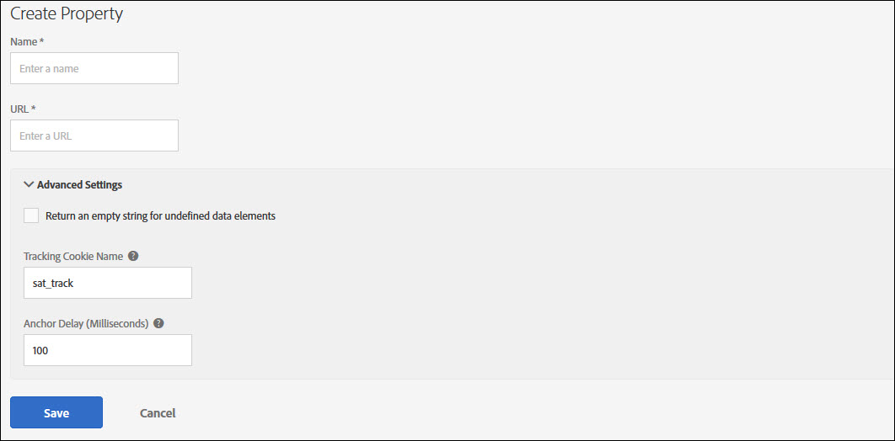

# Companies and Properties

### Web Properties

A property, or web property, is a collection of rules, data elements, configured extensions, environments, and libraries. There is only one publish embed code per property.

A property can be any grouping of one or more domains and subdomains. You can manage and track these assets similarly. For example, suppose that you have multiple websites based on one template, and you want to track the same assets on all of them. You can apply one property to multiple domains.

### Mobile Properties

A mobile property type can contain multiple applications. For example, in a mobile property you can manage the same set of rules and extensions across multiple iOS and Android applications.

For a video tutorial, see [Creating your first property](../getting-started/videos.md).

## Companies

In Launch, there is a 1:1 relationship between your companies and your Experience Cloudorganizations.

First, you can have one or several Launch company accounts. Companies contain properties. You can have one or several or any number of properties within a company account. Within a property, you can have one or any number of domains or subdomains.

Some customers have one company that contains all of their properties. Some have a company that contains many properties, one for each domain or application. Some have a company that contains several properties, one for each type of site or app they manage.

## Separating the Launch environment for multiple entities

There are a few ways to handle multiple geo markets, business units, domains, and subdomains in Launch.

For example, you might have three properties within your company account where one contains all of your blog sites, another contains all of your ecommerce sites, and the third contains all of your lead-generation sites.

Note: Each property requires its own embed codes in your page templates. Any domains or subdomains you want included in a particular property would have the same embed codes in the page templates when Dynamic Tag Management is first installed on your site.

### Can we use separate instances for each?

As described above, you can use separate company accounts for your three entities, or you can combine the entities into one company account and split the domains/subdomains/apps into different properties within that company account.

### Is there a clear way to separate settings within the same Launch instance?

Within a company account, you can use multiple properties to separate settings, or you can put multiple domains or apps into the same property.

### What are the pros and cons for using one Launch instance?

With one property that contains multiple domains or applications, you may eventually want to add conditional logic to separate unique data collection and tracking needs that only apply to a specific domain or app.

### What is the approach recommended by Adobe: one or separate companies?

Multiple Launch companies are not recommended. Adobe strongly suggests multiple properties in a single company.

## Best practices for planning properties

Each implementation can be very different in Launch, with a wide variety of data-collection needs, variable usage, extensions, third-party tags, other systems and technologies, people, teams, geographic regions, and so on. Using the flexible User Management features and properties, you can create a configuration that matches your workflow and processes.

### Web Property Groupings

If the scenarios you are tracking, the data you are collecting, the extensions you are deploying, and the variables you are setting are similar across all or some of your domains and subdomains, it is easier to have those domains and subdomains grouped into the same property in Launch. If those are unique for each domain and subdomain, it is easier to have those domains and subdomains in their own property. If you choose to group domains and subdomains in a single property now, you can always change your mind and later create several web properties.

### Mobile Property Groupings

For mobile applications, if you are planning to send data to the same report suites, use the same 3rd party extensions and utilizie the same rules and data elements, it would make sense to group all of these mobile apps into the same property. If however, you need to send data to different report suites, or you wish to configure different extensions, then it would make sense to create separate properties. If you choose to group applications in a single property now, you can always change your mind and later create several properties.

Considering the following when planning properties:

#### Data

For all of your websites or applications, is the data you are going to collect very similar, somewhat similar, or unique?

If the data you need to collect is similar, it might make sense to group those sites or applications into one property to avoid duplicating rules or copying rules from one property to another.

If your data collection needs are unique for each site or application, it might make sense to separate out into their own properties. This method lets you control the data collection more specifically, without using large amounts of conditional logic in custom scripts.

#### Variables

Similar to data, are the variables you are going to set in your Analytics and other extensions very similar, somewhat similar, or unique?

For example, if eVar27 is used for the same source value across all of your websites or applications, it might make sense to group those sites or applications together so you can set those common variables in just one property.

#### Extensions, Tags, and Systems

Are the extensions, tags and systems you are going to deploy through Launch very similar, somewhat similar, or unique?

If the extensions, tags, and systems you are going to deploy through Launch are very similar across your sites or applications, you might want to include them in the same property.

If you are deploying Adobe Analytics on only one site or application, and your other extensions and tags are also unique, you might want to create separate properties so that you have more control.

For example, If you are deploying Adobe Analytics, Target, and the same 3rd-party extensions across all of your sites or applications, that is a reason to group together.

#### People

For the individuals, teams, and organizations that are working in Launch, will they need access to all of your websites and applications, some of them, or just one?

The User Management features allow you to assign different roles to different people for all of your properties, or on a per-property basis. If someone has sufficient rights, that person can perform administrative actions across all the properties in that Launch company. All the other roles can be assigned on a per-property basis. You can even hide a property from certain users \(non-admins\) by not giving them any role in that property.

## Deactivating a property

The ability to deactivate a property is planned for a future release.

## Properties page

A property is a collection of rules, data elements, configured extensions, environments, and libraries. For web there is only one publish embed code per property. For mobile there is one configuration app ID per property.

A property can be any grouping of one or more domains and subdomains. You can manage and track these assets similarly. For example, suppose that you have multiple websites based on one template, and you want to track the same assets on all of them. You can apply one property to multiple domains.

The left side of the screen shows the companies in your organization. This is particularly useful if you manage multiple accounts. Select a company to see the properties and audit logs for that company.

Each property is shown in the Properties list.

The Properties list shows the following information:

* Property name
* Platform
* Status

Click a property to see an overview of that property. The overview shows any activity performed on the property. It also lists the metrics and extensions for the property.

## Create or configure a property

Create or configure a property in Launch.

Note: Only a user with sufficient rights can create a property. See [User Management](user-permissions.md).

Before beginning, review the [Best practices for planning properties](companies-and-properties.md#best-practices-for-planning-properties) for properties.

1. Navigate to your company page, then click New Property, or select an existing property from the list and click Configure.

### For Web

1. Fill in the fields:

   **Name:** The name of your property.

   **Domain:** The base URL of the property

2. \(Optional\) **Return an empty string for undefined values of Data Elements:** Select this check box if you want undefined values to be empty, rather than to assign default values.
3. Click Save.

   The extension is automatically installed into the new property.

   **For Mobile**

   1. Fill in the fields:

   **Name:** The name of your property.

   **Privacy:** By default the privacy setting is set to Opted In, meaning that you would like for the SDK to collect and send data to solutions. If you select Opted Out, the SDK by default will NOT send data to solutions. If you choose Unknown as the setting, the SDK will require that the application first propmpt the user to allow for data collection and sharing. Note: that these settings can be further controlled via API in the mobile application.

**Use HTTPS:** Choose if all data communication should be sent over HTTP or HTTPS.

1. Click Save.

   Once your mobile property is created, Launch will automatically add a default hosting adapter, a set of dev, stage and production environments and necessary extensions for the SDK to function.

## Delete a property

Delete a property from Launch.

Note: Property removal cannot be reversed. The requestor must be an admin-level user. This request cannot be undone.

1. In the Properties list, select the property you want to delete.

   You can select multiple properties to delete.

2. Click Delete, then confirm the removal of the property.

