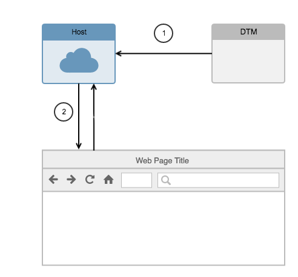

# Link DTM Embed Code

When you link your DTM embed code to Launch, you can keep your DTM production embed code on a page, but serve Launch files there instead of DTM.

DTM publishes files to the web host that you have specified (either an Akamai location, or your own FTP location. When a user visits your site in a browser, the browser requests the DTM file from this server - using the embed code - and loads it.

The linking process allows you to take the DTM Production embed code (with it's matching server location) and use it on your Launch production environment.  This means that DTM and Launch are sharing the server location and the file name.

When you publish in Launch, the Launch file overwrites the DTM file, so when the browser requests the file from the server, the Launch file is returned.

Important: This overwriting works both ways.  If you publish from DTM, DTM overwrites whatever was there already. You have two systems publishing to the same location. This means you don't have to change the code on your page, but it also means you need to be really careful when you publish.

## Pre-requisites

Before you link your embed code:

* Your DTM company must be connected to the same Experience Cloud Organization as Launch.
* Your user account must have the Manage Environments right in Launch and the Admin right in DTM.

## How to Link the embed code

1. In Launch, go to Environments.
2. Create a Prod environment.  You can only have one Prod environment. If you already have one, delete it and create a linked Prod environment. Important: You cannot get your old Prod Environment back if you delete it. Use the Link Your DTM Embed Code toggle. Paste your Prod Embed Code from DTM into the appropriate text field in Launch.
3. Finish configuring your Prod environment.
4. Click Save.

## Recommended setup process

If you use embed code linking, the process is mostly the same as without it, but with a couple highlighted differences:

1. Create your property, install an extension, create data elements, and create rules in Launch, as you normally would.
2. Create your Development and Staging environments in Launch as usual.
3. ** Create your Prod environment in Launch and use the [**Link Your DTM Embed Code**](link-dtm-embed-code.md#embed-code-link) option.
4. Create your library in Launch as usual.
5. Test in Dev, submit, test in Stage, and approve as usual.
6. Publish.
7. ** Disable your DTM property to prevent accidentally publishing the DTM file over the top of the Launch file.