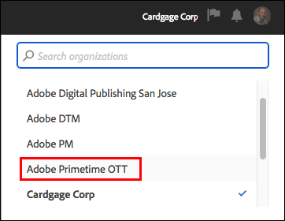
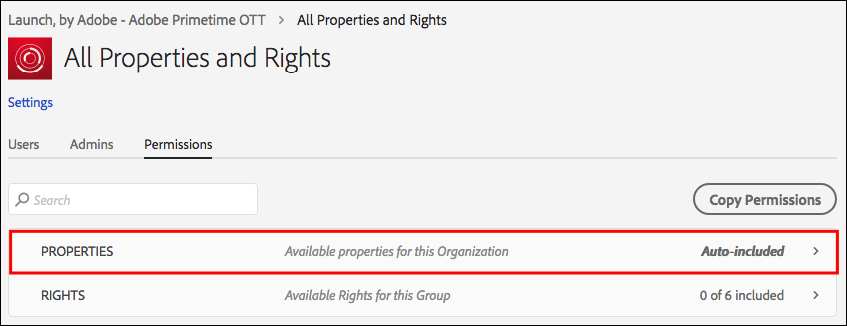
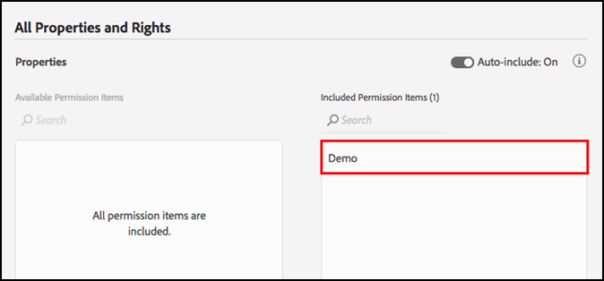
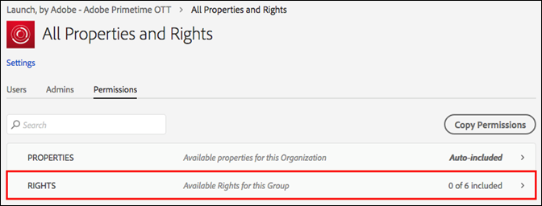
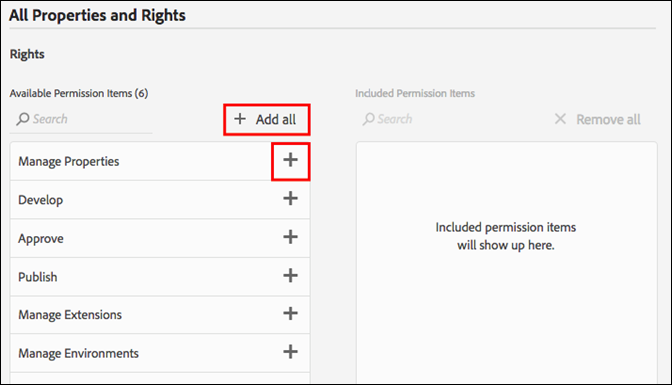
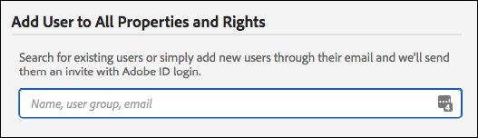
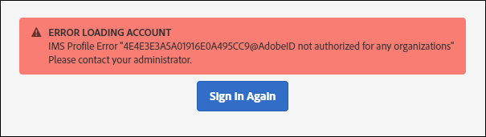

# User Permissions

## Permission Types

In order to understand how users are granted rights to work in Launch, there are two different permissions that you need to understand.

1. Experience Cloud Permissions - these live in the Admin Console at the company level and govern who can control group permissions and group membership for all Experience Cloud products.
2. Launch Permissionss - Launch is one of the Experience Cloud products.  These live in the Admin Console at the Product Profile level and govern which users can actually perform certain actions when logged into Launch.

We'll look at these different permissions types in more detail.

### Experience Cloud Permissions

This section will only mention a few things that are important to understand for usage of Launch.  Please [go here](https://helpx.adobe.com/au/enterprise/using/admin-roles.html) for a more comprehensive view of the scope of Experience Cloud permissions.

#### Organization Administrator

Organization Administrators are often referred to as Org Admins.  An Org Admin's main function is to assign permissions to other users.  They do this by creating Product Profiles \(or groups\) which contain a specific set of rights within a specific product and then assigning users - existing or new - to that Product Profile.

They do not have any rights in Launch as a result of being an Org Admin.  They will have to add themselves to a Product Profile that has Launch rights if they want to do anything in Launch.

#### Product Administrator

A Product Administrator \(or Product Admin\) is similar to an Org Admin, but is narrower in scope.  A Product Admin only has the permission to modify Product Profiles for a specific Adobe product, rather than any Adobe product the company has access to.

### Launch Permissions

Within the Experience Cloud, no rights or permissions are assigned to individual users.  They are assigned to a Product Profile \(see [Experience Cloud Permissions](users.md#experience-cloud-permissions) above\).  Individual users are then assigned to one or more Product Profiles. 

Within a Product Profile, there are two main dimensions that can be used to assign permissions in Launch.

#### 1\) Properties

Any properties you create in Launch become available in the Admin Console for you to assign permissions.  If a  given Product Profile does not have access to Property A1, users who belong to that Profile will not be able to see or modify any settings within Property A1.

#### 2\) Rights

Assuming that a user belongs to a Profile with access to Property A1, then what they can do within Property A1 is determined by the rights they have been granted.  Users with permissions to Property A1, but no assigned rights will have read-only access.

There are 6 rights that can be assigned in a Product Profile.

1. **Manage Properties** - This right grants the ability to create new Properties in Launch and to modify the metadata and settings that live at the Property level. You can also delete properties.  You can read more about Properties [here](companies-and-properties.md). Administrators usually perform this role.
2. **Manage Environments** - This right grants the ability to create and modify environments. You can read more about Environments [here](environments.md). This role typically belongs to the IT group.
3. **Manage Extensions** - This right grants the abilities to install new extensions to a property, to modify the extension configuration for an already installed extension, and to delete an extension.  More information on extensions is available [here](../managing-resources/extensions.md). This role could typically belong to IT or Marketing depending on your organization.
4. **Develop** - The Develop right lets you create rules and data elements. You can also create libraries and build them in existing Development environments.  Finally, you can Submit a library for approval when ready.  Most day-to-day tasks in Launch rely on this right.
5. **Approve** - The Approve right lets you take a submitted library and build to the Staging environment.  You can also Approve a library for publishing once testing has been completed.
6. **Publish** - The Publish right lets you publish approved libraries to the Production environment.

### Total User Permissions

An individual users total permissions are determined by their total membership in different Product Profiles.  If a user belongs to multiple Product Profiles, the permissions from each profile are added together rather than multiplied.

An example: Product Profile A grants Henry the Develop right for Property 1.  Product Profile B grants Henry the Publish right for Property 2.  Henry can Develop in Property 1 and Publish in Property 2, but he cannot Publish in Property 1 \(or Develop in Property 2\) because he has not been granted explicit rights to do so.

## Rights scenarios

Different companies have different sets of needs when it comes time to creating new Product Profiles.  These will vary based on company size, org structure, number of sites, number of people involved in managing tags, etc.

Below are a few common scenarios and a recommended starting point as you think about creating Product Profiles and adding users to them.

### 1\) One-person Show

If you run a small company that has one person in charge of everything, grant this user permission to all Properties and assign them all 6 rights listed above.

### 2\) Separation of Duties

Many people are involved in tagging.  You have one set of people \(maybe an external consultant\) that creates rules and data elements, but you don't want them to have access to the Production environment.  You want to make sure that nobody deploys to Production except the IT team.

1. Create an account for your consultants and grant them only the develop right.
2. The consultant builds and tests within the confines you set.
3. If the consultant wants a new extension, or is ready to go live, a representative from your organization \(with the appropriate rights\), performs those actions.

### 3\) Enterprise

An enterprise company might have multiple sites divided geographically, with different teams responsible for each geo. Within those teams, different individuals develop and publish.

This is similar to Separation of Duties above, but with different geographic areas.

* North America
  * Develop group
  * Publish group
* Europe
  * Develop group
  * Publish group
* ...
  * Develop group
  * Publish group

## Assigning User Permissions

The steps below guide you through the process of assigning permissions. You also view it on video [here](https://www.youtube.com/watch?v=ba28BHX8cwU).

Steps 1-3 below can be bypassed by navigating directly to [Adobe Admin Console](https://adminconsole.adobe.com/enterprise/products). If you belong to more than one Organization, be sure to select the correct org from the top nav on the right.

### 1. Sign in to [http://marketing.adobe.com](http://marketing.adobe.com) 

Sign in to [http://marketing.adobe.com](http://marketing.adobe.com) with your Adobe ID, then choose the organization to use within Launch from the Navigation menu.

Open the solution picker by clicking the 9-dots icon from the navigation menu, then click Administration.

If you can't see this link, both of the following conditions are true:

* You are not an org admin.
* You are not a product admin for any Experience Cloud products.

In either case, ask an org admin to perform these steps for you, or to make you a product admin for Launch so you can do it yourself.

Note: If you don't know who your org admin is, contact Client Care.

### 2. Open Admin Console

Click Launch Admin Console.

Click the Launch, by Adobe - %Company Name% card.

You can also click Products in the top nav, then select Launch, by Adobe - %Company Name% from the left nav.

If you do not see a Launch, by Adobe card and or if Launch, by Adobe does not appear in this list, then you are not an Org Admin, but you are a Product Admin for other Experience Cloud products. Because you are not an Administrator for Launch, you will need to find an Org Admin who can perform these steps for you or who can make you a Product Admin for Launch.

After you select Launch, a list of product profiles displays. Think of these profiles as permission groups. One profile is created for you and is named Launch - %Company Name%.

### 3. Create your product profile

If you are editing an existing product profile, skip this step.

Choose to edit this product profile, or create a new one.

To create a new product profile, click New Profile.

Give your new profile a name and a description, configure whether users should receive emails when they are added or removed from this profile, and then click Done.

### 4. Edit your product profile

Select the product profile from the list, then open the Permissions tab. You can assign permissions across two dimensions: Properties and Rights.

To assign properties to this group definition, open the Properties section.

A list shows your Launch properties.

By default, new product configurations automatically include properties. This means that all properties \(present and future\) are included in the group definition.

If Auto-include is disabled, all currently available properties are listed on the left. You can move properties into this group definition by clicking Add.

Click Save when finished.

### 5. Assign rights

Assign the rights you want to be part of your group definition. Open the Rights section.

Rights are not automatically included. You must assign each right to your profile. You can quickly add all rights to this profile by using the + Add All button or you can assign individual rights by using the individual + buttons. For more information on what permissions are associated with each right, see [Rights details](users.md#rights-details). Click Save when finished. If Save is not available, you didn't make any changes and the profile won't give you any rights

Some important notes:

* Lack of rights means read-only access.

  If you belong to a product configuration with Auto-include properties and no rights, then you have read-only access to all properties in Launch.

* If you don't at least assign the Manage Properties right, you won't be able to add any properties when you log in.
* A user can belong to multiple groups, but the rights from those groups are not combined into a master permission set. That user still has only the rights explicitly granted by each group.

  For example, if Group 1 gives access to Property A with the Develop right and Group 2 gives access to Property B with the Publish right, Develop and Publish rights are not combined for Property A and Property B. You can only develop on Property A and publish on Property B.

### 6. Assign users to groups

To assign users to be part of your group, open the Users tab, then click Add User.

Click ... for additional options, such as bulk user operations.

Note: Being an Org Admin or a Product Admin does not grant you any rights within the Launch product. You must belong to at least one product profile.

Search for the user you'd like to add to the group. You can search by name or by email address. This auto-populates from existing users in your Org. Once you have found the user you want, click on their name.

Once you've added users, they receive an email letting them know that they now have rights to Launch. They can login to Launch at [https://launch.adobe.com](https://launch.adobe.com).

Note: If the user does not exist, you can simply type their entire email address, then provide a first and last name. The new user receives an email, and when they create an Adobe ID from that email invitation, they are linked together with the user account you created for them. If you are assigning permissions for yourself, you won't have this issue.

## Common issues

### Error loading account

When you login to launch, you receive a message saying "Error Loading Account".

Resolution: Your user does not belong to any Launch product profiles. See the steps above to create a profile and assign rights to it, and to assign a user to a profile.

### Grayed-out Property Button

Once you've logged in, you can't add any Properties.

Resolution: Your user account does not belong to a product configuration that has the Manage Properties right. Go back to Step 5 above.

### 

