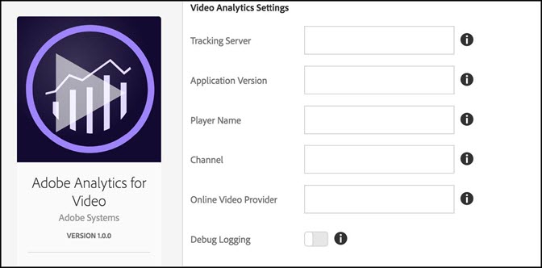
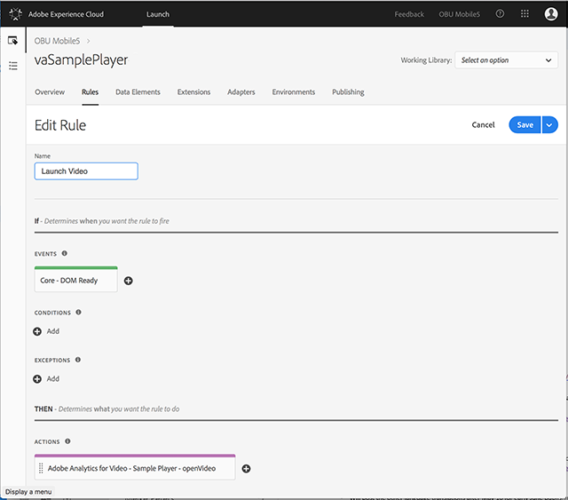
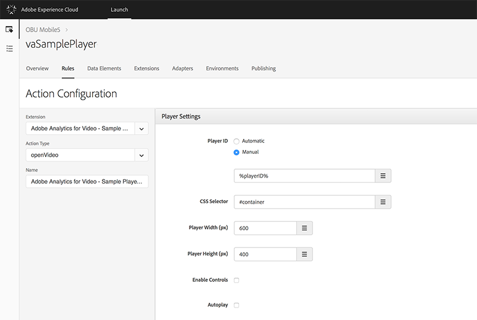
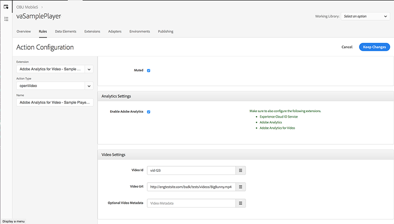

# Adobe Analytics for Video Extension

Use this documentation for information on installing, configuring, and implementing the Adobe Analytics for Video Extension. Included are the options available when using this extension to build a rule, along with examples and links to samples.

The Adobe Analytics for Video Extension \(VA Launch Extension\) adds the core VA JavaScript library. This library provides the functionality for adding the `mediaHeartbeat` instance to a Launch site or project. The VA Launch Extension requires two additional extensions:

* [Analytics Extension](https://github.com/Adobe-Marketing-Cloud/reactor-user-docs/tree/67a59a7519514467a713016adfe46d999fe330d8/extension-reference/c_extension-analytics.md)
* [Experience Cloud ID Extension](https://github.com/Adobe-Marketing-Cloud/reactor-user-docs/tree/67a59a7519514467a713016adfe46d999fe330d8/extension-reference/c_extension-mcid.md)

After you have included all three of the extensions mentioned above in your Launch project, you must then include custom JavaScript, or build a player-specific extension, to map specific video player API events to the Video Analytics events exposed through the VA Launch Extension.

## Install and Configure the VA Launch Extension

**Install -** To install the VA Launch Extension, open your extension property, then click Extensions &gt; Catalog, hover over the Adobe Analytics for Video extension, and click Install.

**Configure -** To configure the VA Launch Extension, open the Extensions tab, hover over the extension, and then click Configure:



#### Configuation Options

<table id="table_j5x_1tp_cdb">
    <thead>
        <tr>
        <td>Option</td>
        <td>Description</td>
        </tr>
    </thead>
    <tbody>
        <tr>
            <td>Tracking Server</td>
            <td>
            <p>Defines the server for tracking media heartbeats. <note>This
            is not the same server as your analytics tracking
            server.</note></p>
            </td>
        </tr>
        <tr>
            <td>Application Version</td>
            <td>The version of the video player app/SDK.</td>
            </tr>
            <tr>
            <td>Player Name</td>
            <td>Name of the video player in use. E.g.: "AVPlayer", "HTML5
            Player", "My Custom VideoPlayer"</td>
        </tr>
        <tr>
            <td>Channel</td>
            <td>Channel name property</td>
            </tr>
            <tr>
            <td>Online Video Provider</td>
            <td>Name of the online video platform through which content gets
            distributed</td>
        </tr>
        <tr>
            <td>Debug Logging</td>
            <td>Preferred debug log output</td>
            </tr>
            <tr>
            <td>Enable SSL</td>
            <td>Enable / Disable sending pings over HTTPS.</td>
        </tr>
    </tbody>
</table>

**Important:** The VA Analytics Launch Extension requires the presence of the [Adobe Analytics](https://github.com/Adobe-Marketing-Cloud/reactor-user-docs/tree/67a59a7519514467a713016adfe46d999fe330d8/extension-reference/c_extension-analytics.md) and [Experience Cloud ID](https://github.com/Adobe-Marketing-Cloud/reactor-user-docs/tree/67a59a7519514467a713016adfe46d999fe330d8/extension-reference/c_extension-mcid.md) extensions. Customers must also add these extensions to their extension property and configure them.

## Using the VA Launch Extension

**Important:** Currently, the only way to leverage the VA Launch Extension is through the use of "shared modules" which you can only access from other Launch extensions. That is, a webpage/JS app cannot access or declare `getMediaHeartbeatInstance`, or use `turbine` (see code sample below) outside of a Launch Extension. 

### Using the VA Launch Extension from other Launch Extensions

The VA Launch Extension exposes the `get-instance` and `media-heartbeat` shared modules. \(For additional information on Shared Modules, see [Shared Modules documentation](https://developer.adobelaunch.com/guides/extensions/shared-modules/).\)

* **`get-instance`**

    **Params:**

    1. A valid delegate object exposing these functions:

        <table id="table_qp4_31t_ycb">
                <thead>
                    <tr>
                        <td>Method</td>
                        <td>Description</td>
                        <td>Required</td>
                    </tr>
                </thead>
                <tbody>
                    <tr>
                        <td><codeph>getQoSObject()</codeph></td>
                        <td>
                        <p>Returns the <codeph>MediaObject</codeph>
                        instance that contains the current QoS
                        information. This method will be called multiple
                        times during a playback session. Player
                        implementation must always return the most
                        recently available QoS data.</p>
                        </td>
                        <td>Yes</td>
                    </tr>
                    <tr>
                        <td><codeph>getCurrentPlaybackTime()</codeph></td>
                        <td>
                        <p>Returns the current position of the playhead. </p>
                        <p>For VOD tracking, the value is specified in
                        seconds from the beginning of the media item. </p>
                        <p>For LIVE/LIVE tracking, the value is specified
                        in seconds from the beginning of the program.</p>
                        </td>
                        <td>Yes</td>
                    </tr>
                </tbody>
        </table>

    2. An optional config object exposing these properties:
        
        <table
            id="table_sqg_4zs_ycb">
            <thead>
                <tr>
                <td>Property</td>
                <td>Description</td>
                <td>Required</td>
                <td>Value</td>
                </tr>
            </thead>
            <tbody>
                <tr>
                    <td>
                    <p>Online Video Provider</p>
                    </td>
                    <td>Name of the online video platform through
                    which content gets distributed.</td>
                    <td>No. If present overrides the value defined
                    during Extension configuration.</td>
                    <td>Empty String</td>
                </tr>
                <tr>
                    <td>Player Name</td>
                    <td>
                    <p>Name of the video player in use. </p>
                    <p>E.g.: "AVPlayer", "HTML5 Player", "My Custom
                    VideoPlayer"</p>
                    </td>
                    <td>No. If present overrides the value defined
                    during Extension configuration.</td>
                    <td>Empty String</td>
                </tr>
                <tr>
                    <td>Channel</td>
                    <td>Channel name property</td>
                    <td>No. If present overrides the value defined
                    during Extension configuration.</td>
                    <td>Empty String</td>
                </tr>
            </tbody>
        </table>

    **Return Value:** A promise which either resolves with a `MediaHeartbeat` instance or rejects with an error message.

* **`media-heartbeat`**

    This module exposes all of the constants from this class: [https://adobe-marketing-cloud.github.io/video-heartbeat-v2/reference/javascript/MediaHeartbeat.html](https://adobe-marketing-cloud.github.io/video-heartbeat-v2/reference/javascript/MediaHeartbeat.html).

    1. Implemement the shared Media Heartbeat instance as follows:

        ```javascript
        var getMediaHeartbeatInstance =
          turbine.getSharedModule('adobe-video-analytics', 'get-instance');

        var MediaHeartbeat =
          turbine.getSharedModule('adobe-video-analytics', 'media-heartbeat');
          ...

        var delegate = {
            getCurrentPlaybackTime: this._getCurrentPlaybackTime.bind(this),
            getQoSObject: this._getQoSObject.bind(this),
        }

        var config = {
            playerName: "Custom Player",
            ovp: "Custom OVP",
            channel: "Custom Channel"
        }
        ...

        var self = this;
        getMediaHeartbeatInstance(delegate, config).then(function(instance) {
            self._mediaHeartbeat = instance;
            ...
            // Do Tracking using the Media Heartbeat instance.
            });
        }
        ...
        ```

    2. Using the Media Heartbeat instance, follow the [VHL SDK JS documentation](https://marketing.adobe.com/resources/help/en_US/sc/appmeasurement/hbvideo/js_2.0/) and [JS API documentation](https://adobe-marketing-cloud.github.io/video-heartbeat-v2/reference/javascript/index.html) to implement video tracking.

**Note: Testing -** For this release, to test your extension you must upload it to [Adobe Launch](https://github.com/Adobe-Marketing-Cloud/reactor-user-docs/tree/67a59a7519514467a713016adfe46d999fe330d8/extension-reference/launch.adobe.com), where you have access to all dependent extensions.

## Leveraging the Sample HTML5 Player

You can obtain the VA Launch HTML5 sample player here: [HTML5 Sample Player](https://github.com/adobe/reactor-adobe-va-sample-player). The sample player acts as a reference to create video player extensions and to showcase using the VA Launch Extension to support Adobe Analytics for Video.



The sample player comes with an existing rule that opens the specified video when the core extension fires the `DOMLoaded` event.

* `< _your sample player repo_ >/src/lib/helpers/analytics/adobeAnalyticsProvider.js` - This file implements Video Analytics tracking by using Shared Modules exposed by the VA Launch Extension.
* [https://github.com/adobe/reactor-adobe-va-sample-player/blob/master/src/view/actions/openVideo/openVideo.jsx](https://github.com/adobe/reactor-adobe-va-sample-player/blob/master/src/view/actions/openVideo/openVideo.jsx) - UI Code to configure the Action is defined here.
* [https://github.com/adobe/reactor-adobe-va-sample-player/blob/master/src/lib/actions/openVideo.js](https://github.com/adobe/reactor-adobe-va-sample-player/blob/master/src/lib/actions/openVideo.js) - This file exports a function that gets executed when the `openVideo` Action is triggered as part of the launch rule. 

    This is a code snippet from `openVideo.js` where the openVideo Action is executed:

    ```javascript
    function openVideo(settings) {
      let player;
      try {
        Logger.info(LOG_TAG, `Executing action with ${JSON.stringify(settings)}`);

        player = new PlayerFacade(settings);
        PlayerStore.registerPlayer(player);
        player.load(settings.media);
      } catch (ex) {
        Logger.error(LOG_TAG, `Creating player for action openVideo failed with error ${ex.message}`);

        // Cleanup from DOM.
        if (player) {
          player.destroy();
        }
      }
    }
    ...
    ```

    **Action Configuration / Player Settings:**  Note the CSS Selector setting where the corresponding `<div>` in the player is set. Note also that the "Enable Adobe Analytics" checkbox is checked in the Analytics Settings pane.

    
    

**Important:** Currently, if you have a custom player that doesn't have a Launch extension, you have to write your own extension to make use of the VA Launch Extension. 
