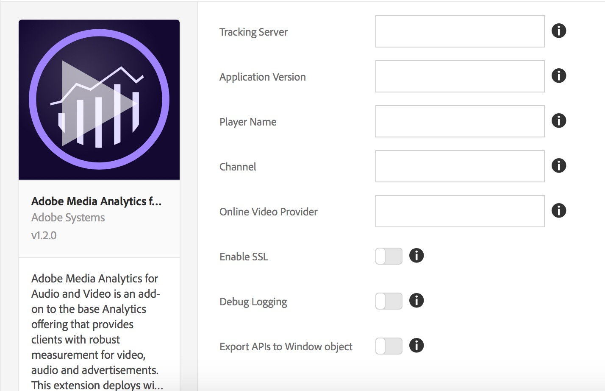

# Adobe Analytics for Video Extension

Use this documentation for information on installing, configuring, and implementing 
the Adobe Analytics for Video Extension (Video Analytics Launch Extension). Included 
are the options available when using this extension to build a rule, along with 
examples and links to samples.

The Video Analytics (VA) Launch Extension adds the core VA JavaScript library (VA 2.x SDK). 
This extension provides the functionality for adding the `MediaHeartbeat` tracker instance 
to a Launch site or project.  The VA Launch Extension requires two additional extensions:

* [Analytics Extension](https://docs.adobelaunch.com/extension-reference/adobe-analytics-extension)
* [Experience Cloud ID Extension](https://docs.adobelaunch.com/extension-reference/experience-cloud-id-service-extension)

After you have included all three of the extensions mentioned above in your 
Launch project, you can proceed in one of two ways:

* Use `MediaHeartbeat` APIs from your web app
* Include, or build, a player-specific extension that maps specific video player 
  events to the Video Analytics APIs on the `MediaHeartbeat` tracker instance. 
  This instance is exposed through the VA Launch Extension.

## Install and Configure the VA Launch Extension

* **Install -** To install the VA Launch Extension, open your extension property, 
  click _Extensions &gt; Catalog_, hover over the _Adobe Analytics for Video_ 
  extension, and click _Install_.
* **Configure -** To configure the VA Launch Extension, open the _Extensions_ tab, 
  hover over the extension, and then click _Configure_:



#### Configuation Options:

| Option | Description |
| --- | --- |
| Tracking Server | Defines the server for tracking media heartbeats (this is not the same server as your analytics tracking server) |
| Application Version | The version of the video player app/SDK |
| Player Name | Name of the video player in use (e.g., "AVPlayer", "HTML5 Player", "My Custom VideoPlayer") |
| Channel | Channel name property |
| Online Video Provider | Name of the online video platform through which content gets distributed |
| Debug Logging | Enable or Disable logging |
| Enable SSL | Enable or Disable sending pings over HTTPS |
| Export APIs to Window Object | Enable or Disable exporting Video Analytics APIs to global scope |
| Variable Name | A variable you use to export Video Analytics APIs under the `window` object |

**Reminder:** The VA Launch Extension requires the [Adobe Analytics](https://docs.adobelaunch.com/extension-reference/adobe-analytics-extension) and [Experience Cloud ID](https://docs.adobelaunch.com/extension-reference/experience-cloud-id-service-extension) extensions. You must also add these extensions to your extension property and configure them.

## Using the VA Launch Extension

### Using From a Webpage/JS App
  
The VA Launch Extension exports the MediaHeartbeat APIs in the global window object 
by enabling the _"Export APIs to Window Object"_ setting in the Configuration page. 
It exports the APIs under the configured variable name. For example, if the variable 
name is configured to be `ADB` then MediaHeartbeat can be accessed by `window.ADB.MediaHeartbeat`.

**Important:** The VA Launch Extension exports the APIs only when `window["CONFIGURED_VARIABLE_NAME"]` 
is undefined and does not override existing variables.

1. **Create MediaHeartbeat Instance:** `window["CONFIGURED_VARIABLE_NAME"].MediaHeartbeat.getInstance`

   **Params:** A valid delegate object exposing these functions:

   | Method | Description |
   | --- | --- |
   | `getQoSObject()` | Returns `theMediaObject` instance that contains current QoS information. This method will be called multiple times during a playback session. Player implementation must always return the most recently available QoS data. |
   | `getCurrentPlaybackTime()` | Returns the current position of the playhead. For VOD tracking, the value is specified in seconds from the beginning of the media item. For LIVE/LIVE tracking, the value is specified in seconds from the beginning of the program. |

   **Return Value:** A promise which either resolves with a `MediaHeartbeat` instance or rejects with an error message.

2. **Access MediaHeartbeat Constants:** `window["CONFIGURED_VARIABLE_NAME"].MediaHeartbeat`

   This exposes all of the constants and static methods from the 
   [`MediaHeartbeat`](https://adobe-marketing-cloud.github.io/video-heartbeat-v2/reference/javascript/MediaHeartbeat.html) class.

   You can obtain the sample player here: [VA Sample Player](https://github.com/Adobe-Marketing-Cloud/video-heartbeat-v2/tree/master/sdks/js/samples/Launch/VideoHeartbeatSample). 
   The sample player acts as a reference to showcase how to use the VA Launch Extension to support Video Analytics directly from a webapp.

### Using From Other Launch Extensions

The VA Launch Extension exposes the `get-instance` and `media-heartbeat` shared 
modules to other extensions. (For additional information on Shared Modules, 
see [Shared Modules documentation](https://developer.adobelaunch.com/guides/extensions/shared-modules/).)

**Important:** Shared Modules can only be accessed from other Launch extensions. 
That is, a webpage/JS app cannot access the shared modules, or use `turbine` 
(see code sample below) outside of a Launch Extension.

1. **Create MediaHeartbeat Instance:** `get-instance` Shared Module

   **Params:**

   * A valid delegate object exposing these functions:

     | Method | Description |
     | --- | --- |
     | `getQoSObject()` | Returns the `MediaObject` instance that contains the current QoS information. This method will be called multiple times during a playback session. The player implementation must always return the most recently available QoS data. |
     | `getCurrentPlaybackTime()` | Returns the current position of the playhead. For VOD tracking, the value is specified in seconds from the beginning of the media item. For LIVE/LIVE tracking, the value is specified in seconds from the beginning of the program. |

   * An optional config object exposing these properties:

     | Property | Description | Required |
     | --- | --- | --- |
     | Online Video Provider | Name of the online video platform through which content is distributed. | No. If present, overrides the value defined during extension configuration. |
     | Player Name | Name of the video player in use (e.g., "AVPlayer", "HTML5 Player", "My Custom VideoPlayer") | No. If present, overrides the value defined during extension configuration. |
     | Channel | Channel name property | No. If present, overrides the value defined during extension configuration. |
 
   **Return Value:** A promise which either resolves with a `MediaHeartbeat` instance or rejects with an error message.

2. **Access MediaHeartbeat Constants:** `media-heartbeat` Shared Module

This module exposes all of the constants and static methods from this class: [https://adobe-marketing-cloud.github.io/video-heartbeat-v2/reference/javascript/MediaHeartbeat.html](https://adobe-marketing-cloud.github.io/video-heartbeat-v2/reference/javascript/MediaHeartbeat.html).

1. Create MediaHeartbeat tracker instance as follows:

    ```javascript
    var getMediaHeartbeatInstance =
      turbine.getSharedModule('adobe-video-analytics', 'get-instance');

    var MediaHeartbeat =
      turbine.getSharedModule('adobe-video-analytics', 'media-heartbeat');
      ...

    var delegate = {
        getCurrentPlaybackTime: this._getCurrentPlaybackTime.bind(this),
        getQoSObject: this._getQoSObject.bind(this),
    }

    var config = {
        playerName: "Custom Player",
        ovp: "Custom OVP",
        channel: "Custom Channel"
    }
    ...

    var self = this;
    getMediaHeartbeatInstance(delegate, config).then(function(instance) {
        self._mediaHeartbeat = instance;
        ...
        // Do Tracking using the MediaHeartbeat instance.
    }).catch(function(err){
        // Getting MediaHeartbeat instance failed.
    });

    ...
    ```

2. Using the Media Heartbeat instance, follow the 
   [VHL SDK JS documentation](https://marketing.adobe.com/resources/help/en_US/sc/appmeasurement/hbvideo/js_2.0/) and 
   [JS API documentation](https://adobe-marketing-cloud.github.io/video-heartbeat-v2/reference/javascript/index.html) 
   to implement video tracking.

**Note: Testing -** For this release, to test your extension you must upload it to 
[Adobe Launch](launch.adobe.com), where you have access to all dependent extensions.

## Leveraging the Sample HTML5 Player

You can obtain the VA Launch Extension sample HTML5 player here: 
[HTML5 Sample Player](https://github.com/adobe/reactor-adobe-va-sample-player). 
The sample player acts as a reference to create video player extensions and to 
showcase using the VA Launch Extension to support Adobe Analytics for Video.

## Sample Player Extension Action Types

This section describes the action types available in the Sample Player extension.

### Open Video

The _Open Video_ action provides various configurations for creating and customizing 
an HTML5 player, providing a video to play and enabling/disabling Adobe Video Analytics tracking.

**Action Configuration / Player Settings:** Note the CSS Selector setting which 
specifics the `<div>` in the web page where the player is added. Note also that 
the _Enable Adobe Analytics_ checkbox is checked in the Analytics Settings pane.


* [\[...\]/openVideo/openVideo.jsx](https://github.com/adobe/reactor-adobe-va-sample-player/blob/master/src/view/actions/openVideo/openVideo.jsx) - 
  UI Code to configure the Action is defined here.
* [\[...\]/actions/openVideo.js](https://github.com/adobe/reactor-adobe-va-sample-player/blob/master/src/lib/actions/openVideo.js) - 
  This file exports a function that gets executed when the Action is triggered as part of the launch rule.

  This is a code snippet from `openVideo.js` where the `openVideo` Action is executed:

    ```javascript
    function openVideo(settings) {
        let player;
        try {
            Logger.info(LOG_TAG, `Executing action with ${JSON.stringify(settings)}`);
      
            player = new PlayerFacade(settings);
            PlayerStore.registerPlayer(player);
            player.load(settings.media);
        } catch (ex) {
            Logger.error(LOG_TAG, `Creating player for action openVideo failed with error ${ex.message}`);

            // Cleanup from DOM.
            if (player) {
                player.destroy();
            }
        }
    }
    ...
    ```

* [\[...\]/analytics/adobeAnalyticsProvider.js](https://github.com/adobe/reactor-adobe-va-sample-player/blob/master/src/lib/helpers/analytics/adobeAnalyticsProvider.js) - 
This file implements Video Analytics tracking by using Shared Modules exposed by the VA Launch Extension.

## Sample Player extension basic deployment

Once the Sample Player Extension is installed, you'll need to create at least 
one rule to properly deploy it. The Image below shows a sample rule that opens 
the specified video when the core extension fires the `DOMLoaded` event.


After you have saved this rule, you will need to add it to a Library, and then 
build and deploy so that you can test the behavior.
