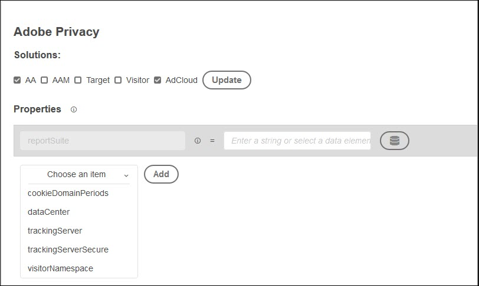
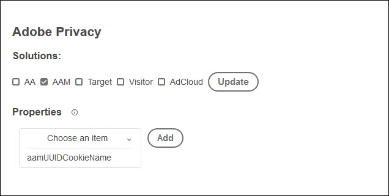
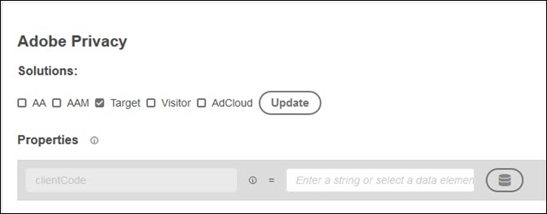
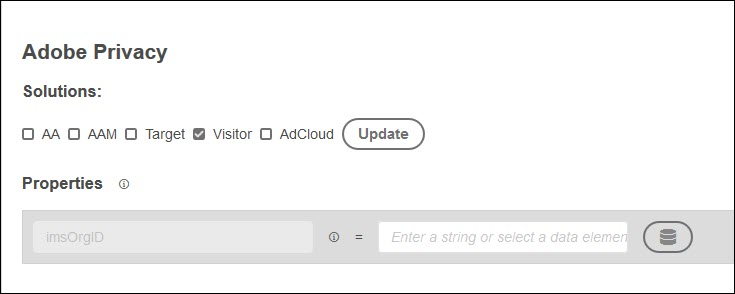

# Adobe Privacy Extension

 The Adobe Privacy extension provides functionality for collecting and removing user IDs assigned to end users by Adobe solutions.

## Configure Solutions During Installation

When you install the Adobe Privacy extension from the Extension Catalog, you are prompted to select the solutions you want to update. Currently you can update the following solutions:

* Analytics \(AA\)
* Audience Manager \(AAM\)
* Target
* Visitor Service
* AdCloud

1. Select one or more solutions, then click Update.
2. When you have selected and configured your solutions, click Save. The Adobe Privacy Extension is added to your installed extensions list.

 The options for each solution are described below.

### Analytics

By default, you must provide your report suite by entering a string or selecting a data element.

To configure other items, click Choose an Item, select the item you want to configure, then click Add and enter the requested parameter or a data element. 

### Audience Manager

Click Choose an Item, select the item you want to configure, then click Add and enter the requested parameter or a data element. Currently, you can configure only the aamUUIDCookieName.

### Target

Enter the Target client code.

### Visitor Service

Enter your IMS Organization ID.

### AdCloud

There are no specific parameters to configure for AdCloud.

## Configure the Adobe Privacy Extension

After you install the extension, you can disable or delete it. Click Configure on the Adobe Privacy card in your installed extensions, then select either Disable or Uninstall.

## Actions

The following actions are available when you configure a rule using the Adobe Privacy extension.

### Retrieve Identities

When the event and conditions are met, retrieve identity information that is stored for the visitor.

Enter the name of a JavaScript function you want to pass the data to.  This function or method handles the retrieved Identities.  Whether you store them, display them, or send them to the Adobe GDPR API, is within your control.

### Remove Identities

When the event and conditions are met, remove identity information that is stored for the visitor.

Enter the name of a JavaScript function you want to pass the data to.  This function or method handles the retrieved Identities.  Whether you store them, display them, or send them to the Adobe GDPR API, is within your control.

### Retrieve Then Remove Identies

When the event and conditions are met, retrieve identity information that is stored for the visitor, then remove it.

