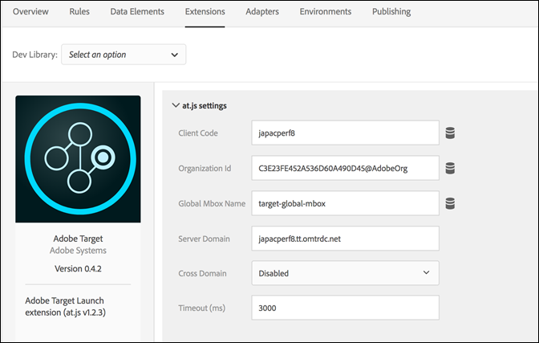
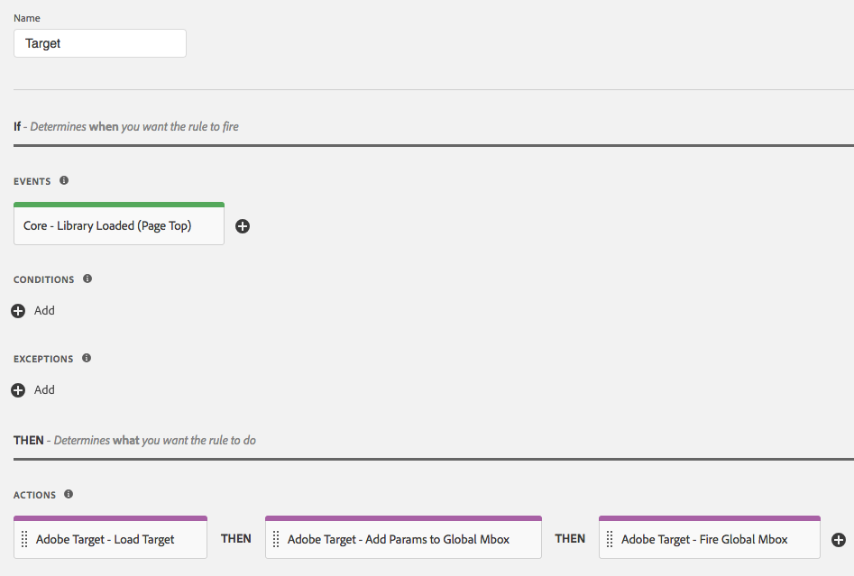

# Adobe Target Extension

Use this reference for information about the options available when using this extension to build a rule.

## Configure the Adobe Target extension

Important: The Adobe Target extension requires at.js. It does not support mbox.js.

If the Adobe Target extension is not yet installed, open your property, then click Extensions &gt; Catalog, hover over the Target extension, and click Install.

To configure the extension, open the Extensions tab, hover over the extension, and then click Configure.



### at.js Settings

All of your at.js settings, with the exception of the Timeout. are automatically retrieved from your at.js configuration in the Target user interface. The extension only retrieves settings from the Target user interface when it is first added, so all settings should be managed in the Launch interface if additional updates are needed. 

The following configuration options are available:

#### Client Code

The client code is Target’s account identifier. This should almost always be left as the default value.

Can be changed using data elements.

#### Organization ID

This ID ties your implementation to your Adobe Experience Cloud account. This should almost always be left as the default value.

Can be changed using data elements.

#### Global Mbox Name

Shows the name of your global Target request. By default, this name is target-global-mbox, unless you have changed the name in the Target user interface before adding the extension.

Can be changed using data elements.

#### Server Domain

The domain where Target requests are sent. This should almost always be left as the default value.

#### Cross Domain

Determines where Target sets cookies in the browsers.

* **Disabled:** Sets the cookies on the first-party domain only. This is the typical setting.
* **Enabled:** Sets cookies on both the first-party domain and the third-party Target domain \(the "Server Domain"\).

#### Timeout \(ms\)

If the response from Target is not received within the defined period, the request times out and default content is displayed. Additional requests continue to be attempted during the visitor's session. The default is 3000ms, which might be different from the Timeout configured in the Target user interface.

For more information about how the Timeout setting works, refer to the [Adobe Target help](https://marketing.adobe.com/resources/help/en_US/target/ov2/c_target-atjs-advanced-settings.html).

#### Other at.js settings available in the Target user interface

Several settings that are available on the “Edit at.js settings” page of the Target user interface are not part of the Target extension. Here are suggested workarounds:

* Auto-create global mbox This setting is replaced by the Fire Global Mbox action in the Target extension.
* Library Header This setting is not part of the Target extension. Put code that needs to load before at.js in a Core Extension&gt;Custom Code action before using the Load Target action.
* Library Footer This setting is not part of the Target extension. Put code that needs to load after at.js in a Core Extension&gt;Custom Code action after using the Load Target action.

## Target extension action types

This section describes the action types available in the Target extension.

The Target extension provides the following actions in the Then portion of a rule:

### Load Target

Add this action to your Launch rule where it makes sense to load Target in the context of your rule. This loads the at.js library into the page. In most implementations, Target should be loaded on every page of your site.

No configuration is needed.

### Add Mbox Params

Add parameters to all mbox requests. The Load Target action must be used earlier.

1. Specify the name and value of any parameter you want to add.
2. Click the Plus icon to add more parameters.

### Add Global Mbox Params

Add parameters only to your global mbox requests. The Load Target action must be used earlier.

1. Specify the name and value of any parameter you want to add.
2. Click the Plus icon to add more parameters.

### Fire Global Mbox

Fire the global mbox on your page. The Load Target action must be used earlier.

Specify whether to enable body hiding to prevent flickering, and the style used when hiding your body element.

The following options are available:

* **Body Hiding:** You can enable or disable this setting. The default value is Enabled, which means HTML BODY is hidden.
* **Body Hidden Style:** The default value is `body{opacity:0}`. This value can be changed to something different, like `body{display:none}`.

For more information, refer to the [Target online help documentation](https://marketing.adobe.com/resources/help/en_US/target/ov/r_advanced_mboxjs_settings.html).

## Adobe Target basic deployment

Once the Target Extension is installed, you'll need to create at least one rule to properly deploy it.  You first need to load the Target library \(at.js\), specify the parameters you want to use with the global mbox, and fire the global mbox.

A Target rule with this basic implementation looks like this:



Once you have saved this rule, you'll need to add it to a Library and build/deploy so that you can test the behavior.

## Adobe Target extension with an asynchronous deployment

Launch can be deployed asynchronously. If you are loading the Launch library asynchronously with Target inside it, then Target will also be loaded asynchronously. This is a fully supported scenario, but there is one additional consideration that must be handled.

In asynchronous deployments, it is possible for the page to finish rendering the default content before the Target library is fully loaded and has performed the content swap. This can lead to what is known as "flicker" where the default content shows up briefly before being replaced by the personalized content specified by Target. If you want to avoid this flicker, we suggest you use a pre-hiding snippet and load the Launch bundle asynchronously to avoid any content flicker. 

Here are some things to keep in mind when using the pre-hiding snippet:

* The snippet must be added before loading the Launch header embed code.
* This code can't be managed by Launch, so it must be added to the page directly.
* The page will be displayed when the earliest of the following events occur: 
  * When the global mbox response has been received
  * When the global mbox request times out
  * When the snippet itself times out
* The “Fire Global Mbox” action should be used on all pages using the pre-hiding snippet to minimize the duration of the pre-hiding.

The pre-hiding code snippet is as follows and can be minified. The configurable options are at the end:

```javascript
;(function(win, doc, style, timeout) {
  var STYLE_ID = 'at-body-style';

  function getParent() {
    return doc.getElementsByTagName('head')[0];
  }

  function addStyle(parent, id, def) {
    if (!parent) {
      return;
    }

    var style = doc.createElement('style');
    style.id = id;
    style.innerHTML = def;
    parent.appendChild(style);
  }

  function removeStyle(parent, id) {
    if (!parent) {
      return;
    }

    var style = doc.getElementById(id);

    if (!style) {
      return;
    }

    parent.removeChild(style);
  }

  addStyle(getParent(), STYLE_ID, style);
  setTimeout(function() {
    removeStyle(getParent(), STYLE_ID);
  }, timeout);
}(window, document, "body {opacity: 0 !important}", 3000));
```

By default, the snippet pre-hides the whole HTML BODY. In some cases, you might want to pre-hide only certain HTML elements and not the entire page. You can achieve that by customizing the style parameter. Replace it with something that pre-hides only particular regions of the page. 

For example, if you have two regions identified by IDs container-1 and container-2, the style can be replaced with the following:

```css
#container-1, #container-2 {opacity: 0 !important}
```

Instead of default:

```css
body {opacity: 0 !important}
```

By default, the snippet times out at 3000ms or 3 seconds. This value can be customized.

