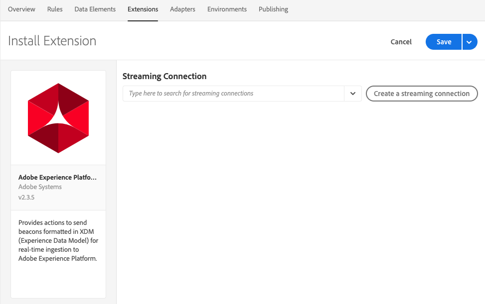
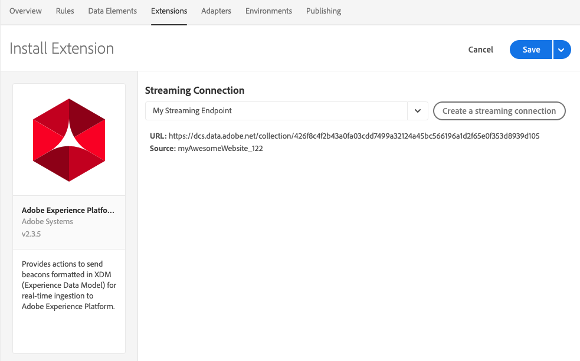
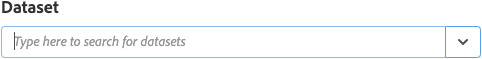
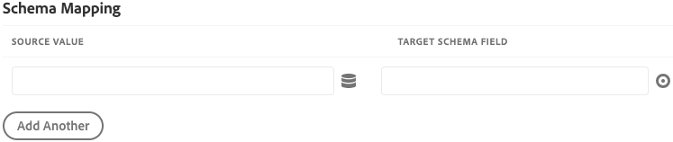
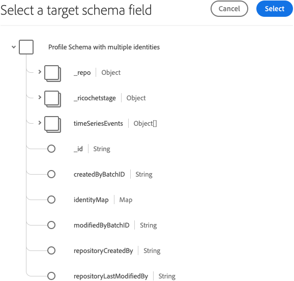
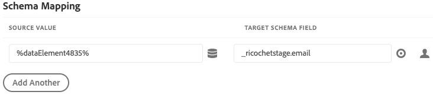
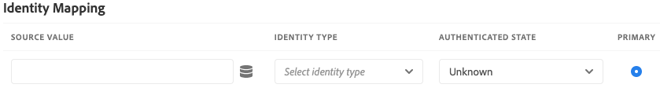
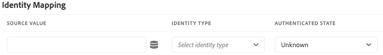

# Adobe Experience Platform Extension

Use this reference for information about configuring the Adobe Experience Platform extension, and the options available when using this extension to build a rule.

## Configure the Adobe Experience Platform extension

This section provides a reference for the options available when configuring the Adobe Experience Platform extension.

If the Adobe Experience Platform extension is not yet installed, open your property, then click Extensions &gt; Catalog, hover over the Adobe Experience Platform extension, and click Install.

To configure the extension, open the Extensions tab, hover over the extension, and then click Configure.

#### Streaming Connection

Choosing a streaming connection is the first step for you to start streaming data to Adobe Experience Platform. You can select one from the streaming connection combobox. Streaming connection is a required field. In case you don't have any streaming connection created, you can create one by clicking the **"Create a streaming connection"** button.

If you click on the **"Create a streaming connection"** button a modal window will appear.

The modal contains fields with pre-populated values that can be changed to suit your needs. If you plan to create more that one streaming connection, you should be aware that the **Data Source** field needs to be unique. Trying to create another streaming connection using a **Data Source** already used on another connection will fail.

Once you selected a streaming endpoint, you will the streaming endpoint URL and source.

## Adobe Experience Platform extension action types

This section describes the action types available in the Adobe Experience Platform extension.

The extension provides a [Send Beacon](adobe-experience-platform-extension.md#send-beacon) action type.

### Send Beacon

This is the action type you will use in order to send data to the Adobe Experience Platform.

You first need to select the dataset where the data will be stored. Generally, datasets represent a table that will store the data sent via the streaming connection. You need to create the datasets inside the Adobe Experience Platform before using this action type.

Once you select the dataset where the data will be stored, you will see details about the schema that is linked to the selected dataset.

#### Schema Mapping

After selecting the dataset you can define your schema mapping.

The source value field accepts a value or a data element. You can add a data element by clicking on the data element button that is located next to the source value field.

The target schema field contains the path of a XDM field defined in the dataset schema. For fields defined deeper in the schema hierarchy you can use the dot as a separator between the path parts  \(eg. timeSeriesEvents.eventType\).

#### Schema Field Selector

The extension offers also the possibility to select a target schema field using a visual selector. If you click on the target button that sits next to the target schema field input, a modal will be shown where you will see the dataset's schema tree. You can select a field, then click the Select button and the target schema field input will be updated the contain the correct XDM path.

#### Identity fields inside the Adobe Experience Platform

Record data schemas and time series data schemas may contain one or more identity fields. Identity fields stitch together to form a single identity representation of a subject and include information such as a CRM identifier, Experience Cloud ID \(ECID\), browser cookie, AdvertisingId, or other IDs in different domains.

Identity fields can be defined in two ways inside the schema:

1.  Record and Time Series schemas both contain a special field called **xdm:identityMap** that can contain a map of identities.
2. Key fields can be marked as "Identity" fields inside the schema.

#### Identity fields inside the Adobe Experience Platform Extension

For each schema field defined as an identity field, a row will be added to the schema mapping section. Each added row will contain the target schema field already filled in with its corresponding XDM schema path. You can recognize if a schema field is also an identity field if you see a profile icon near the field. 

The primary identity fields are always required, so you can not delete the rows containing them from the schema mapping section.

A schema field that is defined as a non-primary identity field, will be automatically added to the schema mapping section, but the source value input can remain empty. That field can be deleted. The field will get discarded if its corresponding source value input is empty. 

You will see a warning icon near each non-primary identity field that doesn't contain a value.

An identity section will be visible if your schema contains an **xdm:identityMap** field. You can use this section if you prefer to send data related to identities using the **xdm:identityMap**.

The identity mapping section can contain multiple rows. Each row can define a certain identity type. You can define the following attributes for an identity: type, authenticated state, primary and value.

If you have multiple identities inside the identity mapping section, only one identity can be marked as primary.

If you have a schema that has an **xdm:identityMap** field and at the same time another field is marked an a primary identity field, the primary column from inside the identity mapping section will not be visible.

#### Required fields

Some schemas will have top level required fields. The most commons ones are timestamp and \_id. Without defining these fields, the beacon will fail. You can defined them inside the schema mapping section.

If your schema mapping section won't contain timestamp or \_id, but the dataset schema requires them, the Adobe Experience Platform extension will send a beacon containing automatically generated values so that the beacon will not fail. The automatically generated values will be added to the beacon data only if you haven't defined those fields inside the schema mapping section.

