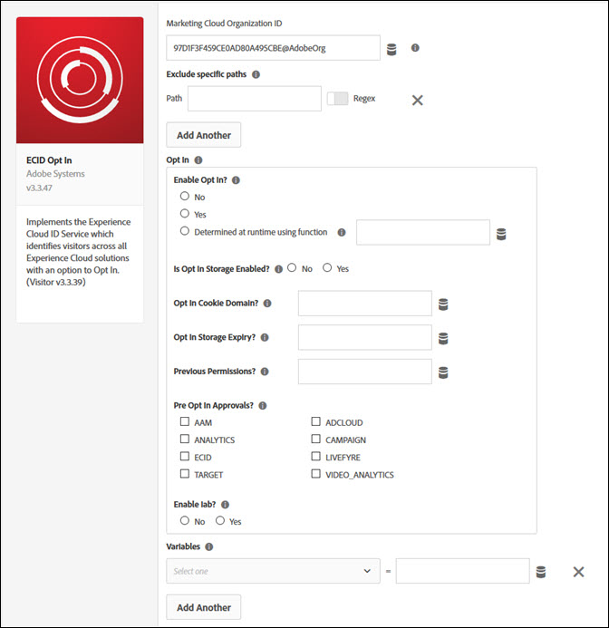

# ECID Opt In Extension

Use this reference for information about configuring the Experience Cloud ID extension, and the options available when using this extension to build a rule.

Use this extension to integrate the Experience Cloud ID Service with your property. With the Experience Cloud ID Service, you can create and store unique and persistent identifiers for your site visitors.

## Configure the Experience Cloud ID extension

This section provides a reference for the options available when configuring the Experience Cloud ID extension.

If the Experience Cloud ID extension is not yet installed, open your property, then click Extensions > Catalog, hover over the Experience Cloud ID extension, and click Install.

To configure the extension, open the Extensions tab, hover over the extension, and then click Configure.

The following configuration options are available:

### Experience Cloud Organization ID

The ID for your Experience Cloud Organization.

Your ID is a 24-character, alphanumeric string followed by @AdobeOrg. If you do not know this ID, contact Customer Care.

### Exclude specific paths

The Experience Cloud ID does not load if the URL matches any of the specified paths.

\(Optional\) Enable Regex if this is a regular expression.

Click Add to exclude another path.

### Opt In

Use the Opt-In options to determine whether or not to create cookies on a visitor's computer or device. If enabled, Opt-In waits for consent to track a visitor's activities on your website.

There are three options:

* **doesOptInApply=False:** Does not wait for consent to track the visitor
* **doesOptInApply=True:** Waits for consent to track the visitor
* **doesOptInApply=Callback:** Sets Opt-In to a function that resolves to a Boolean, after it does some calculations. If you select Callback, the Select Data Element field becomes available. Select the desired data element. For example, Opt-In can parse the website URL to see if it’s located in the EU. In this example, select a data element that contains your country.

### Variables

Set name-value pairs as Experience Cloud ID instance properties. Use the drop-down to select a variable, then type or select a value. For information about each variable, refer to the [Experience Cloud ID Service documentation](https://marketing.adobe.com/resources/help/en_US/mcvid/mcvid-overview.html).

## Experience Cloud ID extension action types

This section describes the action types available in the Experience Cloud ID extension.

### Action Types

#### Set Customer IDs

Set one or more customer IDs.

1. Enter the integration code.

   The integration code should contain the value set up as a data source in Audience Manager or Customer Attributes.

2. Select a value.

   The value should be a user ID. Data elements are most suitable for dynamic values like IDs from a client-specific internal system.

3. Select an authentication state.

   Available options are:

   * Unknown
   * Authenticated
   * Logged out

4. \(Optional\) Click Add to set more customer IDs.
5. Click Keep Changes.

