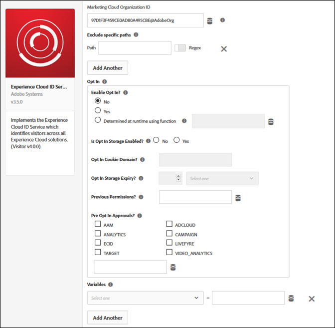

# Experience Cloud ID Service Extension

Use this reference for information about configuring the Experience Cloud ID extension, and the options available when using this extension to build a rule.

Use this extension to integrate the Experience Cloud ID Service with your property. With the Experience Cloud ID Service, you can create and store unique and persistent identifiers for your site visitors.

## Configure the Experience Cloud ID extension

This section provides a reference for the options available when configuring the Experience Cloud ID extension.

If the Experience Cloud ID extension is not yet installed, open your property, then click Extensions &gt; Catalog, hover over the Experience Cloud ID extension, and click Install.

To configure the extension, open the Extensions tab, hover over the extension, and then click Configure.

The following configuration options are available:

### Experience Cloud Organization ID

The ID for your Experience Cloud Organization.

Your ID is a 24-character, alphanumeric string followed by @AdobeOrg. If you do not know this ID, contact Customer Care.

### Exclude specific paths

The Experience Cloud ID does not load if the URL matches any of the specified paths.

\(Optional\) Enable Regex if this is a regular expression.

Click Add to exclude another path.

### Opt In

Use the Opt In options to determine whether to require visitors to opt in Adobe services on your site, including whether to create cookies that track visitor activity.

Opt In is the centralized point of reference for all Platform solution client-side libraries to determine if cookies can be created on a user's device or browser when visiting your site. Opt In does not provide support for either gathering or storing user consent preferences.

**Enable Opt In?**

The selected option determines whether your website waits for consent to track a visitor's activities on your website.

There are three options:

* **No:** Does not wait for consent to track the visitor. This is the default behavior if you do not select an option.
* **Yes:** Waits for consent to track the visitor.
* **Determined at runtime using function:** Programmatically determine whether the value is true or false at runtime. If you select this option, the Select Data Element field becomes available. Select a data element that can determine whether to wait for consent. This data element resolves to a boolean value. For example, you can select a data element that provides consent determined on whether the visitor's country is located in the EU.

**Is Opt In Storage Enabled?**

If enabled, consent is stored in a first-party cookie on your domain. If not enabled, consent settings are kept in your CMP or a cookie you manage.

**Opt In Cookie Domain?**

Use this optional setting to specify the domain where the Opt In cookie is stored if storage is enabled. You can enter a domain, or select a data element that contains the domain.

**Opt In Storage Expiry?**

Specify when the Opt In cookie expires if storage is enabled, in seconds.

 Enter a number, then select a unit of time from the dropdown list. For example, enter 2 and select Weeks. Default is 13 months.

**Permissions?**

Pass previous consent to the Opt In library. Select a data element that contains the consent. The element type must be an object or a JSON string. Overrides Pre Opt In Approvals.

Example:

`"{"aa":true,"aam":true,"ecid":true}"`

**Pre Opt In Approvals?**

Define which categories are approved or denied when no preference has been set by the visitor. Consent is assumed for the selected solutions from the time the page is loaded. The element type must be an object or a JSON string \(example: `{aam: true}`\).

### Variables

Set name-value pairs as Experience Cloud ID instance properties. Use the drop-down to select a variable, then type or select a value. For information about each variable, refer to the [Experience Cloud ID Service documentation](https://experiencecloud.adobe.com/resources/help/en_US/mcvid/mcvid-overview.html).

## Experience Cloud ID extension action types

This section describes the action types available in the Experience Cloud ID extension.

### Action Types

#### Set Customer IDs

Set one or more customer IDs.

1. Enter the integration code.

   The integration code should contain the value set up as a data source in Audience Manager or Customer Attributes.

2. Select a value.

   The value should be a user ID. Data elements are most suitable for dynamic values like IDs from a client-specific internal system.

3. Select an authentication state.

   Available options are:

   * Unknown
   * Authenticated
   * Logged out

4. \(Optional\) Click Add to set more customer IDs.
5. Click Keep Changes.

