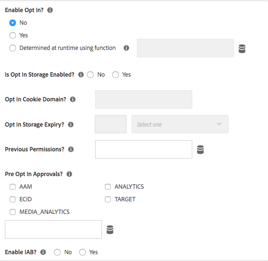
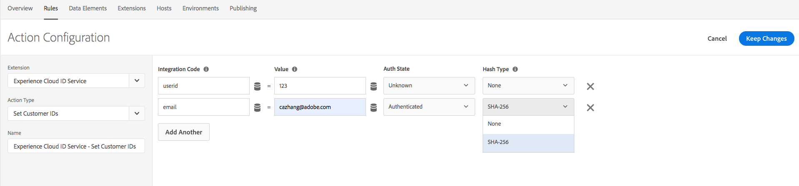
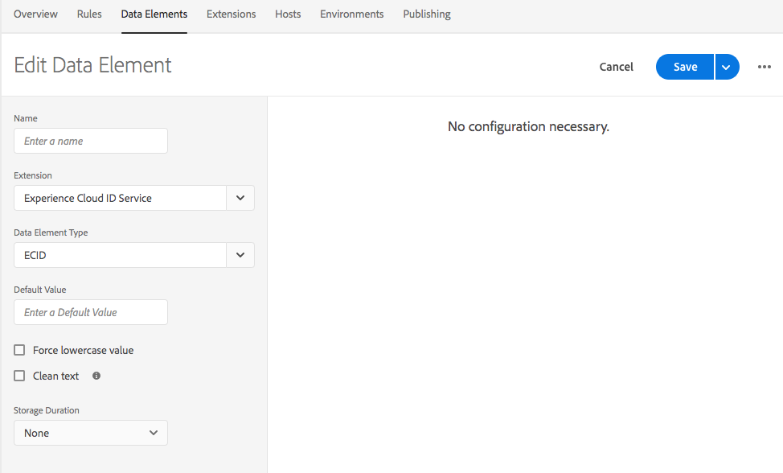
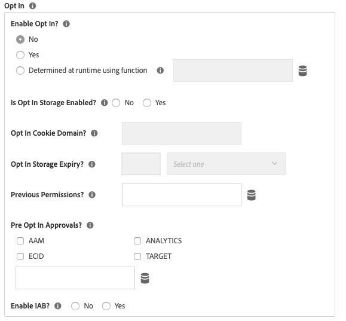

# Experience Cloud ID Release Notes

For release notes on the Experience Cloud ID Service itself and not just the Launch Extension, please reference: [https://marketing.adobe.com/resources/help/en\_US/mcvid/mcvid-release-notes.html](https://marketing.adobe.com/resources/help/en_US/mcvid/mcvid-release-notes.html)

## September 19, 2019

### Experience Cloud ID Extension 4.4.1

#### **Features**

* Updated visitor.js to 4.4.1
* Fixed a bug for get Opt-In preApprovals Input
* Renamed VIDEO_ANALYTICS to MEDIA_ANALYTICS in preOptInApprovals

  

## July 17, 2019

### Experience Cloud ID Extension 4.4.0

#### **Features**

* Updated visitor.js to 4.4.0
* Added SHA256 hashing support for setCustomerIDs

  

## May 13, 2019

### Experience Cloud ID Extension 4.3.1

#### **Features**

* Updated visitor.js to 4.3
* Added data element type for ECID as part of Launch Extension

  

## April 9, 2019

### Experience Cloud ID Extension 4.2.0

#### **Features**

* Updated visitor.js to 4.2 which included support for Audience Manager IAB TCF Plug-in

## February 25, 2019

### Experience Cloud ID Extension 4.1.0

#### **Features**

* Updated visitor.js to 4.1 which updated publishDestinations per new API change. With this update the referrer information of the page can be exposed during ID - sync if desired.

## February 15, 2019

### Experience Cloud ID Extension 4.0.0

#### **Features**

* Updated visitor.js to 4.0
* Added a configuration options for the new built-in Opt-In Object. Opti-In settings can be used to suppress cookie and beacon calls of Adobe Solutions to better support regulations such as GDPR

  

## March 20, 2018

### Experience Cloud ID Extension 3.1.0

#### **Features**

* Updated visitor.js to 3.1
* Adds two configuration properties: `resetBeforeVersion` and `serverState`

