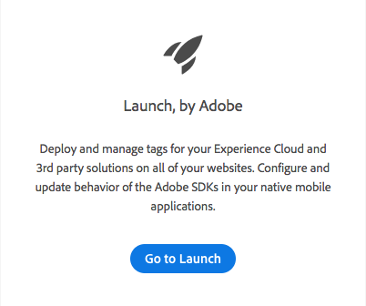

# Configure Launch

This lesson gets you familiar with some of the basic components within Launch–properties, adapters, environments, data elements, and rules.

### Objectives

At the end of this lesson, you will be able to:

* Log in to the Launch user interface
* Create a new Launch property
* Configure a Launch property

### Prerequisites 

To complete this lesson, you must have permission to Develop, Approve, Publish, Manage Extensions, and Manage Environments in Launch. If you are unable to complete any of these steps because any of the user interface options are not available to you, contact your Experience Cloud Administrator to request access.

### Go to Launch 

1. Log into the Experience Cloud.
2. Open the Solution Switcher .
3. Select **Activation** from the menu.

1.  Under **Launch, by Adobe**, click the **Go to Launch** button.

You should now see the Properties screen \(if no properties have ever been created in the account this screen might be empty\):

