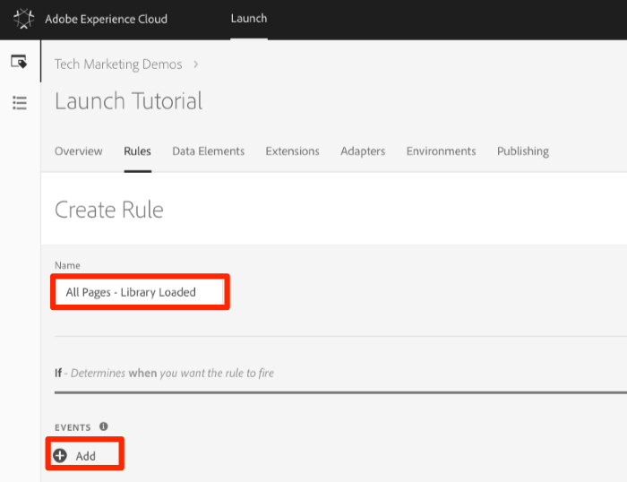
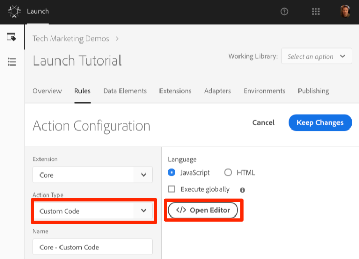
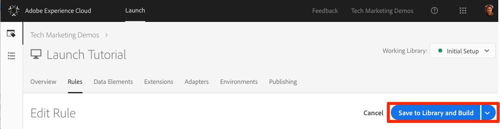

# Add a Data Element, a Rule, and a Library

This lesson introduces some of the main concepts of Launch:

* **Data elements:** Store the attributes you want to send to your marketing and advertising solutions
* **Rules:** Fire the requests to those solutions under the right conditions
* **Libraries:** JavaScript files that load on the page to do all of the work

Data elements and rules are the basic building blocks of Launch.

**Note:** New data element types have been added to Launch, which did not exist in DTM. Some of the new data element types include Local Storage, Session Storage, Page Info, and Random Number

This lesson uses all three of these items to make the sample page perform an action.

## Objectives

At the end of this lesson, you will be able to:

* Create a data element
* Create a rule
* Create a library
* Add changes to a library
* Validate that your library is loading in your web browser
* Use the Working Library feature to work more efficiently

## Create Data Element for Page Name

Data elements are Launch’s version of a data layer. They can store values from your own data layer object, cookies, local storage objects, query string parameters, page elements, meta tags, and so on.

**Note:** Data element capabilities can be extended with Extensions. For example, the ContextHub extension allows you to add data elements using features of the extension.

This exercise shows how to create a data element for Page Name, which will be used later in the Target and Analytics implementations.

1. In the top navigation, click **Data Elements**.  Because you haven’t created any data elements yet in this property, a brief video appears with additional information on this topic. Watch this video, if you like.
2. Click **Create New Data Element**.

   

3. Name the data element \(for example, "Page Name"\).
4. Use the JavaScript Variable Data Element type to point to a value in your sample page's data layer: `digitalData.page.pageInfo.pageName`.
5. Use `not available` as the Default Value. The Default Value tells Launch what value to use for the data element if your JavaScript Variable specified above is not found.
6. Check the boxes for **Force lowercase value** and **Clean text** to standardize the case and remove extraneous spaces.
7. Leave **None** as the **Storage Duration** setting, because this value is typically different on every page.
8. Save the data element.

## Create a Rule

Next, use the data element you created in a simple rule. Rules are one of the most powerful features in Launch. They tell specify what happens when a visitor interacts with your website. When the criteria outlined in your rules are met, the rule triggers the specified action.

Use the following steps to create a rule that outputs the Page Name data element value to the browser console.

1. In the top navigation, click **Rules**.  Because you haven’t created any rules yet in this property, a brief video appears with additional information on the topic. Watch this video, if you like.
2. Click **Create New Rule**.

   

3. Name the Rule \(for example, "All Pages - Library Loaded"\). This name uses a convention that indicates where and when the rule will fire, which makes it easier to identify and reuse as your Launch property matures.
4. Under Events, click **Add**.

   

   The Event tells Launch when the rule should fire and can be many things, including a page load, a click, a custom JavaScript event, and so on.

5. As the Event Type, select **Library Loaded \(Page Top\)**. When you select the Event Type, Launch pre-populates a name for the event using your selection. The default order for the event is 50. Ordering is a powerful feature in Launch that gives you precise control over the sequence of actions when multiple rules are triggered by the same event. This feature is used later in the tutorial.
6. Click **Keep Changes**.

   

7. To fire this rule on all pages, leave **Conditions** blank. If you open the Conditions modal, you will see that conditions can add both restrictions and exclusions based on a large variety of options, including URLs, data element values, date ranges, and more.
8. As the Action Type, select **custom code**. At this point, this is the only option. Later in the tutorial, as you add extensions, more options will become available.
9. Select **Open Editor**, then add the following to the code window:`console.log('The page name is '+_satellite.getVar('Page Name'));`

   

   

10. Save the code window.
11. On the Action configuration screen, click **Keep Changes**.
12. Save the rule.

### **Note for DTM Migrators**

In Launch, rules are required in order to fire most marketing pixels. For example, in order to fire the Adobe Analytics Beacon, we must use a Rule to instruct Launch to do so.The Rule builder has been dramatically redesigned and rebuilt in Launch. Some of the main changes are:

* There is just one Rule builder. DTM rule-types like "Page Bottom", "Click", and "Direct Call" are all just event-types in the Rule builder. This makes it much easier to update a rule should you need to change the trigger from, say, a DOM Ready event to a custom event.
* There is a new "Custom Code" event-type
* Extensions can add new event types to the Rule builder. For example, the Target extension could eventually add built-in support for its [at.js custom events](https://marketing.adobe.com/resources/help/en_US/target/ov2/r_target-atjs-notification.html), so custom code wouldn't be needed to use this feature.
* Extensions can add new actions to the Rule builder, reducing issues by deprecating reliance on custom code. You will be using many of these extension actions in this Tutorial.
* Rules are required to fire requests associated with most marketing tools. This will require a mindset adjustment, especially for things like setting Customer IDs, firing Analytics beacons, and firing the global mbox.

## **Save the rule to a library**

After configuring a collection of extensions, data elements, and rules in the Launch interface, you need to package these capabilities and logic into a set of JavaScript code that you can deploy on your website so marketing tags fire when visitors come to the site. A library is the set of JavaScript code that does this.

In an earlier lesson, you implemented the embed code of your development environment on the sample page. When you loaded the sample page a 404 error was returned for the embed code URL because a Launch library had not been built yet and assigned to the environment. In this tutorial, you will put your new data element and rule in a library so that your sample page can do something.

1. Go to the Publishing tab and click **Add New Library.**

   

2. Name the library "Initial Setup."
3. Select **Environment &gt; Development.**
4. Click **Add All Changed Resources.** Launch summarizes the changes you just made.
5. Click **Save & Build for Development**


After a few moments, the status turns green, indicating the library built successfully.


## Validate your rule

To validate that your rule is working as expected, reload your sample page. If you look at the **Developer Tools &gt; Network** tab, you should see a 200 response for your Launch Library.


You have created your first data element and rule, and built your first Launch library.

## Use the Working Library feature

When you are making a lot of changes in Launch, it is inconvenient to have to open the Publishing tab, add changes, and build the library each time you want to see the result. After you have created your Initial Setup library, you can use the Working Library feature to rapidly save your changes and rebuild the library in a single step.

1. Make a small change to the All Pages - Library Loaded rule.
2. In the top navigation, click **Rules** and then click on the All Pages - Library Loaded rule to open it.

   

3. On the Edit Rule page, click the **Select an option** dropdown to show the Working Library options. Select your Initial Setup library.

   

   After you select the library, the **Save** button defaults to **Save to Library and Build**. When you make a change in Launch, you can use this option to automatically add the change directly to your working library and rebuild it.

4. To test this feature, open your Custom Code action and add a colon after the text "The page name is" so the entire code block reads:

   ```text
   console.log('The page name is: '+_satellite.getVar('Page Name'));
   ```

5. Save the code, keep the changes in the action, and click **Save to Library and Build**.

   

6. Wait a moment until the green status reappears next to the Working Library dropdown, then reload your sample page.

   You should see your change reflected in the console message. \(You might need to clear your browser cache and reload to see the change to the page.

   

   This is a much faster way of working. The rest of the implementation tutorials use this approach.

