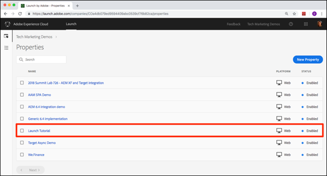

# Create a Property

A property is a container that you fill with extensions, rules, data elements, and libraries as you deploy tags to your site. A property can be any grouping of one or more domains and subdomains. You can manage and track these assets similarly. 

For example, suppose that you have multiple websites based on one template, and you want to track the same assets on all of them. You can apply one property to multiple domains. For more information on creating properties, read [Companies and Properties](../../launch-reference/administration/companies-and-properties.md) in the product documentation or watch the [Creating your first property](https://www.youtube.com/embed/Fb2pcbAYjIE) video.

1. Click **New Property.**
2. Name your property \(for example, “Launch Tutorial”\).
3.  As the domain, enter `enablementadobe.com`. This tutorial uses this property in conjunction with the We.Retail demo site, which is hosted on this domain.
4. Click **Save**.

Your new property should display on the Properties page.  If you check the box next to the property name, options to **Configure** or **Delete** the property appear above the property list. Click on the name of your property \(for example, “Launch Tutorial”\) to open the Overview screen.

