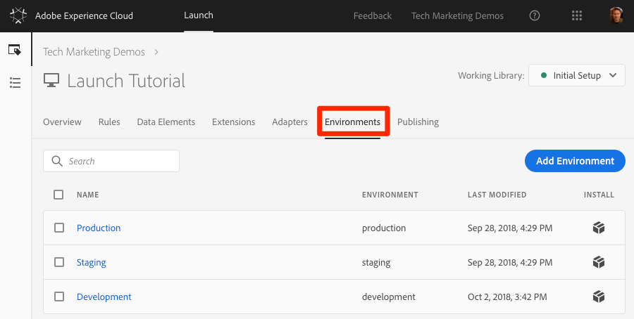
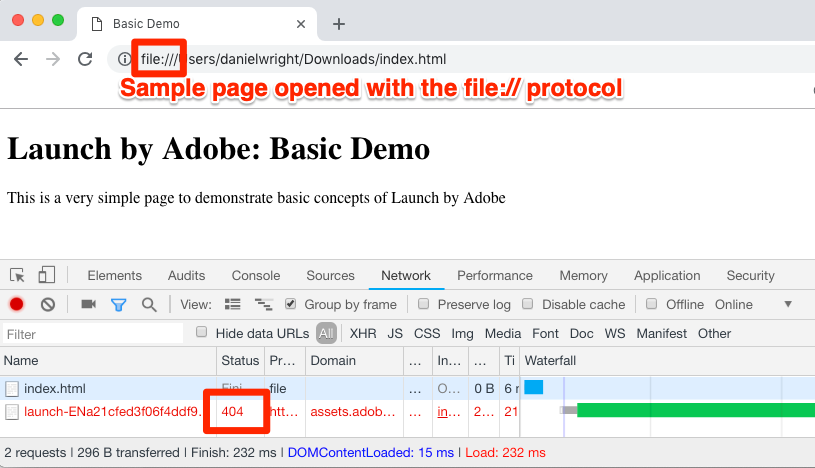

# Add the Launch Embed Code

This lesson introduces two of the main concepts of Launch:

* Environments
* Embed Codes

New properties are created with three environments:

* Development
* Staging
* Production

These environments correspond to the typical stages in the code development and release process. If desired, you can add additional Development environments, which is common on larger teams with multiple developers working on different projects at the same time.

The embed code is a `<script>` tag that you put on the pages of your site to load and execute the logic you build in Launch. If you load the library asynchronously, the browser continues to load the page, retrieves the Launch library, and executes it in parallel. In this case, there is only one embed code, which you put in the `<head>`.  When Launch is deployed synchronously, there are two embed codes, one which you put in the `<head>` and another which you put before the `</body>.`

This lesson shows how to implement the asynchronous embed code of your Launch property's Development environment.

## Objectives

At the end of this lesson, you will be able to:

* Obtain the embed code for your Launch property
* Understand the difference between a Development, Staging, and Production environment
* Add a Launch embed code to an HTML document
* Explain the optimal location of the Launch embed code in relation to other code in the `<head>` of an HTML document

## Copy the embed code

From the property Overview screen, click on the Environments tab to go to the environments page. Note that Development, Staging, and Production environments have already been created for you.



Development, Staging, and Production environments correspond to the typical environments in the code development and release process. Code is first written by developers in a Development environment. When they have completed their work, they send it to a Staging environment for QA and other teams to review. After the QA and other teams are satisfied, the code is published to the Production environment, which is the public-facing environment which your visitors experience when they come to your website.

Launch permits additional Development environments, which is useful in large organizations where multiple developers work on different projects at the same time.

These are the only environments needed to complete the tutorial. Environments allow you to have different working versions of your Launch libraries hosted at different URLs, so you can safely add new features and make them available to the right users \(such as developers, QA engineers, the public, and so on\) at the right time

1. In the Development row, click the **Install** icon to open the modal.

    Launch defaults to the asynchronous embed codes.

2. Click the copy icon to copy the installation code to your clipboard.
3. Click **Close** to close the modal.


### Implement the embed code in the `<head>` of the sample HTML page <a id="implement-the-install-code-in-the-head-of-the-sample-site"></a>

The embed code should be implemented in the `<head>` element of all HTML pages that share the property. You might have one or several template files that control the `<head>` globally across the site, making it a straightforward process to add Launch.

If you haven’t already, download [the sample HTML page](https://www.enablementadobe.com/multi/web/basic-sample.html). Right-click on this link and click **Save Link As**. Then, open the page in a code editor.

Replace the existing embed code on or around line 34 with the one on your clipboard and save the page. Next, open the page in a web browser. If you are loading the page using the file:// protocol, you need to add "https:" at the beginning of the embed code URL in your code editor. Lines 33-36 of your sample page might look something like this:

```text
    <!--Launch Header Embed Code: REPLACE LINE 39 WITH THE EMBED CODE FROM YOUR OWN DEVELOPMENT ENVIRONMENT-->
    <script src="https://assets.adobedtm.com/launch-ENa21cfed3f06f4ddf9690de8077b39e81-development.min.js" async></script>
    <!--/Launch Header Embed Code-->
```

Open your web browser’s developer tools and go to the Network tab. At this point, you should see a 404 error for the Launch environment URL:



The 404 error is expected because you haven't built a library in this Launch environment yet. You will do that in the next lesson. If you see a "failed" message instead of a 404 error, you probably forgot to add the `https://` protocol in the embed code. Again, you only need to specify the `https://` protocol if you are loading the sample page using the `file://` protocol. Make that change and reload the page until the 404 error appears.

### Launch implementation best practices

 Review some of the Launch implementation best practices that are demonstrated in the sample page:

* **Data Layer**:
  * Adobe _strongly_ recommends creating a digital data layer on your site, containing all of the attributes needed to populate variables in Analytics, Target, and other marketing solutions. This sample page only contains a very simple data layer, but a real data layer might contain many more details about the page, the visitor, their shopping cart details, etc. For more info on data layers, see [Customer Experience Digital Data Layer 1.0](https://www.w3.org/2013/12/ceddl-201312.pdf).
  * To maximize what you can do in Target, Customer Attributes, and Analytics,

    define your data layer before the Launch install code, in order.
* **JavaScript helper libraries**: If you already have a library like JQuery implemented in the `<head>` of your pages, load it before Launch in order to leverage its syntax in Launch and Target.
* **HTML5 doctype**: The HTML5 doctype is required for Target implementations.
* **preconnect and dns-prefetch**: Use preconnect and dns-prefetch to improve the page load time. See also: [https://w3c.github.io/resource-hints/](https://w3c.github.io/resource-hints/).
* **Pre-hiding snippet for asynchronous Target implementations**: To manage content flicker when Target is deployed via asynchronous Launch embed codes, you should hardcode a pre-hiding snippet on your pages before the Launch embed codes. Thi sis discussed in the Target tutorial.

Here is a summary what these best practices look like in the suggested order. Placeholders are in ALL CAPS for account specific details:

```html
<!doctype html>
<html lang="en">
<head>
    <title>Basic Demo</title>
    <!--Preconnect and DNS-Prefetch to improve page load time. REPLACE "techmarketingdemos" WITH YOUR OWN AAM PARTNER ID, TARGET CLIENT CODE, AND ANALYTICS TRACKING SERVER-->
    <link rel="preconnect" href="//dpm.demdex.net">
    <link rel="preconnect" href="//fast.techmarketingdemos.demdex.net">
    <link rel="preconnect" href="//techmarketingdemos.demdex.net">
    <link rel="preconnect" href="//cm.everesttech.net">
    <link rel="preconnect" href="//techmarketingdemos.tt.omtrdc.net">
    <link rel="preconnect" href="//techmarketingdemos.sc.omtrdc.net">
    <link rel="dns-prefetch" href="//dpm.demdex.net">
    <link rel="dns-prefetch" href="//fast.techmarketingdemos.demdex.net">
    <link rel="dns-prefetch" href="//techmarketingdemos.demdex.net">
    <link rel="dns-prefetch" href="//cm.everesttech.net">
    <link rel="dns-prefetch" href="//techmarketingdemos.tt.omtrdc.net">
    <link rel="dns-prefetch" href="//techmarketingdemos.sc.omtrdc.net">
    <!--/Preconnect and DNS-Prefetch-->
    <!--Data Layer to enable rich data collection and targeting-->
    <script>
    var digitalData = {
        "page": {
            "pageInfo" : {
                "pageName": "Home"
                }
            }
    };
    </script>
    <!--/Data Layer-->
    <!--jQuery or other helper libraries-->
    <script src="https://code.jquery.com/jquery-3.3.1.min.js"></script>
    <!--/jQuery-->
    <!--prehiding snippet for Adobe Target with asynchronous Launch deployment-->
    <script>
        (function(g,b,d,f){(function(a,c,d){if(a){var e=b.createElement("style");e.id=c;e.innerHTML=d;a.appendChild(e)}})(b.getElementsByTagName("head")[0],"at-body-style",d);setTimeout(function(){var a=b.getElementsByTagName("head")[0];if(a){var c=b.getElementById("at-body-style");c&&a.removeChild(c)}},f)})(window,document,"body {opacity: 0 !important}",3E3);
    </script>
    <!--/prehiding snippet for Adobe Target with asynchronous Launch deployment-->
    <!--Launch Header Embed Code: REPLACE LINE 39 WITH THE INSTALL CODE FROM YOUR OWN DEVELOPMENT ENVIRONMENT-->
    <script src="//assets.adobedtm.com/launch-EN93497c30fdf0424eb678d5f4ffac66dc.min.js" async></script>
    <!--/Launch Header Embed Code-->
</head>
<body>
    <h1>Launch by Adobe: Basic Demo</h1>
    <p>This is a very simple page to demonstrate basic concepts of Launch by Adobe</p>
</body>
</html>
```
