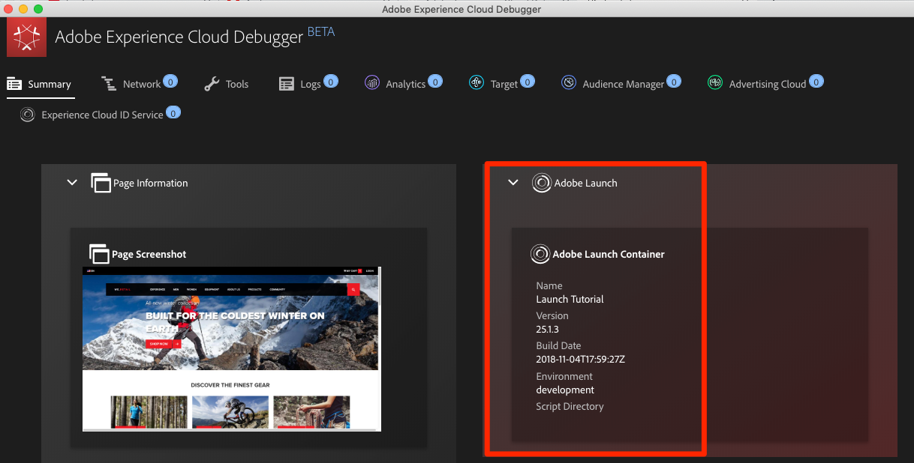

# Switch Environments with the Experience Cloud Debugger

This tutorial shows how to use the [Adobe Experience Cloud Debugger extension](https://chrome.google.com/webstore/detail/adobe-experience-cloud-de/ocdmogmohccmeicdhlhhgepeaijenapj) to replace the Launch property hardcoded on the [We.Retail demo site](https://aem.enablementadobe.com/content/we-retail/us/en.html) with your own property.

This technique is called environment switching. It will be helpful later, when you work with Launch on your own website. You can load your production website in your browser, but with your development Launch environment. This enables you to confidently make and validate Launch changes independently from your regular code releases. This separation of marketing tag releases from your regular code releases is one of the more common reasons why people use Launch.

## Objectives

At the end of this lesson, you will be able to:

* Use the Debugger to load an alternate Launch environment
* Use the Debugger to validate that you have loaded an alternate Launch environment

## Get the URL of your Development Environment

1.  In your Launch property, open the Environments page.
2. In the **Development** row, click the **Install** icon to open the modal.
3. Click **Copy** to copy the embed code to your clipboard.
4. Click **Close** to close the modal.

## Replace the Launch URL on the We.Retail demo site

Open the [We.Retail demo site](https://aem100-us.adobevlab.com/content/we-retail/us/en.html) in your Chrome browser, then open the [Experience Cloud Debugger extension](https://chrome.google.com/webstore/detail/adobe-experience-cloud-de/ocdmogmohccmeicdhlhhgepeaijenapj) by clicking the  icon.

Note that the currently implemented Launch property is shown on the Summary tab.

Open the Tools tab, then click **Adobe Launch &gt; Dynamically Insert Launch &gt; Embed Code** to open the text input field:

Make sure the Chrome tab with the We.Retail site is in focus behind the Debugger \(not the tab with this tutorial or the tab with the Launch interface\), then paste the embed code from your clipboard. Click the disk icon to save.

Reload the site and check the Summary tab of the Debugger. Under the Launch section, you should see that your Development Property is being used.  Confirm that the Name of the property matches yours and that the Environment says "development."

**Note:**  The Debugger saves this configuration and replaces the Launch embed codes whenever you come back to the We.Retail site. It does not impact other sites you visit in other open tabs. To stop the Debugger from replacing the embed code, click the X next to the embed code in the Tools tab of the Debugger.

Use this technique of mapping the We.Retail site to your own Launch property to validate your Launch implementation. When you start using Launch on your production website, you can use this same technique to validate changes you make to your Development and Staging environments before you publish them to Production.
