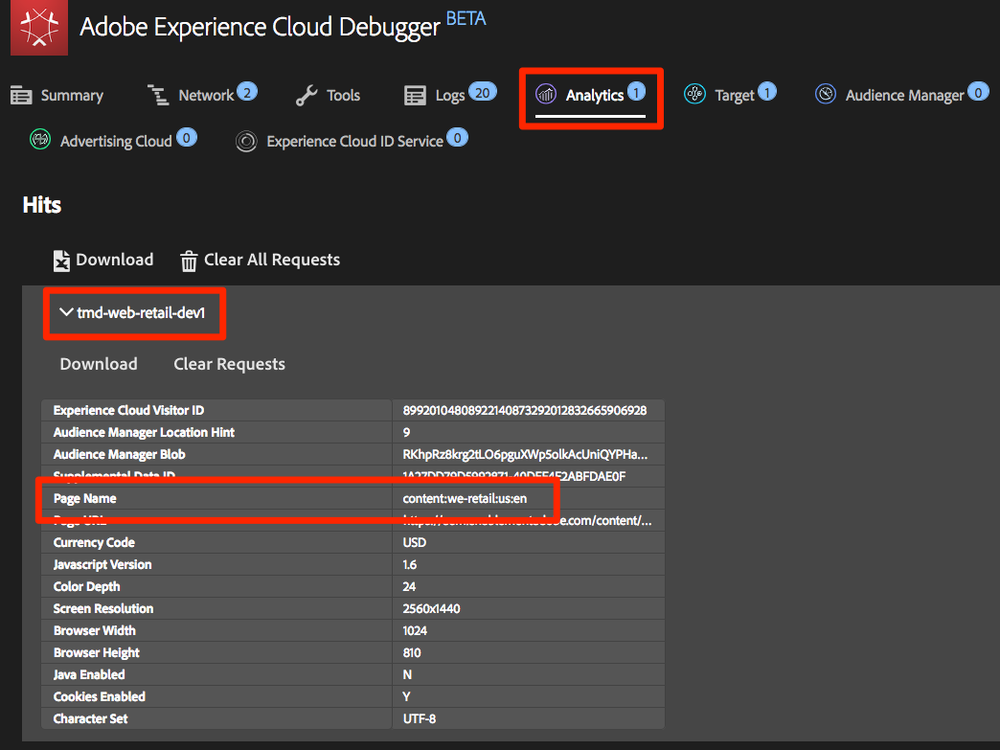
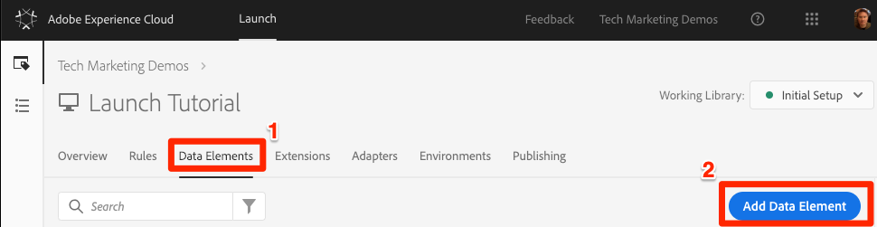
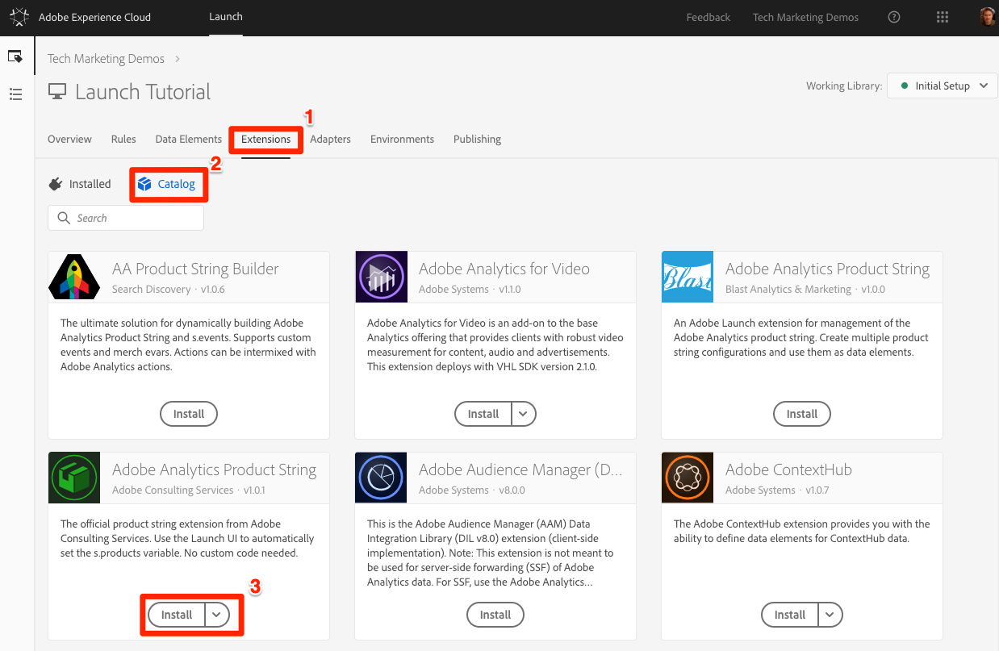
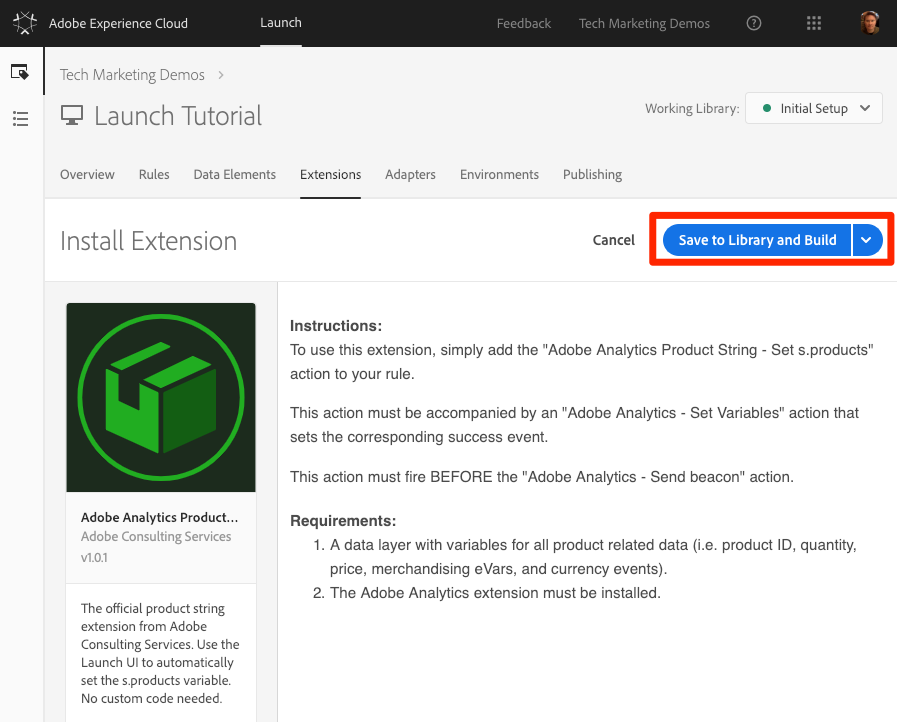
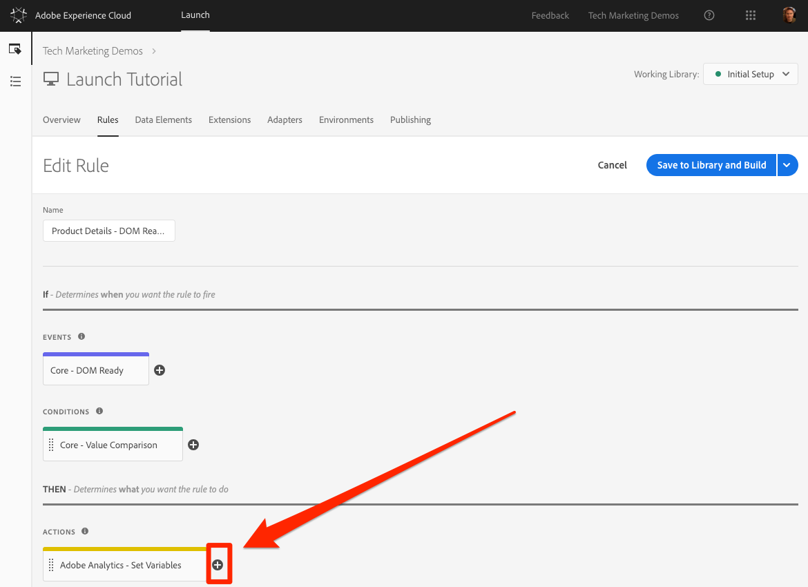
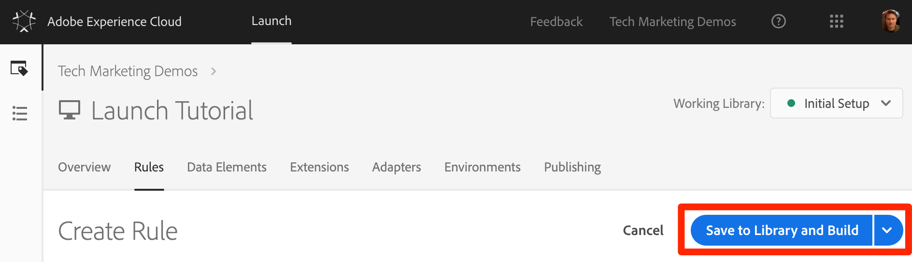

# Add Adobe Analytics

This tutorial implements the [Adobe Analytics extension](https://docs.adobelaunch.com/extension-reference/web/adobe-analytics-extension) and creates rules to send data to Adobe Analytics. [Adobe Analytics](https://marketing.adobe.com/resources/help/en_US/reference/) is an industry-leading solution that empowers you to understand your customers as people and steer your business with customer intelligence.

## Objectives

At the end of this lesson, you will be able to:

* Add the Adobe Analytics extension
* Set global variables using the extension
* Add the page view beacon
* Add additional variables using rules
* Add click-tracking and other event-based beacons
* Add Analytics plugins

There are many things that could be implemented for Analytics in Launch. This tutoroal is not exhaustive, but should give you a solid overview of the main techniques you need for implementing Analytics on your own site.

## Prerequisites  

You should have already completed the tutorials in Configure Launch and Add the ID Service. Additionally, you need at least one report suite ID and your tracking server. If you don't have a test/dev report suite that you can use for this tutorial, create one. If you are unsure how to do that, see [the documentation](https://marketing.adobe.com/resources/help/en_US/reference/new_report_suite.html). You can retrieve your tracking server from your current implementation, Adobe Consultant or Customer Care representative.

## Add the Analytics Extension

The Analytics extension consists of two main parts:

* The extension configuration, which manages the core AppMeasurement.js library settings and can set global variables
* Rule actions to do the following:
  * Set Variables
  * Clear Variables
  * Send the Analytics Beacon

1. Go to **Extensions &gt; Catalog** and locate the Adobe Analytics extension.
2. Click **Install**.
3. Under **Library Management &gt; Report Suites**, enter the report suite IDs you want to use with each Launch environment. In this tutorial, you can use one report suite for all environments, but in production you would want to use separate report suites, as shown in the image below:   **Note:** Use the **Manage the library for me** option as the Library Management setting. This makes it much easier to keep the core AppMeasurement.js code up-to-date.
4. Under **General &gt; Tracking Server**, enter your tracking server \(for example, `tmd.sc.omtrdc.net`\). Enter your SSL Tracking Server if your site supports `https://`.  
5.  In the Global Variables section, set the Page Name variable using your Page Name data element. Click the **Data Element** icon to open the modal and choose the page Page Name data element.
6. Click **Save to Library and Build**.

**Note:** Global variables can be set in the extension configuration or in rule actions. Be aware that when setting variables with the extension configuration, the data layer must be defined before the Launch embed codes.

## Send the Page View beacon

Next, create a rule to fire the Analytics beacon, which sends the Page Name variable set in the extension configuration.

You have already created an "All Pages - Library Loaded" rule in the Add a Data Element, a Rule and a Library tutorial, which is triggered on every page when the Launch library loads. You could use this rule for Analytics as well. However, this setup requires all data layer attributes used in the Analytics beacon to be defined before the Launch embed codes. To allow more flexibility with the data collection, create a new "all pages" rule triggered on DOM Ready to fire the Analytics beacon.

1. Go to the **Rules** in the top navigation and then click **Add Rule**.
2. Name the rule All Pages - DOM Ready.
3. Click **Events &gt; Add** to open the Event Configuration screen.
4. Select **Event Type &gt; DOM Ready**. Note that the order of the rule is "50."
5. Click **Keep Changes**.
6. Under **Actions**, click the **Add** icon to add a new action. 
7. Select **Extension &gt; Adobe Analytics**.
8. Select **Action Type &gt; Send Beacon**.
9. Leave Tracking set to `s.t()`.  **Note:** If you wanted to make an `s.tl()` call in a click-event rule, you could do that using the Send Beacon action as well.
10. Click **Keep Changes**.
11. Click **Save to Library and Build**.

### Validate the Page View beacon

After you have created a rule to send an Analytics beacon, you should be able to see the request in the Experience Cloud Debugger.

1. Open the [We.Retail site](https://aem.enablementadobe.com/content/we-retail/us/en.html) in your Chrome browser.
2. Click the Debugger icon  to open the **Adobe Experience Cloud Debugger**.
3. Make sure the Debugger is mapping the Launch property to your Development environment, as described in the earlier lesson. 
4. Open the Analytics tab, then expand your Report Suite name to show all of the requests made to it.
5. Confirm the request has fired with the Page Name variable and value.

**Note:** If the Page Name is not showing up for you, go back through the steps in this page to make sure that you haven't missed anything.

## Add Variables with Rules

When you configured the Analytics Extension, you populated the `pageName` variable in the extension configuration. This is a fine location to populate other global variables such as eVars and props, provided the value is available on the page before the Launch embed code loads.

A more flexible location to set variables, as well as events, is in rules using the Set Variables action. Rules allow you to set different Analytics variables and events under different conditions. For example, you could set the `prodView` only on product detail pages and the purchase event only on order confirmation pages. This section shows you how to set variables using rules.

### Use Case

Product Detail Pages \(PDP\) are important points for data collection on retail sites. Typically, you want Analytics to register that a product view occurred and which product was viewed. This is helpful in understanding which products are popular with your customers. On a media site, article or video pages could use similar tracking techniques to the ones demonstrated in this section. When you load a Product Detail Page, you might want to put that value into a Page Type eVar, as well as set some events and the product id. This allows us to see the following in our analysis:

1. How many times product detail pages are loaded?
2. Which specific products are viewed and how many times?
3. How other factors \(campaigns, search, etc\) affect how many PDP's people load?

### Create Data Element for Page Type

First, you need to identify which pages are the Product Detail pages. You do that with a Data Element.

1. Click **Data Elements** in the top navigation.
2. Click **Add Data Element**. ****
3. Name the data element Page Type.
4. Select **Data Element Type &gt; JavaScript Variable**.
5. Use digitalData.page.category.type as the Path to Variable.
6. Check the Clean Text and Force Lower Case options.
7. Click **Save to Library and Build**.

### Create Data Element for Product ID

Next, collect the product ID of the current Product Detail page with a Data Element.

1. Click **Data Elements** in the top navigation, then click **Add Data Element**. 
2. Name the data element "Product ID."
3. Select **Data Element Type &gt; JavaScript Variable**.
4. Use digitalData.product.0.productInfo.sku as the Path to Variable.
5. Check the Force Lowercase Value option.
6. Check the Clean Text option.
7. Click **Save to Library and Build**.

### Add the Adobe Analytics Product String Extension

If you are familiar with Adobe Analytics implementations, you are probably already familiar with the [products variable](https://marketing.adobe.com/resources/help/en_US/sc/implement/products.html) . The products variable has a specific syntax and gets used in slightly different ways depending on the context. To help make the population of the products variable easier in Launch, three additional extensions have been created in the Launch extension marketplace. 

In this section you will add an extension created by Adobe Consulting for use on the Product Detail page.

1. Go to the Extensions &gt; Catalog page.
2. Find the Adobe Analytics Product String extension by Adobe Consulting Services and click **Install**. **** 
3. Take a moment to read the instructions.
4. Click **Save to Library and Build**. ****

### Create the Rule for Product Detail Pages

Use your new data elements and extension to build your Product Detail page rule. For this functionality, create another page load rule, triggered by DOM Ready. Use a condition so it only fires on the Product Detail pages, and the order setting so it fires before the rule that sends the beacon.

#### Set the event type and order

1. Go to the **Rules** section in the top navigation, click **Add Rule**, then name the rule "Product Details - DOM Ready."
2. Click **Events &gt; Add** to open the Event Configuration screen. 
3. Select **Event Type &gt; DOM Ready**.
4. Set the **Order** to 40, so that the rule will run before the rule containing the Analytics &gt; Send Beacon action.  ****
5. Click **Keep Changes**.

#### Set the conditions

1. Under **Conditions**, click the Plus icon to open the Condition Configuration screen.
2. Select **Condition Type &gt; Value Comparison**.
3. Use the data element picker, choose Page Type in the first field.
4. Select **Contains** from the comparison operator drop down.
5. In the next field, type product-page. This is the unique part of the page type value pulled from the data layer on PDPs.
6. Click **Keep Changes**.

#### Add an action

1. Under Actions, click the **Add** icon to add a new action.
2. Select **Extension &gt; Adobe Analytics**.
3. Select **Action Type &gt; Set Variables**.
4. Set **eVar1** as product detail page.
5. Set **event1**, leaving the optional values blank.

#### Add another event

1. Under Events, click **Add Another**.
2. Set the **prodView** event, leaving the optional values blank.
3. Click **Keep Changes**.

#### Add another action and save the rule

1. Under Actions, click the Add icon to add a new action. 
2. Select **Extension &gt; Adobe Analytics Product String**.
3. Select **Action Type &gt; Set s.products**.
4. Select **Action Type &gt; Set Variables**.
5. In the **Analytics E-commerce Event** section, select **prodView**.
6. In the **Data layer variables for product data** section, use the Data Element picker to choose the Product Id data element.
7. Click **Keep Changes**.
8. Click **Save to Library and Build**. ****

### Validate the Product Detail Page Data

In the previous section, you created a rule that sets variables before the beacon is sent. You should now be able to see the data going out in the hit in the Experience Cloud Debugger.

1. Open the [We.Retail site](https://aem.enablementadobe.com/content/we-retail/us/en.html) in your Chrome browser.
2. Navigate to any product detail page.
3. Click the Debugger icon to open Adobe Experience Cloud Debugger.
4. Open the Analytics tab.
5. Expand your report suite. Notice the Product Detail Variables that are now in the debugger, namely that eVar1 has been set to "product detail page," that the Events variable has been set to "event1" and "prodView," that the products variable is set with the product ID of the product you are viewing, and that your Page Name is still set by the Analytics extension.


## Send a Track Link beacon

When a page loads, you typically fire a page load beacon triggered by the s.t\(\) function. This automatically increments a page view metric for the page listed in the pageName variable.

However, sometimes you don't want to increment page views on your site, because the action that is taking place is smaller, or maybe just different, than a page view. In this case, use the s.tl\(\) function, which is commonly referred to as a _track link_ request. Even though it is referred to as a track link request, it doesn't have to be triggered on a link click. It can be triggered by any of the events that are available to you in the Launch rule builder, including your own custom JavaScript.

This tutorial shows how to trigger an s.tl\(\) call using an "Enters Viewport" JavaScript event.

### The Use Case

You want to know if people are scrolling far enough down on the We.Retail home page to see the New Arrivals section of the page. Some people in the company disagree about whether people are seeing that section, so you want to use Analytics to determine the truth.

#### Create the rule and add an event

1. Select **Rules** from the top navigation and click **Add Rule**.
2. Name the rule "Homepage - New Arrivals enters Viewport."
3. Click **Events &gt; Add** to open the Event Configuration screen.
4. Select **Event Type &gt; Enters Viewport**.  This brings up a field where you enter the CSS selector that identifies the item on your page that should trigger the rule when becomes visible in the browser.
5. Go back to the home page of We.Retail and scroll down to the New Arrivals section.
6. Right-click on the space between the "NEW ARRIVALS" title and the items in this section, and select Inspect from the right-click menu.  This is near the section you want to be visible..
7. In that area of the page, possibly right below the selected section, locate the &lt;div&gt; element with class="we-productgrid aem-GridColumn aem-GridColumn--default--12." 
8. Right-click on this element and select **Copy &gt; Copy Selector**
9. Go back to Launch and paste this value from the clipboard into the field labeled **Elements** matching the CSS selector. It is up to you to decide how to identify CSS selectors. This method requires care, because certain changes on the page can break this selector. Consider this when using any CSS selectors in Launch.
10. Click **Keep Changes**.

**Create a condition**

1. Under Conditions, click the **Add** icon to add a new condition.
2. Select **Condition Type &gt; Value Comparison**
3. Use the data element picker to choose Page Name in the first field.
4. Select **Equals** from the comparison operator dropdown, then type "content:we-retail:us:en" in the next field. This is the page name of the home page as pulled from the data layer. This rule runs only on the home page.
5. Click **Keep Changes**.

#### Create an action

1. Under Actions, click the **Add** icon to add a new action.
2. Select **Extension &gt; Adobe Analytics**.
3. Select **Action Type &gt; Set Variables**.
4. Set eVar3 to Home Page - New Arrivals.
5. Set prop3 to Home Page - New Arrivals.
6. Set the Events variable to event3.
7. Click **Keep Changes**.

#### Create another action and save the rule

1. Under Actions, click the **Add** icon to add another new action. 
2. Select **Extension &gt; Adobe Analytics**.
3. Select **Action Type &gt; Send Beacon**.
4. Choose the **s.tl\(\)** tracking option.
5. In the **Link Name** field, enter Scrolled down to New Arrivals.  This value will be included in the Custom Links report in Analytics.
6. Click **Keep Changes**.
7. Click **Save to Library and Build**.

### Validate the Track Link beacon

Make sure that this hit occurs when you scroll down to the New Arrivals section of the home page of the site. When you first load the home page the request shouldn't be made, but after you scroll down and the section comes into view, the hit should fire with the specified values.

1. Open the [We.Retail site](https://aem.enablementadobe.com/content/we-retail/us/en.html) in your Chrome browser, make sure you are at the top of the home page, then click the Debugger icon to open the Adobe Experience Cloud Debugger.
2. Open the Analytics tab and expand the hit for your report suite. Notice the normal page view hit for the home page with the page name and other elements, but nothing in eVar3 or prop3. 
3. With the Debugger open, scroll down on your site until you can see the New Arrivals section.
4. View the Debugger again. Another Analytics hit should appear. This hit should have the parameters associated with the s.tl\(\) hit that you set up, namely:
   * LinkType = "link\_o"  This means that the hit is a custom link hit, not a page view hit.
   * LinkName = "Scrolled down to New Items"
   * prop3 = "Home Page - New Arrivals"
   * eVar3 = "Home Page - New Arrivals"
   * Events = "event3"


## Add a plug-in

A plug-in is a piece of JavaScript code that you can add to your implementation to perform a function that is not built into the product. Plug-ins can be built by you, by other Adobe Customers or Partners, or by Adobe Consulting.

To implement plug-ins, there are three steps:

1. Include the doPlugins function, where the plug-in is referenced.
2. Add the main function code for the plug-in.
3. Include the code that calls the function and sets variables, etc.

### Make the Analytics object globally accessible

If you are going to add the doPlugins function \(below\) and use plug-ins, you need to check a box to make the Analytics "s" object available globally in the Analytics implementation.

1. Go to **Extensions &gt; Installed**.
2. In the Adobe Analytics extension, Click **Configure**. ****
3. Under **Library Management**, select the box labeled **Make tracker globally accessible**.  As you can see in the help bubble, this causes the tracker to be scoped globally under window.s, which is important when you refer to it in your customer JavaScript.

### Including the doPlugins function

To add plug-ins, you need to add a function called doPlugins. This function is not added by default, but once added, is handled by the AppMeasurement library. It is called last when a hit is sent to Adobe Analytics. Therefore, you can use this function to run some JavaScript to set variables that are easier set this way.

1. While still in the Analytics extension, scroll down and expand the section titled Configure Tracking Using Custom Code.
2. Click **Open Editor**.
3. Paste the following code into the code editor:

   ```text
   /* Plugin Config */
   s.usePlugins=true
   s.doPlugins=function(s) {
   /* Add calls to plugins here */
   }
   ```

4. Keep this window open for the next step.

### Add Function Code for the Plug-in

The function code calls two plug-ins, but one of them is built into the AppMeasurement library, so you do not need to add the function to call that one. However, for the second one, you need to add the function code. This function is called getValOnce\(\).

The purpose of this plug-in is to keep values from being falsely duplicated in the code when a visitor refreshes a page or uses the browser's back button to go back to a page where a value was set. This tutorial uses it to keep the clickthrough event from being duplicated.

The code for this plug-in is available in the [Analytics Documentation](https://marketing.adobe.com/resources/help/en_US/sc/implement/getValOnce.html) , but it is included here for your ease of copy/paste.

1. Copy the following code

   ```text
   /*
   * Plugin: getValOnce_v1.11
   */
   s.getValOnce=new Function("v","c","e","t",""
   +"var s=this,a=new Date,v=v?v:'',c=c?c:'s_gvo',e=e?e:0,i=t=='m'?6000"
   +"0:86400000,k=s.c_r(c);if(v){a.setTime(a.getTime()+e*i);s.c_w(c,v,e"
   +"==0?0:a);}return v==k?'':v");
   ```

2. Paste it into the code window in the Analytics extension, **completely below** the doPlugins function \(not inside of it\).  
   If you don't still have extension open, re-open it as per the previous step.

   

You can now call this plug-in from within doPlugins.

### Calling Plug-ins from Within doPlugins

Now that the code is in place and can be referenced, you can make the calls to plug-ins within the doPlugins function.

First, call a plug-in which has been incorporated into the AppMeasurement library, and so is known as a "utility." It is referred to as s.Util.getQueryParam, because it is part of the s object, is a built-in utility, and will grab values based on a parameter from the query string in the URL.

1. Copy the following code:

   ```text
   s.campaign = s.Util.getQueryParam("cid");
   ```

2. Paste the code into the doPlugins function.  This looks for a parameter called `cid`in the current page URL and places it into the s.campaign variable.
3. Call the getValOnce function by copying the following code and pasting it in right below the call to getQueryParam:

   ```text
   s.campaign=s.getValOnce(s.campaign,'s_cmp',30);
   ```

   This code makes sure that the same value is not sent in more than once in a row for 30 days. See the documentation for ways to customize this code to your needs.

4. Save the code window.
5. Click **Save to Library and Build**.

### Validate the plug-ins

 Make sure that the plug-ins are working.

1. Open the [We.Retail site](https://aem.enablementadobe.com/content/we-retail/us/en.html) in your Chrome browser, then click the Debugger icon to open the **Adobe Experience Cloud Debugger**.
2. Click to the Analytics tab and expand your report suite. Notice the Analytics hit does not have a Campaign variable
3. Leaving the Debugger open, go back to the We.Retail site and add ?cid=1234 to the URL, then press **Enter** to refresh the page with that query string included. 
4. Check the Debugger and confirm that there is a second Analytics request with a Campaign variable set to 1234. 
5. Go back and refresh the We.Retail page again, with the query string still in the URL.
6. Check the next hit in the Debugger.  The Campaign variable should **not** be present, because the getValOnce plug-in has made sure that it isn't duplicated to look like another person came in from the campaign tracking code.

### Rule Validation: Product, Cart, and Checkout flow


You can test this over and over by changing the value of the cid parameter in the query string. The Campaign variable should only be there if it is the **first** time you run the page with the value. If you are not seeing the Campaign value in the debugger, simply change the value of the cid in the query string of the URL and press **Enter** to see it again in the debugger. There are actually a few different ways to fetch a parameter out of the query string of the URL, including in the Analytics extension configuration. However, in these other non-plug-in options, they don't provide the ability to stop unnecessary duplication, as you have done here with the getValOnce plug-in. This is a common method, but you should determine which method works best for you and your needs.

You have completed the Analytics tutorials. Of course, there are many other things that you can do to enhance your Analytics implementation, but these tutorials have demonstrated some of the core skills needed to implement Analytics.

