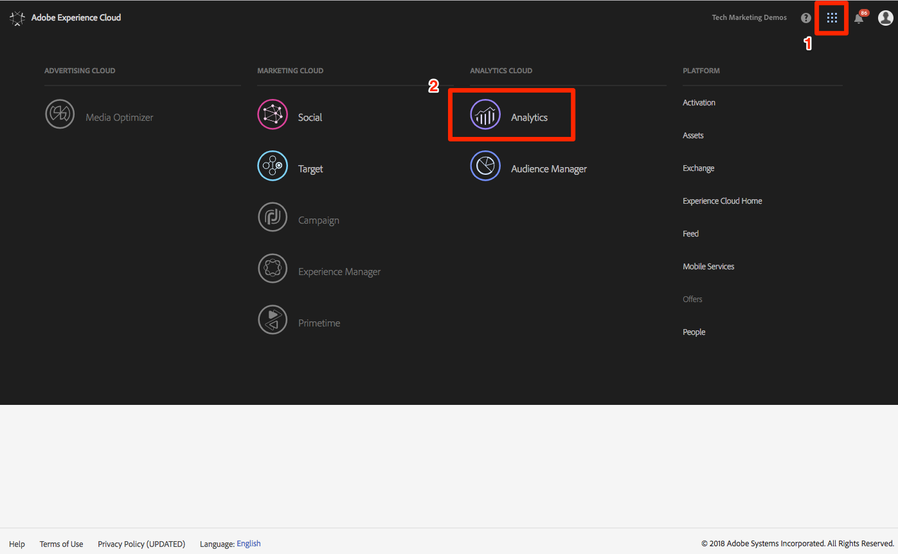
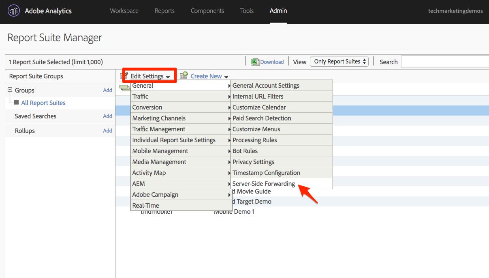
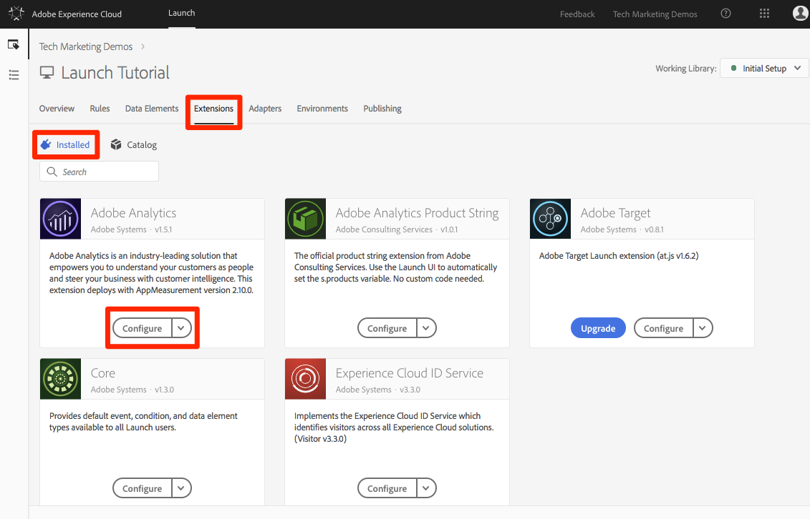

# Add Adobe Audience Manager \(AAM\)

This tutorial guides you through the steps to enable Adobe Audience Manager using Server-Side Forwarding.

[Adobe Audience Manager](https://marketing.adobe.com/resources/help/en_US/aam/) \(AAM\) provides industry-leading services for online audience data management, giving digital advertisers and publishers the tools they need to control and leverage their data assets to help drive sales success.

## Objectives

At the end of this lesson, you will be able to:

* Describe the two main ways to implement Audience Manager on a website
* Add Audience Manager using Server-Side Forwarding of the Analytics beacon
* Validate the Audience Manager implementation

## Prerequisites

To complete this lesson, you need the following:

* Complete the lessons in Configure Launch, Add Adobe Analytics, and Add the ID Service.
* Admin access to Adobe Analytics so you can enable Server-Side Forwarding for the report suite you are using for this tutorial.

  Alternatively, you can ask an existing admin at your organization to do this for you, following the instructions below.

* Your “Audience Manager Subdomain” \(also known as the “Partner Name” “Partner ID,” or “Partner Subdomain”\).

  If you already have Audience Manager implemented on your website, the easiest way to obtain this is to go to your actual website and open the Debugger. The subdomain is available on the Summary tab, in the Audience Manager section:

## Implementation options

There are two ways to implement Audience Manager in a website:

* **Server-Side Forwarding \(SSF\):** For customers with Adobe Analytics, this is the easiest and recommended way to implement. Adobe Analytics forwards data to AAM on Adobe's backend, allowing for one less request on the page. This also enables key integration features and conforms with the best practices for Audience Manager code implementation and deployment.
* **Client-Side DIL:** This approach is for customers who do not have Adobe Analytics. DIL code \(Data Integration Library Code, the AAM JavaScript configuration code\) sends data directly from the web page into Audience Manager.

Because you have already deployed Adobe Analytics in these tutorials, you can deploy Audience Manager using Server-Side Forwarding. For a complete description and requirements list for Server-Side Forwarding, review the [documentation](https://marketing.adobe.com/resources/help/en_US/reference/ssf.html) so you can be familiar with how it works, what is required, and how to validate.

## Enable Server-Side Forwarding

There are two main steps when implementing Server-Side Forwarding:

1. Turn on a "switch" in the Analytics Admin Console to forward data from Analytics to Audience Manager per the report suite.
2. Put the code in place via Launch.

   For this to work correctly, you need to install the Experience Cloud ID Service extension, as well as the Analytics extension. You will actually not need the AAM extension, which is explained below.

### Enable Server-Side Forwarding in the Analytics Admin Console

A configuration in the Adobe Analytics Admin Console is required to start forwarding data from Adobe Analytics to Adobe Audience Manager. Because it can take up to four hours to start forwarding the data, you should do this step first.

1. Log in to Analytics via the Experience Cloud UI.

   If you don't have Admin access to Analytics, ask your Experience Cloud or Analytics admin to assign you access or to complete these steps for you.

   

2. From the top navigation in Analytics, choose **Admin &gt; Report Suites**, and from the list, select the report suites that you want to forward to Audience Manager.

   

3. From the Report Suites screen and with the report suites selected, choose **Edit Settings &gt; General &gt; Server-Side Forwarding**.

   

   **Note:** As stated above, you will need to have administrator privileges to see this menu item.

4. Once you are on the Server-Side Forwarding page, read the info and check the box to **Enable Server-Side Forwarding** for the report suite\(s\).
5. Click **Save**.

**Note:** Because SSF needs to be enabled per report suite, make sure you repeat this step for your real report suites when you deploy SSF on your own site's report suite. If the SSF option is grayed out, you need to map the report suites to your Experience Cloud Org to enable the option. This is explained in [the documentation](https://marketing.adobe.com/resources/help/en_US/mcloud/map-report-suite.html).

Once this step has been completed, and if you have the Experience Cloud ID Service enabled, data is forwarded from Analytics to AAM. However, to complete the process so the response comes back correctly from AAM to the page \(and to Analytics via the Audience Analytics feature\), you must complete the following step in Launch as well.

### Enable Server-Side Forwarding in Launch

1. Go to **Extensions &gt; Installed** and click to configure the Analytics extension.

   

2. Expand the Adobe Audience Manager section, then check the box to **Automatically share Analytics Data with Audience Manager**.

   This adds the Audience Manager module \(code\) to the Analytics AppMeasurement.js implementation.

3. Add your Audience Manager Subdomain, also known as the Partner Name, Partner ID, or Partner Subdomain.
4. Click **Save to Library and Build**.

### Validate the Server-Side Forwarding

The main way to validate that the Server-Side Forwarding is up and running is to look at the response to any of your Adobe Analytics hits. First, though, check a couple other things that can help make sure that it is working the way you want it to.

#### Verify that the code loads correctly

The code that Adobe Launch installs to handle the forwarding, and especially the response from AAM to the page, is called the Audience Manager Module. Use the Experience Cloud Debugger to ensure that it has loaded.

1. Open the We.Retail site.
2. Click the debugger icon in your browser to open the Experience Cloud debugger.
3. On the Summary tab, scroll down to the Analytics section.
4. Verify that **AudienceManagement** is listed under the Modules section.

   

#### Verify the Partner ID in the Debugger

Next, verify that the debugger is picking up the right partner ID from the code.

1. In the Debugger, on the Summary tab, scroll down to the Audience Manager section.
2. Verify your Partner ID/Subdomain under Partner.

   

**Note:** The Audience Manager section of the debugger refers to "DIL," which is the Data Integration Library that typically refers to a client-side implementation, as opposed to the server-side approach used here. The AAM Module used in this SSF approach uses much of the same code as the client-side DIL library, so the Debugger repors it as such. If you have followed the steps in this tutorial, and the rest of the items in this validation section are correct, be assured that server-side forwarding is working.

#### Verify the Analytics request and response

If you are not doing server-side forwarding of data from Analytics to Audience Manager, then there is no response to the Analytics beacon \(besides a 2x2 pixel\). However, if you are doing SSF, then there are items that you can verify in the Analytics request and response that let you know that it is working correctly. Unfortunately, at this time, the Experience Cloud Debugger does not support showing the response to the beacons. Therefore, you should use another debugger/packet sniffer, like Charles Proxy or the browser's Developer Tools.

1. Open the Developer Tools in your browser and go to the Network tab.
2. In the Filter field, type b/ss, which limits what you see to the Adobe Analytics requests.
3. Refresh the page to see the Analytics request.

   

4. In the Analytics beacon \(request\), look for a "callback" parameter. This parameter is set to something like this: `s_c_il[1].doPostbacks.`

   

This is a response to the Analytics beacon. It contains references to `doPostbacks`, as called in the request. Most importantly, it should see a `stuff` object. This is where AAM segment IDs are sent back to the browser. If you have the `stuff` object, SSF is working.

**Important:** Beware the false "Success." If there is a response, and everything seems to be working, make sure you have that `stuff` object. If you don't, you might see a message in the response that says "status":"SUCCESS".

Despite its appearance, this is actually proof that it is **not** working correctly. If you see this, it means that you have completed this second step \(the code in Launch\), but that the forwarding in the Analytics Admin Console \(first step of this section\) has not yet completed. In this case, verify that you have enabled SSF in the Analytics Admin Console. If you have, and it hasn't been four hours yet, be patient.

