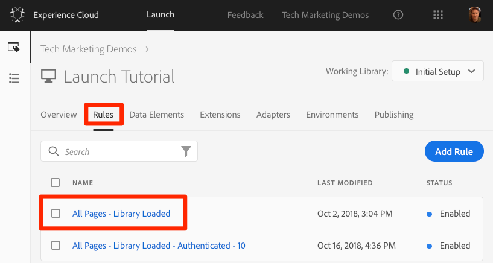
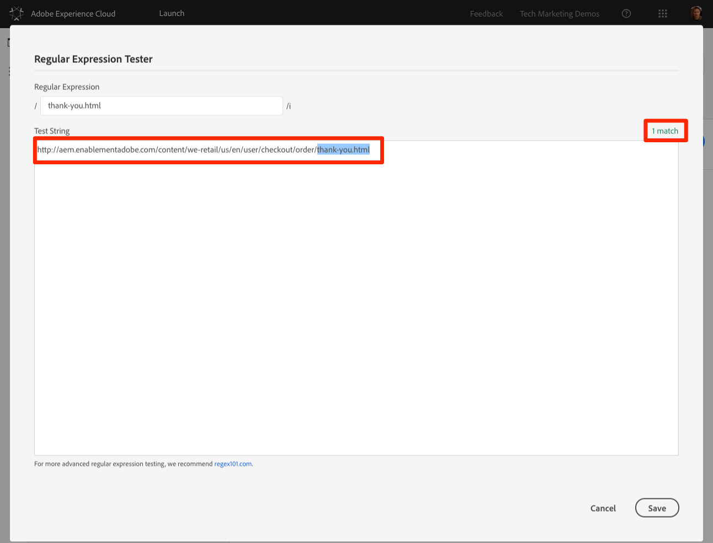
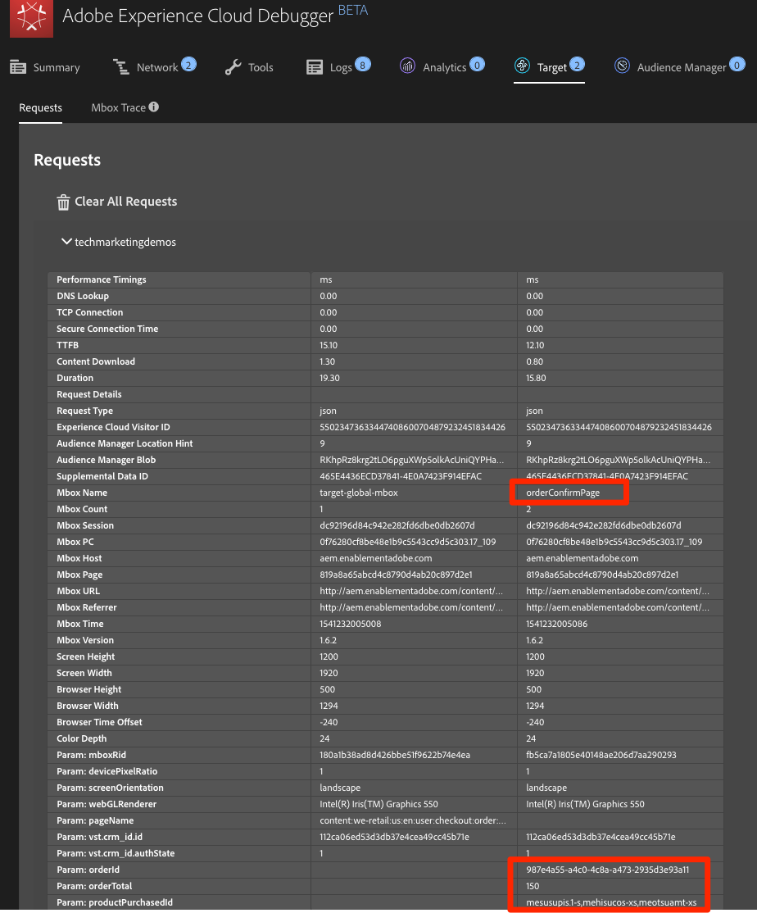
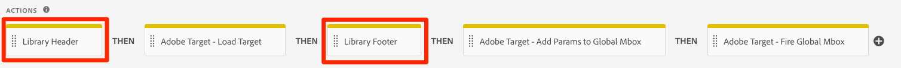

# Add Adobe Target

This tutorial shows how to implement Adobe Target with a global mbox with custom parameters.

[Adobe Target](https://marketing.adobe.com/resources/help/en_US/target/) is the Adobe Experience Cloud solution that provides everything you need to tailor and personalize your customers' experience, so you can maximize revenue on your web and mobile sites, apps, social media, and other digital channels.

## Objectives

At the end of this lesson, you will be able to:

* Add the prehiding snippet used to manage flicker when using Target with asynchronous Launch embed codes.
* Add the Target extension.
* Fire the global mbox.
* Add parameters to the global mbox.
* Explain how profile and entity parameters can be added to the global mbox.
* Fire the order confirmation mbox with required parameters.
* Explain how to add advanced configurations such as Library Header and Library Footer code.
* Validate a Target implementation.

## Prerequisites

To complete the exercises in this tutorial, you must first complete the exercises in [Configure Launch](../general-launch-configuration-and-settings/) and [Add the ID Service](idservice-save.md).

## Add the Target prehiding snippet

Before you begin, you must make a slight update to the Launch embed codes. When the Launch embed codes are loaded asynchronously, the page could finish rendering before the Target library is fully loaded and has performed its content swap. This can lead to what is known as "flicker," where default content briefly displays before being replaced by the personalized content specified by Target. If you want to avoid this flicker, you should hardcode a special prehiding snippet immediately before Launch's asynchronous embed codes.

This has already been done on the We.Retail site, but here's how it's done on the sample page, so you understand the implementation. Copy the following lines of code:

```text
<script>
    //prehiding snippet for Adobe Target with asynchronous Launch deployment
    (function(g,b,d,f){(function(a,c,d){if(a){var e=b.createElement("style");e.id=c;e.innerHTML=d;a.appendChild(e)}})(b.getElementsByTagName("head")[0],"at-body-style",d);setTimeout(function(){var a=b.getElementsByTagName("head")[0];if(a){var c=b.getElementById("at-body-style");c&&a.removeChild(c)}},f)})(window,document,"body {opacity: 0 !important}",3E3);
</script>
```

Open the sample page and paste it just before your Launch embed code as pictured below:


Reload your sample page. The page is hidden for three seconds before it displays. This behavior is temporary and goes away after you deploy Target. This behavior is controlled by two configurations at the end of the prehiding snippet, which can be customized but are usually best left on the default settings:

* `body {opacity: 0 !important}` Specifies the CSS definition to use for the prehiding until Target loads. By default, the entire body is hidden. If you have a consistent DOM structure with an easily identifiable container element wrapping all of the content below your navigation, for example, and you never want to test or personalize your navigation, you could use this setting to limit the prehiding to that container element.
* `3E3` Specifies the timeout setting for the prehiding. By default, if Target hasn't loaded in three seconds, the page is shown. This should be extremely rare.

For more details, and to obtain the unminified prehiding snippet, see [Adobe Target extension with an asynchronous deployment​](https://docs.adobelaunch.com/extension-reference/web/adobe-target-extension)

## Add the Target extension

The Adobe Target extension supports client-side implementations using the Target JavaScript SDK for the modern web, at.js. Customers still using Target's older library, mbox.js, [should upgrade to at.js](https://marketing.adobe.com/resources/help/en_US/target/ov2/t_target-migrate-atjs.html) in order to use Launch.

The Target extension consists of two main parts:

* The extension configuration, which manages the core library settings.
* Rule actions to do the following:
  * Load Target \(at.js\)
  * Add parameters to all mboxes
  * Add parameters to the global mbox
  * Fire the global mbox

This first exercise adds the extension and examines the configurations. Later exercises use the actions defined in this exercise.

1. Go to **Extensions &gt; Catalog**, then type "Target" in the filter to quickly locate the Adobe Target extension.
2. Click **Install**.

  When you add the extension, it imports many of your at.js settings from the Target interface.  One setting that is not imported is the Timeout, which is always 3000ms after adding the extension. For the tutorial, leave the default settings. Note that the at.js version that ships with the current version of the extension is shown on the left side of the screen.

3. Click **Save to Library and Build**.

   At this point, Target isn't doing anything yet, so there is nothing to validate.

**Note:** Each version of the Target extension comes with a specific version of at.js, which is listed in the extension description. Update the at.js version by updating the Target extension.

## Load Target and fire the global mbox

Marketers use Target to control the visitor experience on the page when testing and targeting content. Because of this important role in the final display of the page, Target should be loaded as early as possible to minimize the impact on page visibility. This section shows how to load the Target JavaScript SDK library, at.js, as well as fire the global mbox.

### Set up the rule

You can use the All Pages - Library Loaded rule you created in "[Add a Data Elements, a Rule, and a Library](../general-launch-configuration-and-settings/add-data-elements-and-rules.md)" to implement Target because it is already triggered on the first event that fires on a page load, the Library Loaded event.

1. Go to the **Rules** in the top navigation, then click on All Pages - Library Loaded to open the rule editor.

  

2. Under Actions, click the **Add** icon to add a new action.

  

3. Select **Extension &gt; Adobe Target**.
4. Select **Action Type &gt; Load Target**.
5. Click **Keep Changes**.

With the Load Target action added, at.js loads on the page. However, no Target requests fire until you add the Fire Global Mbox action.

### Add the Fire Global Mbox action

1. Under Actions, click the **Add** icon again to add another action.

  

2. Select **Extension &gt; Adobe Target**.
3. Select **Action Type &gt; Fire Global Mbox**.

   There are some configurations available for the global mbox related to whether to hide the page and CSS selector to use for prehiding. These settings work in conjunction with the prehiding snippet hard-coded on the page. Leave the default settings.

4. Click **Keep Changes**.

   The new action is added in sequence after the Load Target action. The actions will execute in this order. You can drag-and-drop the actions to rearrange the order. In this scenario, Load Target needs fire before Fire Global Mbox.

5. Click **Save to Library and Build**.

### **Validate the global mbox**

Now that you have added the Target extension and fired the Load Target and Fire Global Mbox actions, there should be a global mbox request from all pages where your Launch property is used.

1. Reload your sample page.

   You should no longer see a delay of three seconds before the page is visible. If you are loading the sample page using the `file://` protocol, you should do this step in a Firefox or Safari browser because Chrome does not fire a Target request when using the `file://` protocol.

2. Open the [We.Retail site](https://aem.enablementadobe.com/content/we-retail/us/en.html).
3. Make sure the Debugger maps the Launch property to your Development environment, as described earlier.

  

4. Go to the Summary tab of the Debugger.
5. In the Launch section, confirm that Target appears under the Extensions heading.
6. In the Target section, confirm that your client code, at.js library version, and global mbox name appear.

  

7. Finally, go to the Target tab, expand your client code, and confirm that the request for your global mbox appears:

  


## Add parameters

Passing parameters in the Target request adds powerful capabilities to your targeting, testing, and personalization activities. The Launch extension provides two actions to pass parameters:

* **Add Params to All Mboxes** adds parameters in all mbox requests, such as  the global mbox plus additional mbox requests made from Custom Code actions or hardcoded on your site. It is equivalent to using the [`targetPageParamsAll()`](https://marketing.adobe.com/resources/help/en_US/target/ov2/cmp_at.js_Functions.html) method in at.js.
* **Add Params to Global Mbox** adds parameters to the global mbox requests. It is equivalent to using the [`targetPageParams()`](https://marketing.adobe.com/resources/help/en_US/target/ov2/cmp_at.js_Functions.html) method in at.js.

These actions can be used before the Load Target action and can set different parameters on different pages based on your rule configurations. Use the rule ordering feature to set additional parameters on the Library Loaded event before the rule firing the global mbox.

**Note:** Because most implementations use the global mbox for activity delivery, it is usually sufficient to use the Add Params to Global Mbox action.

### Add an mbox parameter

Mbox parameters pass custom data to Target, enriching your personalization capabilities. They are ideal for attributes that change frequently during a browsing session and do not persist, such as the page name, template, and so on.

Add the Page Name data element that we created earlier in [Add a Data Element, a Rule, and a Library](../general-launch-configuration-and-settings/add-data-elements-and-rules.md) as an mbox parameter.

1. Go to the **Rules** in the top navigation and then click on All Pages - Library Loaded to open the rule editor.

  

2. Under Actions, click the **Add** icon to add a new action.

  

3. Select **Extension &gt; Adobe Target**.
4. Select **Action Type &gt; Add Params to Global Mbox**.
5. Enter pageName as the **Name**.
6. Click the **Data Elements** icon to open the data element modal.
7. Click the Page Name data element, then click **Select**.


8. Click **Keep Changes**.
9. Click-and-drag the left edge of the Add Params to Global Mbox action to rearrange the actions so Add Params to Global Mbox is before Fire Global Mbox.

  It can be either before or after Load Target.

10. Click **Save to Library and Build**.

### **Validate the Mbox Parameter**

1. Reload the We.Retail site with it mapped to your property with Experience Cloud Debugger.
2. Go to the **Target** tab in the Debugger, then expand your client code and look at the requests.

  You should see the new pageName parameter passed in the request:


### Profile parameters

Similar to mbox parameters, profile parameters are passed through the Target request. However, profile parameters are stored in Target's visitor profile database and persist for the [duration of the visitor's profile](https://marketing.adobe.com/resources/help/en_US/target/ov/c_visitor_profile_lifetime.html). You can set them on one page of your site and use them in Target activities on another page.

Here is an example from an automobile website. When a visitor goes to a vehicle page, you could pass a profile parameter `"`profile.lastViewed=sportscar` to record their interest in that particular vehicle. When the visitor browses to other, non-vehicle pages, you can target content based on their last vehicle viewed.

Profile parameters are ideal for attributes that rarely change or are only available on certain pages. You won't pass any profile parameters in this tutorial, but the workflow is almost identical to what you did when passing the pageName mbox parameter. The one difference is you need to give profile parameter names a `profile.` prefix.

This is what a profile parameter called `userType` would look like in the Pass Parameters to Global Mbox action:


### Entity Parameters

Entity parameters are special parameters used in [Recommendations implementations](https://marketing.adobe.com/resources/help/en_US/target/recs/c_plan_implement.html) for three main reasons:

* As a key to trigger product recommendations.

  For example, when using a recommendations algorithm like "People who viewed Product X, also viewed Y," "X" is the "key" of the recommendation. It is usually the product sku \(`entity.id`\) or category \(`entity.categoryId`\) that the visitor is currently viewing.

* To collect visitor behavior to power recommendations algorithms, such as "Recently Viewed Products" or "Most Viewed Products."
* To populate the Recommendations catalog.

  Recommendations contains a database of all of the products or articles on your website, so they can be served in the recommendation offer. For example, when recommending products, you typically want to display attributes like the product name \(`entity.name`\) and image \(`entity.thumbnailUrl`\). Some customers populate their catalog using backend feeds, but they can also be populated using entity parameters in Target requests.

You don't need to pass any profile parameters in this tutorial, but the workflow is identical to what you did earlier when passing the pageName mbox parameter: give the parameter a name prefixed with `entity.` and map it to the relevant data element. Some common entities have reserved names that must be used \(for example, `entity.id` for the product sku\). This is what it would look like to set entity parameters in the Pass Parameters to Global Mbox action:


### Add Customer ID Parameters

The collection of customer IDs with the Experience Cloud ID Service makes it easy to import CRM data into Target using the [Customer Attributes](https://marketing.adobe.com/resources/help/en_US/target/target/c_working-with-customer-attributes.html) feature of the Adobe Experience Cloud. It also enables [cross-device visitor stitching](https://marketing.adobe.com/resources/help/en_US/target/target/c_experience-cloud-device-co-op.html) , allowing you to maintain a consistent user experience as your customers switch between, for example, a laptop and their mobile device.

It is imperative that the customer ID is sent before firing the global mbox. To that end, make sure you have the following capabilities on your site:

* The customer ID must be available on the page before the Launch Embed Code
* The Experience Cloud ID Service extension must be installed
* You must use the "Set Customer IDs" action in a rule that fires at the "Library Loaded \(Page Top\)" event
* Use the "Fire global mbox" action in a rule that fires after the "Set Customer IDs" action

In the previous tutorial, [Add the Experience Cloud ID Service](idservice-save.md), you created the All Pages - Library Loaded - Authenticated - 10 rule to fire the "Set Customer ID" action. Because this rule has an Order setting of 10, the customer IDs are set before the global mbox fires from the All Pages - Library Loaded rule with its Order setting of 50. So, you have already implemented the collection of customer IDs for Target.

#### Validate the customer ID

1. Open the [We.Retail site](https://aem.enablementadobe.com/content/we-retail/us/en.html).
2. Make sure the Debugger is mapping the Launch property to your Development environment, as described in the [earlier lesson](../general-launch-configuration-and-settings/switch-environments-with-launch-command.md).


3. Log in to the We.Retail site using the credentials `test@adobe.com /test`.
4. Return to the [We.Retail homepage](https://aem.enablementadobe.com/content/we-retail/us/en.html).
5. Open the Debugger, then go to the Target tab and expand your client code.

  You should see parameters in the latest Target request for `vst.crm_id.id` and `vst.crm_id.authState`. `vst.crm_id.id` should have a value of the hashed email address, and `vst.crm_id.authState` should have a value of 1 to represent authenticated. Note that `crm_id` is the Integration Code you specified in the ID Service configuration and must align with the key you use in your [Customer Attributes data file](https://marketing.adobe.com/resources/help/en_US/mcloud/t_crs_usecase.html):


**Important:** The Experience Cloud ID Service allows you to send multiple IDs to the Service, but only the first one is sent to Target.

### Add the Property Token parameter

**Note:** This is an optional exercise for Target Premium customers.

The property token is a reserved parameter used with the Premium [Enterprise User Permissions](https://marketing.adobe.com/resources/help/en_US/target/target/property_channel.html). It is used to define different properties so different members of an Experience Cloud Organization can be assigned different permissions to each property. For example, a group of users can set up activities on the web site, but not on the mobile application.

Target properties are analogous to Launch properties and Analytics report suites. An enterprise with multiple brands, websites, and marketing teams might use a different Target property, Launch property, and Analytics report suite for each website or mobile app. Launch properties are differentiated by their embed codes, Analytics report suites are differentiated by their report suite ID, and Target properties are differentiated by their property token parameter.

The property token is implemented like an mbox parameter. Name the parameter `at_property` and paste in the value provided in the Target interface. If you are implementing multiple sites with a single Launch property, you could manage the `at_property` value via a data element.

Here is an optional exercise, if you would like to implement a property token in your Tutorial property:

1. In a separate tab, open the Target user interface, go to **Setup &gt; Properties**, and identify the property that you want to use, then click the **&lt;/&gt;** \(or create a new property\).
2. Copy the at\_property value to your clipboard.

  

3. In your Launch tab, go to the **Rules** in the top navigation, then click on **All Pages - Library Loaded** to open the rule editor.
4. Under Actions, click the **Adobe Target - Add Params to Global Mbox** action top open the Action Configuration.

  

5. Under the pageName parameter, click **Add**.


6. Name the parameter `at_property` and paste in the value you copied from the Target interface.

  

7. Click **Keep Changes.**
8. Click **Save to Library and Build**.

#### **Validate the Property Token**

1. Open the [We.Retail site](https://aem.enablementadobe.com/content/we-retail/us/en.html).
2. Make sure the Debugger is mapping the Launch property to your Development environment, as described earlier.

  

3. Open the Debugger, go to the Target tab, and expand your client code.
4. You should see the parameter for `at_property` in every global mbox request:


## Add custom mboxes

Next, add a custom mbox.

### Add an Order Confirmation mbox

The order confirmation mbox is a special type of mbox used to define order submissions in Target. The inclusion of three specific mbox parameters--`orderId`, `orderTotal`, and `productPurchasedId`--is what turns an mbox into an order mbox. In addition to reporting revenue, the order mbox also does the following:

* Deduplicates accidental order resubmissions
* Filters extreme orders \(any order whose total was more than three standard deviations from the mean\)
* Uses a different algorithm behind the scenes to calculate statistical confidence
* Creates a special, downloadable Audit report of individual order details

The best practice is to use an order confirmation mbox in all order funnels, even on non-retail sites. For example, lead generation sites usually have lead funnels with a unique "lead id" generated at the end. These sites should implement an order mbox, using a static value \(such as "1"\) for the `orderTotal`.

Customers using the Analytics for Target \(A4T\) integration for most of their reporting should also implement the order mbox, because A4T is not yet compatible with activity types like Auto Allocate, Automated Personalization, and Auto Target. Additionally, the order mbox is a critical element in Recommendations implementations, powering algorithms based on purchase behavior.

The order confirmation mbox should fire from a rule that is only triggered on your order confirmation page or event. Often, it can be combined in a rule that also sets the Adobe Analytics purchase event. It must be configured by using the Custom Code action of the Core extension, using the appropriate data elements to set the `orderId`, `orderTotal`, and `productPurchasedId` parameters.

Add the data elements and rule required to fire an order confirmation mbox on the We.Retail site. Because you have already created several data elements, these instructions are abbreviated.

#### **Create Data Element for Order Id**

1. Click **Rules** in the top navigation, then click **Add Data Element**.
2. Name the data element Order Id.
3. Select **Data Element Type &gt; JavaScript Variable**.
4. Use `digitalData.cart.orderId` as the Path to Variable.
5. Select the Clean Text option.
6. Click **Save to Library and Build**.

#### **Create Data Element for Cart Amount**

1. Click **Add Data Element**.
2. Name the data element Cart Amount.
3. Select **Data Element Type &gt; JavaScript Variable**.
4. Use `digitalData.cart.cartAmount` as the Path to Variable.
5. Select the Clean Text option.
6. Click **Save to Library and Build**.

#### **Create Data Element for Cart SKUs \(Target\)**

1. Click **Add Data Element**.
2. Name the data element Cart SKUs \(Target\).
3. Select **Data Element Type &gt; Custom Code**. For Target, the skus must be a comma separated list.

  This custom code reformats the data layer array into the proper format.

4. In the custom code editor, paste the following:

   ```javascript
   var targetProdSkus="";
   for (var i=0; i<digitalData.cart.cartEntries.length; i++) {
     if(i>0) {
       targetProdSkus = targetProdSkus + ",";
     }
     targetProdSkus = targetProdSkus + digitalData.cart.cartEntries[i].sku;
   }
   return targetProdSkus;
   ```

5. Check the **Force lowercase value** and **Clean text** options.
6. Click **Save to Library and Build**.

#### **Create Rule for Order Confirmation page**

1. Click **Rules** in the top navigation, then click **Add New Rule**.
2. Name the rule Order Confirmation Page - Library Loaded - 60.
3. Create an event.
   1. Click **Events &gt; Add**, then select **Events &gt; Library Loaded \(Page Top\)**.
   2. Change the Order to 60 so that it fires after the Load Target action \(which is in the All Pages - Library Loaded rule where Order is set to 50\).
   3. Click **Keep Changes**.
4. Create a condition.
   1. Click **Conditions &gt; Add**, then select **Condition Type &gt; Path Without Query String**.
   2. For Path equals enter thank-you.html.
   3. Toggle on the Regex option to change the logic from equals to contains.

    You can use the Test feature to confirm the test will pass with the URL `https://aem.enablementadobe.com/content/we-retail/us/en/user/checkout/order/thank-you.html`

    

   4. Click **Keep Changes**.
5. Create an action.

  1. Click **Actions &gt; Add**, then select **Action Type &gt; Custom Code**.
  2. Click **Open Editor**.
  3. Paste the following code into the Edit Code modal:

    ```javascript
        adobe.target.getOffer({
          "mbox": "orderConfirmPage",
          "params":{
            "orderId": _satellite.getVar('Order Id'),
            "orderTotal": _satellite.getVar('Cart Amount'),
            "productPurchasedId": _satellite.getVar('Cart SKUs (Target)')
          },
          "success": function(offer) {
            adobe.target.applyOffer({
              "mbox": "orderConfirmPage",
              "offer": offer
            });
          },
          "error": function(status, error) {
            console.log('Error', status, error);
          }
        });
    ```

   4. Click **Save** to save the custom code.
   5. Click **Keep Changes** to keep the action.

6. Click **Save to Library and Build**.

#### **Validate the Order Confirmation Mbox**

1. Open the We.Retail site.
2. Make sure the Debugger is mapping the Launch property to your Development environment, as described [earlier](../general-launch-configuration-and-settings/switch-environments-with-launch-command.md).

  

3. Browse the site and add several products to your cart.
4. Continue to checkout.
5. During the checkout process the only required fields are First Name and Last Name.

  

6. On the Review Order page, be sure to click the Place Order button.
7. Open the Debugger, go to the **Target tab**, then expand your client code.

  You should see the `orderConfirmPage` request as the latest Target request with the `orderId`, `orderTotal`, and `productPurchasedId` parameters populated with the details of your order.



### Custom mboxes

There are rare instances when you need to make Target requests other than the global and order confirmation mbox. For example, sometimes important data you would like to use for personalization is not defined on the page before the Launch embed codes. It might be hardcoded on the bottom of the page or get returned from an asynchronous API request. This data can still be sent to Target using an additional request, although it is not optimal to use this request for content delivery since the page is already visible. It can be used to enrich the visitor profile for later use \(using profile parameters\) or to populate the Recommendations catalog.

In these circumstances, use the Custom Code action in the Core extension to fire an mbox using the [`getOffer`\(\)](https://marketing.adobe.com/resources/help/en_US/target/?f=r_target-atjs-getoffer) /[`applyOffer`\(\)](https://marketing.adobe.com/resources/help/en_US/target/ov2/r_target-atjs-applyoffer.html) and [`trackEvent`\(\)](https://marketing.adobe.com/resources/help/en_US/target/ov2/r_target-atjs-trackevent.html) methods. This is similar to what you did in the Order Confirmation mbox exercise, but you use a different mbox name and do not use the special order parameters. Be sure to use the **Load Target** action before making mbox calls from custom code.

## Library Header and Library Footer

The Edit at.js screen in the Target user interface has locations in which you can paste custom JavaScript that execute immediately before or after the at.js file.

The Library Header is sometimes used to override at.js settings via the [`targetGlobalSettings()`](https://marketing.adobe.com/resources/help/en_US/target/ov2/c_atjs-settings-override.html) function or pass data from third parties using the Data Providers feature.

The Library Footer is sometimes used to add at.js library extensions or at.js custom event listeners.

To replicate this capability in Launch, use the Custom Code action in the Core extension and sequence the action before \(Library Header\) or after \(Library Footer\) the Load Target action. This can be done in the same rule as the Load Target action, as pictured below, or in separate rules with events or order settings that reliably fire before or after the rule containing Load Target:



To learn more about use cases for custom headers and footers see the following resources:

* [Use dataProviders to integrate third-party data into Adobe Target](https://helpx.adobe.com/target/kt/using/dataProviders-atjs-feature-video-use.html)
* [Implement dataProviders to integrate third-party data into Adobe Target](https://helpx.adobe.com/target/kt/using/dataProviders-atjs-technical-video-implement.html)
* [Use Response Tokens and at.js Custom Events with Adobe Target](https://helpx.adobe.com/target/kt/using/response-tokens-atjs-custom-events-technical-video-use.html)
