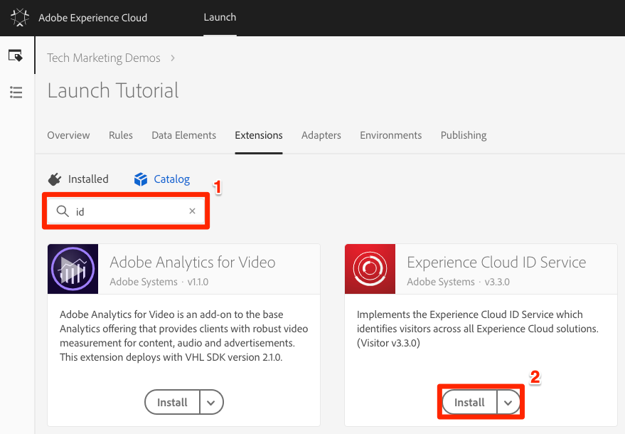
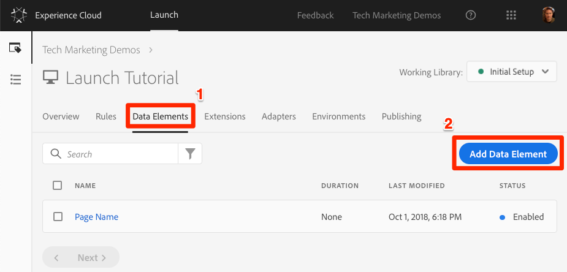
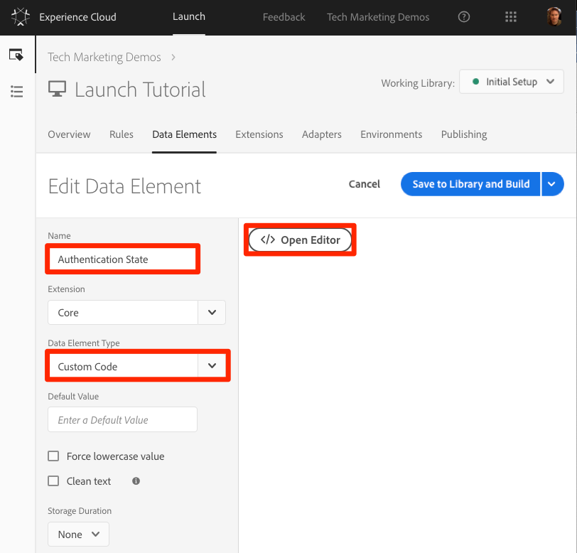
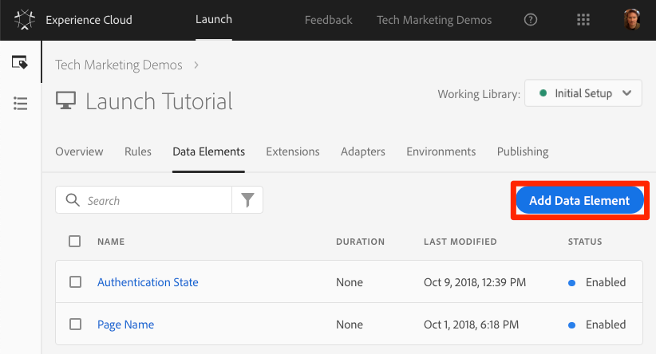

# Add the Experience Cloud ID Service Extension

## Objectives

At the end of this lesson, you will be able to:

* Add the ID Service extension
* Create a data element to collect your customer IDs
* Create a rule that uses the "Set Customer IDs" action to send the customer IDs to Adobe
* Use the rule ordering feature to sequence rules that fire on the same event

## Prerequisites

 You should have already completed the lessons in the Configure Launch section.

## Add the Experience Cloud ID Service Extension

1. In the top navigation, click **Extensions**.
2. Click **Catalog** to open the Extensions Catalog page.

  

3. In the filter at the top, type “id” to filter the catalog, then on the card for the Experience Cloud ID Service, click **Install**.

  

4. Leave all of the default settings and click  **Save to Library and Build**.  Note that your Experience Cloud Organization ID has been auto-detected for you.

The ID Service is added to your installed extensions. For more details on the advanced options, see the [configuration options documentation](https://marketing.adobe.com/resources/help/en_US/mcvid/mcvid-function-vars.html).

**Note:** Each version of the ID Service extension comes with a specific version of `VisitorAPI.js` which is noted in the extension description. You update the `VisitorAPI.js` version by updating the ID Service extension.

### Validate the extension

The ID Service extension is one of the few Launch extensions that makes a request without having to use a rule action. The extension automatically makes a request to the ID Service on the first page load of the first visit to a website. Once the ID has been requested, it is stored in a first party cookie beginning with `AMCV_`.

1. Open the [We.Retail site](https://aem.enablementadobe.com/content/we-retail/us/en.html).
2. Make sure the Debugger is mapping the Launch property to your Development environment, as described in the earlier lesson.
3. On the Summary tab of the Debugger, the Launch section should indicate that the Experience Cloud ID Service extension is implemented.
4. Also, on the Summary tab, the ID Service section should populate with the same Org ID shown on your extension configuration screen in the Launch interface.

 The initial request to retrieve the Visitor ID might appear in the ID Service tab of the Debugger. It might have already been requested, though, so don't worry if you don't see it.

After the initial request to fetch the Visitor ID, the ID is stored in a cookie whose name begins with `AMCV_`. You can confirm that the cookie has been set by doing the following:

1. Open your browser's Developer Tools.
2. Go to the Application tab.
3. Expand Cookies on the left side.
4. Click on the domain https://aem.enablementadobe.com.
5. Look for the `AMCV_` cookie on the right hand side.  You might see several because the We.Retail site using both its hardcoded Launch property as well as mapping to your own.

## Send customer IDs

Next, send a [customer ID](https://marketing.adobe.com/resources/help/en_US/mcvid/mcvid-authenticated-state.html) to the ID Service. This allows you to [integrate your CRM](https://marketing.adobe.com/resources/help/en_US/mcloud/attributes.html) with the Experience Cloud, as well as track visitors across devices.

In the Add Data Elements, Rules, and Libraries tutorial, you created a data element and used it in a rule. In this tutorial, you use those same techniques to send a customer ID when the visitor is authenticated.

### Create Data Elements for Customer IDs

Start by creating two data elements:

* `Authentication State`: Captures whether the visitor is logged in
* `Email (Hashed)`: Captures the hashed version of the email address \(used as the customer ID\) from the data layer

Create the data element for Authentication State:

1. Click **Data Elements** in the top navigation.
2. Click **Add Data Element**.

  

3. Name the data element "Authentication State."
4. For `Data Element Type`, select `Custom Code`.
5. Click **Open Editor**, then in the Edit Code window, paste the following:
  `if (digitalData.user[0].profile[0].attributes.loggedIn)  return "logged in" else  return "logged out"`
6. Save the custom code.
7. Leave all of the other settings on their default values.
8. Save the data element.

  

By knowing the authentication state of the user, you know when a customer ID should exist on the page to send to the ID Service. The next step is to create a data element for the customer ID itself. On the We.Retail demo site, you will use the hashed version of the visitor's email address.

1. Click **Add Data Element**.

  

2. Name the data element "Email \(Hashed\)."
3. For`Data Element Type`, select **JavaScript Variable.**
4. In `Path to variable`, paste the following:`digitalData.user.0.profile.0.attributes.username`
5. Leave all of the other settings on their default values
6. Save the data element.

### Add a Rule to Send the Customer IDs

The Experience Cloud ID Service passes the customer IDs using a rule action called “Set Customer IDs.” Create a rule to trigger this action when the visitor is authenticated:

1.  In the top navigation, click **Rules**, then click **Add Rule** to open the Rule Builder.
2. Create a new rule called: “All Pages - Top - Authenticated - 10.”

   **TIP:** This naming convention indicates you are implementing this rule at the top of all pages when the user is authenticated and it will have an order of “10.” Using a naming convention like this, rather than naming it for the solutions triggered in the actions, minimizes the overall number of rules needed in this implementation.

3. Under **Events**, click **Add**.

  1. For the **Event Type** select **Library Loaded \(Page Top\)**.
  2. Specify the order “10”. The Order controls the sequence of rules that are triggered by the same event. Rules with a lower order fire before rules with a higher order. In this case, you want to set the customer ID before you fire the Target request, which you will do in the next lesson with a rule with an order of 50 .
  3. Click **Keep Changes** to return to the Rule Builder.

4.  Under **Conditions** click **Add**:

  1. For the **Condition Type** select **Value Comparison**.
  2. Click the icon to open the Data Element modal.
  3. In the Data Element Modal, click on **Authentication State**, and then click **Select.**

5. Make sure Equals is the operator.
6. Type "logged in" in the text field, which causes the rule to fire whenever the data element “Authentication State” has has a value of “logged in.”
7. Click **Keep Changes.**
8.  Under **Actions** click **Add**.

  1. Select the Experience Cloud ID Service extension.
  2. Select the “Set Customer IDs” Action Type.
  3. For the **Integration Code** enter `crm_id`.
  4. For the **Value** enter open the Data Element selector modal and select the Email \(Hashed\) option.
  5. For the **Auth State** select **Authenticated**.
  6. Click the **Keep Changes** button to save the action and return to the Rule Builder.

9. Click **Save to Library and Build**.

This rule sends the Customer ID as a variable `crm_id` when the visitor is authenticated. Because you specified the order as 10, this rule fires before the All Pages - Library Loaded rule created in the [Add Data Elements, Rules, and Libraries](../general-launch-configuration-and-settings/add-data-elements-and-rules.md) tutorial,which uses the default Order value of 50.

### Validate the customer IDs

 To validate your work, log in to the We.Retail site to confirm the behavior of the new rule.

1.  Open the [We.Retail site](https://aem.enablementadobe.com/content/we-retail/us/en.html).
2. Make sure the Debugger is mapping the Launch property to your Development environment, as described earlier.
3. Click the **Login** link and log in, using `test@adobe.com` as the username and `test` as the password.
4. Click **Login**.
5. Return to the Homepage.

Next, confirm the customer id is sent to the Service using the Debugger extension:

1. Make sure the tab with the We.Retail site is in focus.
2. Go to the Experience Cloud ID Service tab.
3. Click on the cell with the Customer ID - `crm_id` value.
4. In the modal, note the customer ID value and that the AUTHENTICATED state is reflected.
5. Confirm the hashed email value by viewing the source code of the page and looking at the username property. It should match the value you see in the Debugger.

### Additional debugging tips

Launch also has rich console logging features. To turn them on, go to the **Tools** tab in the Debugger and turn on the **Launch Console Logging** Toggle.

This turns on console logging, both in your browser console and in the Logs tab of the Debugger. You should see the logging of all of the rules you have created so far. New log entries are added to the top of the list, so your rule "All Pages - Library Loaded - Authenticated - 10" should fire before the "All Pages - Library Loaded" rule and appear below it in the Debugger's Console Logging.
