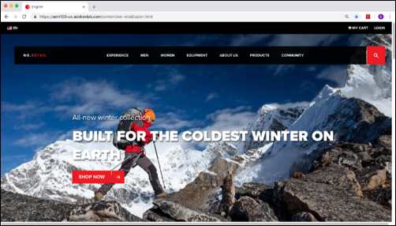

# Overview

This implementation guide is for front-end developers or technical marketers who want to learn how to implement the Adobe Experience Cloud solutions in their website.

A detailed guide to setup Launch for use inside a mobile app with the Adobe Experience Platform SDK v5 is available [here](https://aep-sdks.gitbook.io/docs/).  

Each lesson contains how-to exercises and foundational information to help you implement the Experience Cloud and understand its value. Callouts are provided to highlight information which might be useful to customers migrating from the older tag manager, Dynamic Tag Management \(DTM\). Demo sites are provided for you to complete the tutorial, so you can learn the underlying techniques in a safe environment. After completing this tutorial, you should be comfortable implementing these solutions as well as non-Adobe marketing tags on your own website.

This guide shows you how to:

* Create a Launch property
* Install a Launch property on a website
* Add the Adobe Experience Cloud solution extensions, including:
  * Experience Cloud ID Service
  * Adobe Target
  * Adobe Analytics
  * Adobe Audience Manager
* Create rules and data elements to send data to the Adobe solutions
* Validate the implementation using the Adobe Experience Cloud Debugger
* Publish changes in Launch through development, staging, and production environments  

## Prerequisites

These lessons assume that you have an Adobe ID and the required Launch permissions \(Develop, Approve, Publish, Manage Extensions, and Manage Environments\) needed to complete the exercises. If you do not have these, contact your Experience Cloud Administrator to request access.

* For Launch, you must have permission to Develop, Approve, Publish, Manage Extensions, and Manage Environments. For more information on Launch permissions, see the [documentation](../launch-reference/administration/user-permissions.md).
* For Adobe Analytics, you must know your tracking server and which report suites you will use to complete this tutorial.
* For Audience Manager, you must know your Audience Manager Subdomain \(also known as the Partner Name, Partner ID, or Partner Subdomain\).

Also, it is assumed that you are familiar with front-end development languages like HTML and JavaScript. You do not need to be a master of these languages to complete the lessons, but you will get more out of them if you can comfortably read and understand code.

## About the Lessons

In these lessons, you’ll be implementing the Adobe Experience Cloud into a fake retail website called We.Retail. The We.Retail site has rich functionality that will allow you to build a realistic implementation that resembles a real implementation.  You will build your own Launch property, in your own Experience Cloud organization, and map it to the Adobe-hosted We.Retail site using the Experience Cloud Debugger.

## Get the Tools

1.  Because you will be using some browser-specific extensions, we recommend completing the tutorial using the [Chrome Web Browser](https://www.google.com/chrome/).
2. Add the [Adobe Experience Cloud Debugger](https://chrome.google.com/webstore/detail/adobe-experience-cloud-de/ocdmogmohccmeicdhlhhgepeaijenapj) extension to your Chrome browser.
3. Downloaded the [sample html page](https://adobe-marketing-cloud.github.io/launch-reference-architectures/basic/index.html) \(right-click on this link and click “Save Link As”\).
4. Get a text editor in which you can make changes to the sample HTML page.
5. Bookmark [the We.Retail site](https://aem100-us.adobevlab.com/content/we-retail/us/en.html).

