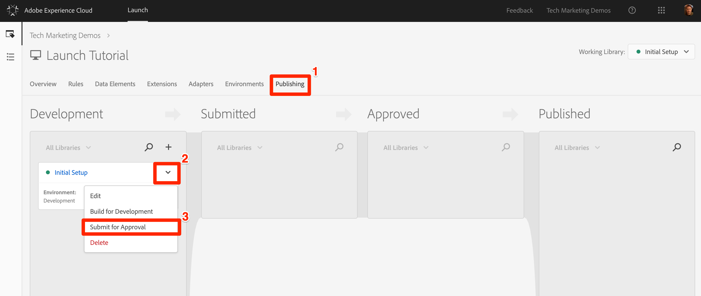
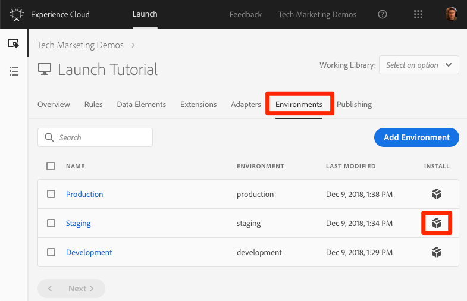
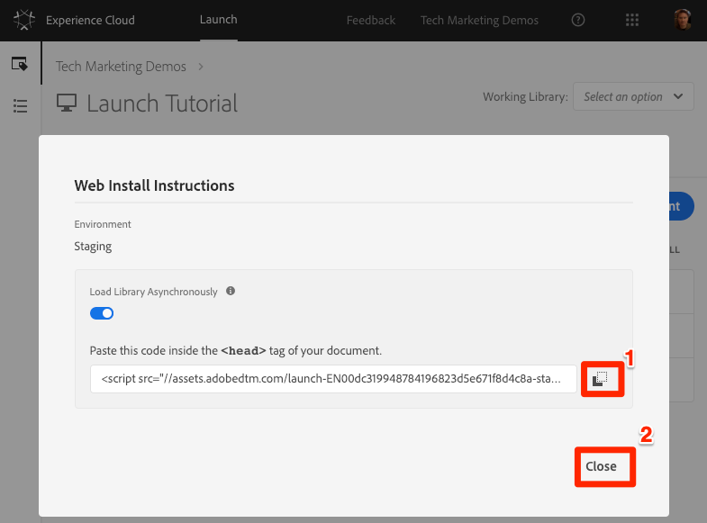
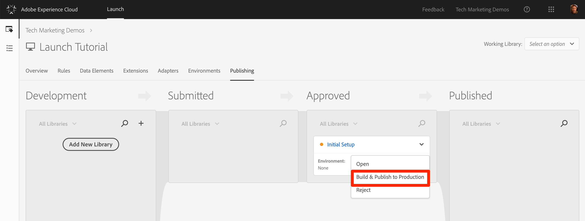
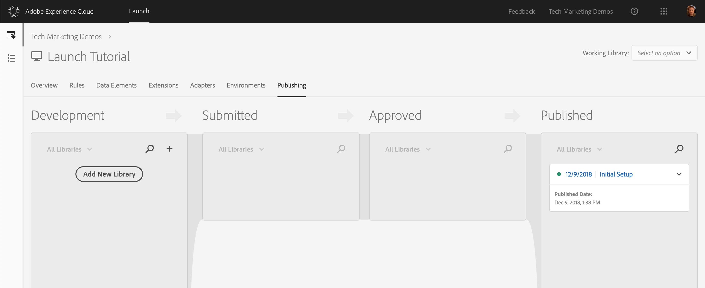

# Publish your Launch property

After you have implemented some key solutions of the Adobe Experience Cloud in your Development environment, it's time to learn the publishing workflow.

## Objectives

At the end of this tutorial, you will be able to:

* Publish a Development library to the Staging environment
* Map a Staging library to your production website using the Debugger
* Publish a Staging library to the Production environment

## Publish to Staging

After you have created and validated your library in the Development environment, it is time to publish it to Staging.

1. Go to the **Publishing** page.
2. Open the drop down next to your library and select **Submit for Approval**.

  

3. Click **Submit**.

  Your library appears in the Submitted column in an unbuilt state.

4. Open the drop down and select **Build for Staging**.

  

Once the green-dot icon appears, the library can be previewed in the Staging environment.

In a real-life scenario, the next step in the process would typically be to have your QA team validate the changes in the Staging library. They can do this using the Debugger.

###  Validate the changes in the Staging library

1. In your Launch property, open the Environments page.
2. In the Staging row, click the **Install** icon.

  

3. Click the **Copy** icon to copy the embed code to your clipboard, then click **Close**.

  

4. Open the [We.Retail demo site](https://aem.enablementadobe.com/content/we-retail/us/en.html) in your Chrome browser.
5. Open the [Experience Cloud Debugger extension](https://chrome.google.com/webstore/detail/adobe-experience-cloud-de/ocdmogmohccmeicdhlhhgepeaijenapj).

  

6. Open the Tools tab and click **Adobe Launch &gt; Dynamically Insert Launch &gt; Embed Code** to open the text input field \(it might currently have the URL of your Development embed code\):

  

7. Paste the Staging embed code that is in your clipboard, then click the disk icon to save.

8. Reload and check the Summary tab of the Debugger.  Under the Launch section, you should see that your Staging Property is implemented, showing your property name \(for example, "Launch Tutorial" or whatever you named your property\).

  

In real life, once your QA team has signed off by reviewing the changes in the Staging environment, it is time to publish to production.

## Publish to Production

1. Go to the Publishing page, then from the dropdown, click **Approve for Publishing**:

  

2. Click **Approve**. The library appears in the Approved column in the unbuilt state \(yellow dot\).
3. Open the drop down and select **Build and Publish to Production**:

  

4. Click **Publish**. The library appears in the Published column:

  

You've completed the tutorial and published your first property in Launch.
