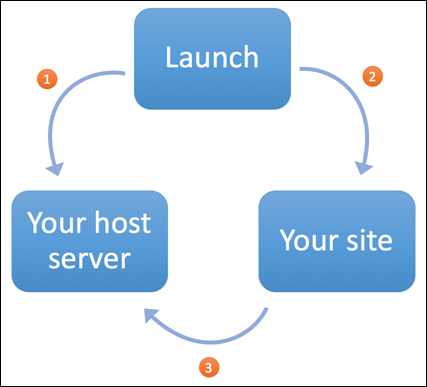

# Quick Start

Launch is the next-generation of Adobe's tag management technology, built on the Adobe Experience Platform. It is built from the ground up to support an open and sustainable ecosystem where anyone can build their own integrations that Adobe customers can deploy to their sites. It is an API first application so anything you can do through the UI you can also do programmatically through an API.

The basic Launch workflow:

1. [Set up groups and users](./#1-set-up-groups-and-users). 
2. [Log in](./#2-log-in). 
3. [Create a property](./#3-create-a-property). 
4. [Install extensions](./#4-install-extensions). 
5. [Create data elements and rules](./#5-create-data-elements-and-rules). 
6. [Test in your dev environment](./#6-test-in-your-dev-environment). 
7. [Promote to production](./#7-promote-to-production). 

For an introductory video, see [Introduction to Launch, by Adobe](../videos.md).

## 1. Set up groups and users

Launch is fully integrated with your Adobe ID. User permissions are managed through the Admin Console with other Adobe products and solutions from the Creative Cloud, Document Cloud, and Experience Cloud.

Unlike DTM, Launch has rights-based user management. \(DTM was role-based.\) This means that instead of getting a role which implies a certain set of rights, individual rights must be granted explicitly. These rights are assigned to groups, then users are added to the appropriate groups in order to gain access. Even if your company has access to Launch, individual users cannot do anything until an Org Administrator explicitly grants them some rights.

For detailed instructions on how to create groups and add users for Launch, see [Users](../launch-reference/administration/user-permissions.md).

## 2. Log in

Once Launch rights have been added to your Adobe ID, you need to log in to Launch. You can do this by navigating directly to [https://launch.adobe.com](https://launch.adobe.com) or by logging in to the [Experience Cloud \(https://marketing.adobe.com\)](https://marketing.adobe.com), navigating to the Activation page, and clicking on Launch.

## 3. Create a property

Once you're in Launch, the first thing you'll want to do is create a property. A property is basically a container that you fill with extensions, rules, data elements, and libraries as you deploy tags to your site. Many people create a property for each website \(or group of closely related sites\) where they want to deploy the same set of tags.

For more about creating properties, see [Create a property](../launch-reference/administration/companies-and-properties.md#create-a-property).

## 4. Install extensions

Extensions are one of the core features of Launch. An extension is an integration built by Adobe or an Adobe partner that adds new and endless options for the tags that you can deploy to your sites. If you think of Launch as an operating system, extensions are the apps that you install so Launch can do the things you need it to do.

All new properties come with the [Core extension](../extension-reference/web/core-extension/) installed. This extension is built by the Launch team to provide a robust default set of data element types for your data layer and event types for your rules. Most actions you will want to perform \(get an ECID, send Adobe Analytics beacons, load the Target global mbox, etc\) will come from extensions that you install from the catalog.

What makes Launch truly unique among tag management systems is that these extensions can be built by anyone. Do you need to drop a Facebook remarketing pixel on your site? Check out the extension that Facebook built. Do you want the same for Twitter or Linked In? Use those extensions. Do you need to run a survey? Look at Question Pro or Foresee. Do you need to manage privacy and consent from your end users to help out with GDPR? Take a good look at Evidon and Trust Arc. Would you like to see really granular insight into the behavior of individual users on your site? Maybe take a look at Clicktale. For more information, see [Add a new extension](../launch-reference/managing-resources/extensions/#add-a-new-extension).

## 5. Create data elements and rules

**Data elements** are pointers to the information that you want to collect and send to different places on your page:

* A defined data layer in JSON
* DOM elements
* Cookies
* Session and local storage
* Just about everything else

Once defined in a data element, you can use the element anywhere throughout Launch for any extension. \(See [Data Elements](../launch-reference/managing-resources/data-elements.md).\)

**Rules** are at the logical core of your implementation and control the what, when, where, and how of all the tags on your site. Define an event, set conditions and exceptions, then define the actions and order. Finally, publish your changes to see the results. For more information, see [Rules](../launch-reference/managing-resources/rules.md).

## 6. Test in your Dev environment

### Libraries and builds

Nothing in Launch is published automatically. Each set of changes you make is encapsulated into a [library](../launch-reference/publishing/libraries.md). Each library you create automatically inherits anything upstream \(published, approved, or submitted\) as a baseline, so all you need to do is define the changes you'd like to make. This library serves as the blueprint for a [build](../launch-reference/publishing/builds.md). A build is the actual set of JavaScript files that are deployed and used.

To make sense of that process, there are a couple relationships between Launch, your web page, and your hosting location that you need to understand.

1. Launch publishes a build to your host server.

   As mentioned above, a build is the actual JavaScript file\(s\) that Launch produces. This relationship between Launch and your host location is defined by an adapter. Read more about Adapters below.

2. Launch provides an embed code `<script>` tag that goes onto your site.

   When you create an environment and attach an adapter, the environment provides this `<script>` tag for you to put on your pages.

3. When a user browses your site, the Embed Code `<script>` tag retrieves the Build from your host server and performs your defined actions within the browser.

### Adapters

An adapter is a connection between Launch and your hosting location. Launch currently supports an Akamai adapter and an SFTP adapter. Whenever you produce a build, Launch connects to the server defined by your adapter.

If you want to self-host, you can have Launch push directly to your servers through SFTP or you can push it to Akamai and download it \(using your environment's Archive option\).

For more information, see [Adapters](../launch-reference/publishing/adapters.md).

### Environments

Each library is created inside an environment. An environment defines how you want your build to look when it is published. You can specify:

* **Adapter:** Each environment needs an adapter which determines where Launch will push any builds created in this environment
* **Archive:** The default is to deploy your build as a minified .js file \(or if you're using custom code, multiple files which reference each other\). You can have wrap all these together into a zip file and encrypt it.

Once you have saved your environment, it generates the embed code which you can copy and paste into your website. Note that the embed code will not work until you have actually created a library and produced a build. For more information, see [Environments](../launch-reference/publishing/environments.md).

### Publish a build to Dev

Now that you understand the basic components, the publishing process should make more sense. You need to:

1. Create an adapter.
2. Create a dev environment using the adapter you created.
3. Deploy the embed code from your dev environment to your dev test site.
4. Create a library and assign it to the dev environment you created.
5. Build your library.

## 7. Promote to production

Once you've tested your build in your dev environment, the promotion process is pretty straightforward. Before you try it out, make sure to create your stage and production environments and put the embed codes in the necessary places. \(You can reuse existing adapters.\)

Promoting a library all the way through to production will typically require coordination among different people with the appropriate rights.

1. A Developer \(someone with the Develop right\) submits the library, which moves the library to the Submitted state.
2. An Approver \(someone with the Approve right\) can build the library to the stage environment and can approve it after testing. This moves the library to the approved state. Only one library can be submitted and approved at a time.
3. A Publisher \(someone with the Publish right\) can build the library to the production environment.

You can assign all these rights to a single person.

For more information about the different states and options available during the publishing process, see [Approval Workflow](../launch-reference/publishing/approval-workflow.md).

## Additional resources

To learn more about Launch, refer to these resources:

[https://forums.adobe.com/community/experience-cloud/platform/launchAsk](https://forums.adobe.com/community/experience-cloud/platform/launchAsk) and answer questions, submit ideas, vote on the ideas of others. Log in with your Adobe ID.

* [**Launch Community**](https://forums.adobe.com/community/experience-cloud/platform/launch)**:** Ask and answer questions, submit ideas, vote on the ideas of others. Log in with your Adobe ID.
* [**Launch Webinars**](https://adobe.com/go/launchme)**:** Sign up for upcoming webinars and watch recordings of past webinars.
* [**Developer Docs**](http://developer.adobelaunch.com/)**:** Get involved with the Launch developer community to build extensions or use the Launch APIs
* [**Videos**](https://github.com/Adobe-Marketing-Cloud/reactor-user-docs/tree/67a59a7519514467a713016adfe46d999fe330d8/getting-started/videos.html)

  These videos introduce you to Launch concepts and tasks.

