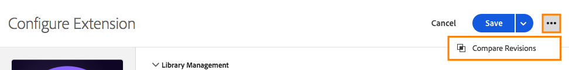
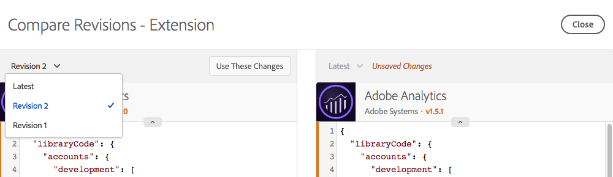
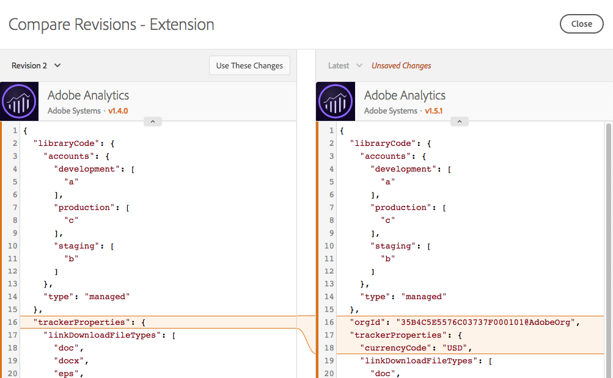
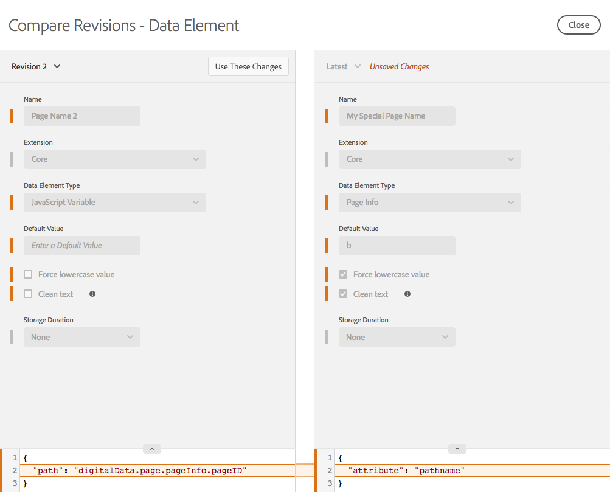
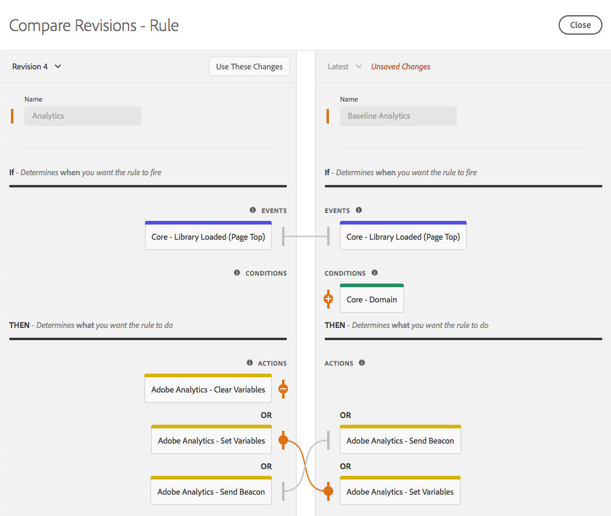
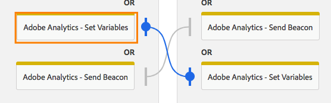
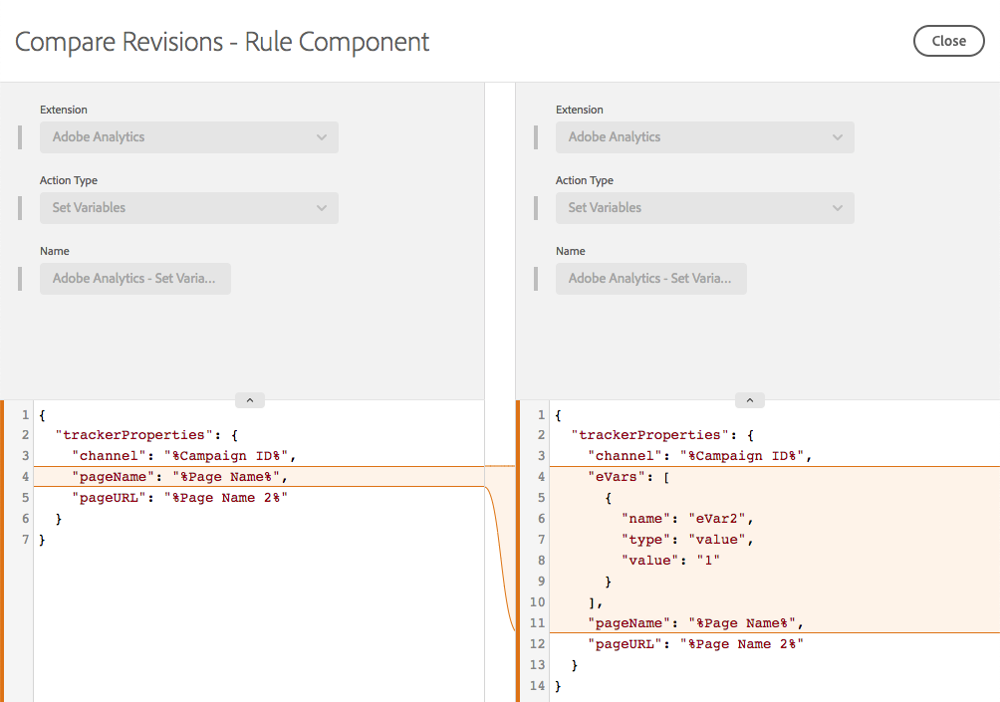

# Compare resource revisions

Compare resource revisions to see the history of an individual resource.  You can compare the current state of the resource to older versions, or compare the currently published version of a resource to the most recent set of changes that have been saved.

## Initiate a comparison

Initiating a comparison is the same for all resource types.  Open the Edit view for an individual resource, then find the three dots icon next to the **Save** button to view available actions for that resource.  Select **Compare Revisions** from the list.

For extensions, access the detail view by clicking the **Configure** button when viewing your list of installed extensions.  For data elements and rules, select one from the list.

## Using the Compare view

When you initiate a comparison, the default view shows the latest version on the right.  This version includes any unsaved changes you've made to the resource within the Edit view. \(Notice the **Unsaved Changes** label on the right in the picture below.\)

On the left, you can choose from any existing revisions to compare to **Latest**.

Click **Use These Changes** to copy the settings from your selected revision \(left\) to the latest version \(right\).  This copies the settings from the old revision to the latest unsaved changes.  If you want these changes to stick, be sure to **Save** after exiting the Compare view.


**Note:** Individual resources can have both attributes and settings.  These settings are stored as a JSON block, which is a structured way to store data, but flexible enough that extension developers can put whatever they need to make their extensions do what they want.

The initial release of Compare view displays settings in their raw form as JSON. Future enhancements will allow you to view versions in different ways, including detailed code comparisons and using the extension views provided by the extension developers.


## Comparing extensions

Extensions have a single screen to show the differences between versions.  

In Compare view, differences between settings versions are highlighted.  Additions and removals to individual settings are indicated by an expansion of a line in either direction.

Above, you can see the following changes:

* The Adobe Analytics extension is updated to a new version, indicated by the orange version numbers at the top.
* The `orgID` and `currencyCode` are changed to the settings indicated by the expansion of the orange section in the settings.

## Comparing data elements

Data elements have a single screen to show differences, but because data elements have additional attributes besides their settings, additional information is shown.  Attributes that have changed are highlighted in orange.

Above, you can see the following changes:

* The name changed from "Page Name 2" to "My Special Page Name," as indicated by the orange bar.
* The type changed from JavaScript Variable to Page Info.
* The default value of "b" was added.
* "Force lowercase value" was selected.
* "Clean text" was selected.
* The settings changed. \(The settings for the JavaScript Variable type are different from the Page Info type.\)

In cases where the settings block is large, you can expand the settings section so you can see it better.

## Comparing rules

Rules consist of many rule components.  To understand the changes to a rule, you need to know about the addition and removal of components as well as modifications to an individual component.  So, when you compare versions of a rule, there are actually two screens.

The first screen shows a high-level view, which highlights changes to the arrangement of rule components within the rule.  Changes are highlighted. Several different types of changes are shown.

Above, you can see the following changes:

* The rule name changed from "Analytics" to "Baseline Analytics," indicated by the orange bar by Name.
* The "Core - Domain" condition was added,  indicated by the orange "+" icon and the component's addition on the right side.
* The "Adobe Analytics - Clear Variables" action was removed, indicated by the orange "-" icon and the absence of the component on the right side.
* The "Adobe Analytics - Set Variables" action was modified, indicated by the orange line between the versions of the component on the left and right sides. This line is straight if the component order has not changed.
* The "Adobe Analytics - Set Variables" action and the "Adobe Analytics - Send Beacon" action order has changed, indicated by the curved lines connecting the different versions of the components on the left and right sides

To view the specific modifications to one of the rule components, click the specific component you'd like to view.  The line changes to blue when you mouse over.

The comparison for an individual rule component behaves the same as the comparison for a data element.

Above, you can see the following change:

* The rule component changed to add eVar2 with a value of "1".

In cases where the settings block is large, you can expand the settings section so you can see it better.

