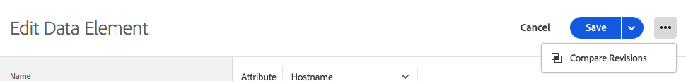
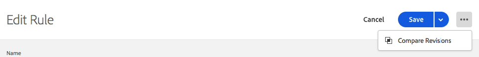

# Compare Resource Revisions

Comparing resource revisions is a great way to see the history of an individual resource.  It allows you to compare the current state of the resource to older versions.  Or to compare the currently published version of a resource to the most recent set of changes that have been saved.

## Initiate a Comparison

Initiating a comparison is the same for all resource types.  When looking at the Edit view for an individual resource, find the 3 dots icon next to the Save button to view available actions for that resource.  Select **Compare Revisions** from the list.

For extensions, you can get to the detail view by clicking the **Configure** button when viewing your list of installed extensions.  For data elements and rules, just select one from the list.

## Using the Compare View

When you initiate a comparison, the default view will show the latest version on the right.  This version on the right will include any unsaved changes you've made to the resource within the Edit view \(note the Unsaved Changes label on the right in the picture below\).

On the left, you can choose from any existing revisions to compare to **Latest**.

You also click **Use These Changes** to copy the settings from left \(your selected revision\) to right \(latest\).  Note that this only copies the settings from the old revision to the latest unsaved changes.  If you want these changes to stick, be sure to **Save** after exiting the Compare view.


Note that individual resources may have both attributes and settings.  These settings are stored as a JSON block which is a structured way to store data, but flexible enough that extension developers can put whatever they need to make their extensions do what they want.

The initial release of Compare view displays settings in their raw form as JSON, but future enhancements will allow you to view these in different ways including detailed code comparisons and using the extension views provided by the extension developers.


## Comparing Extensions

Extensions have a single screen to show the differences between versions.  

In Compare view, differences between settings versions are highlighted in orange.  Additions and removals to individual settings are indicated by an expansion of a line in either direction.

Above, you can see the following changes:

1. I have updated my Adobe Analytics extension to a new version indicated by the orange version numbers at the top
2. I have added "orgID" and "currencyCode" to the settings indicated by the expansion of the orange section in the settings

## Comparing Data Elements

Data elements also have a single screen to show differences, but because data elements have additional attributes besides their settings, there is additional information shown.  Attributes that have changed are highlighted in orange.

Above, you can see the following changes:

1. I changed the name from "Page Name 2" to "My Special Page Name" indicated by the orange bar 
2. I changed the type from JavaScript Variable to Page Info
3. I added the Default Value of "b"
4. I checked "Force lowercase value"
5. I checked "Clean text"
6. I changed my settings \(this is because the settings for the JavaScript Variable type are different from the Page Info type\)

In cases where the settings block is large, you can expand the settings section so you can see it better.

## Comparing Rules

Rules are made up of many rule components.  In order to understand the changes to a rule, you need to know about the addition and removal of components as well as modifications to an individual component.  So when you compare versions of a rule, there are actually two screens.

The first screen will show you a high-level view which will highlight changes to the arrangement of rule components within the rule.  Changes are highlighted in orange and there are several different types of changes to highlight.

Above, you can see the following changes:

1. I have changed the name of my rule from "Analytics" to "Baseline Analytics" indicated by the orange bar by Name
2. I have added the "Core - Domain" condition indicated by the orange "+" icon and the component's addition on the right side
3. I have removed the "Adobe Analytics - Clear Variables" action indicated by the orange "-" icon and the absence of the component on the right side
4. I have modified the "Adobe Analytics - Set Variables" action indicated by the orange line between the versions of the component on the left and right sides - this line will be straight if the component has not changed its order
5. I have changed the order of the "Adobe Analytics - Set Variables" action and the "Adobe Analytics - Send Beacon" action indicated by the curved lines connecting the different versions of the components on the left and right sides

If I want to see the specific modifications to one of the rule components, I can click on the specific component I'd like to view.  You'll see the line turn blue when you mouse over.

The comparison for an individual rule component behaves the same as the comparison for a data element.

Above, you can see the following changes:

1. I changed the settings of my rule component to add eVar2 with a value of "1".

In cases where the settings block is large, you can expand the settings section so you can see it better.

