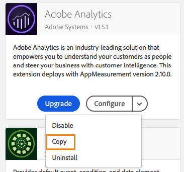
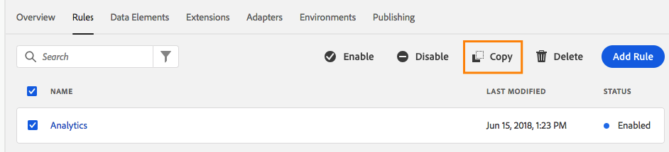

# Copying Resources

Copy a resource creates a duplicate of that resource in the specified destination.  This is a discreet, one-time action and there is no ongoing relationship between the original resource and any copies that have been made.

## Initiate a copy

You can initiate a copy of an extension by viewing your installed extensions, clicking the drop-down arrow on the **Configure** button and selecting **Copy**.

For Rules and Data Elements, simply select the resource you want to copy and then click the **Copy** button in the actions menu.

Once inside the copy dialog, you may use the drop-down menu to select a Destination Property you want to copy to.  Rules and Data Elements will select the current property by default.  Extensions cannot be copied to the same property, so those will not have a default selection. 

**Note:** In the Launch user interface, it is not possible to copy resources to another Property if one Property is configured for extension development and the other Property is not.

## Copying Extensions

When you copy an extension to another property, there are a few things that you need to be aware of:

* If the Destination Property does not have the extension installed, it will be installed using the same settings as the Origin Property.
* If the Destination Property already has the extension installed, then only the settings will be copied.
* If the Destination Property has a lower version of the extension installed, you'll receive a notice that you need to upgrade the extension on the Destination Property before you can perform the copy.  Extension developers can add settings to their extensions over time, so settings from a newer extension cannot be reliably applied to older versions.
* If the Destination Property has a higher version of the extension installed, then the settings will be copied over, but no downgrade is performed.  The Destination Property will still retain its current version number.

## Copying Rules & Data Elements

All Rules and Data Elements are provided by an extension, so when you copy across properties, Launch must account for these underlying extensions.

An explanation of exactly what Launch is planning on doing is available inside the Copy dialog before you actually begin copying.  The above dialog is for a Rule, but the same applies to Data Elements.

1. **Extensions required by these rules will be copied** - this is just letting you know that required extensions will go along with the rule.  These copies will follow the same rules as a regular Extension copy outlined above.
2. **Extension settings will NOT be copied if the extension is already installed** - This means if the required extensions already exist on the Destination property, that we'll just leave the extension alone.  If you wish to copy the Extension settings as well, you can use the **Replace extension settings on destination property** toggle and the explanation will be updated accordingly.
3. **Data Elements required by these Rules will NOT be copied** - This explanation only applies to rules.  Rules often rely on Data Elements in order to function correctly.  If you copy a Rule to a new property, you'll also need to copy any required Data Elements as a separate action.

Once you've configured the behavior you want, click **Copy**.

