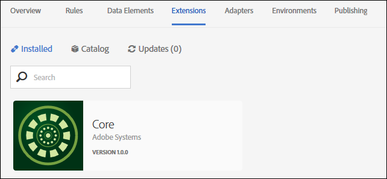

# Extensions

An extension is a packaged set of code that extends the Launch interface and the library functionality. Launch is the platform, and extensions are like apps that run on the platform.

Adding an extension adds new data elements and new options for creating rules.

Note: Extensions are similar to _tools_ in the previous Dynamic Tag Management.

Extensions determine the elements that are available when building properties, rules, and data elements. They provide:

* Events, conditions, and exceptions
* Data elements
* Client-side code

Use the links at the top of the Extensions list to view installed extensions, the extensions catalog, or updates.

Select an extension, then click Configure to view and change the extension's settings. See [Add a new extension](./#add-a-new-extension) for information about extension options.

Important: Changes do not take effect until they are [published](../../publishing/).

By default, Adobe provides extensions that support common integrations. Extensions can be modified with custom configurations. Configurations are provided through the extensions. To create a configuration, click the extension card, then click Add New Configuration.

For a video introduction, see [Extensions](../../../getting-started/videos.md).

## Extension catalog

Use the extension catalog to browse, configure, and deploy marketing and advertising technology built and maintained by independent software vendors, as well as extensions for Adobe solutions.

The Extensions page provides three views:

* Installed

  Shows all of your installed extensions.

* Catalog
* Shows all available extensions
* Updates

  Shows updates to installed extensions.

Click Extensions to see all your installed extensions. You can also use the catalog to see a list of all available extensions and which extensions have updates available.

See [Extensions Reference](./) for details about the Adobe-owned extensions.

## Add a new extension

Launch is highly extendible. Extensions add core functionality to Launch.

A common use of extensions is to create integrations with other applications. In the previous version of Launch, known as Dynamic Tag Management, extensions were called _tools_.

1. From a property's overview page, open the Extensions tab.
2. Select an extension.

   

   * If the extension exists, select it from the extensions catalog.
   * Mouse over an extension in your list to configure or disable it.
   * Add other extensions from the catalog if they are not currently in your list.

   The Core extension is the starting point for your new extension. The default extension provides:

   * Default event
   * Default conditions and exceptions
   * Default client-side code

   These defaults are the basis for the custom rules you'll build to create your extension.

When creating or editing elements, you can save and build to your [active library](../../publishing/libraries.md#active-library). This immediately saves your change to your library and executes a build. The status of the build is displayed. You can also create a new library from the Active Library drop down.

## Configure an extension

Mouse over an installed extension and click Configure.

Note: Some extensions do not require configuration and do not offer configuration options.

Each configurable extension has unique options. Refer to [Extensions Reference](../../../extension-reference/web/) for information about the options available for each Adobe extension.

