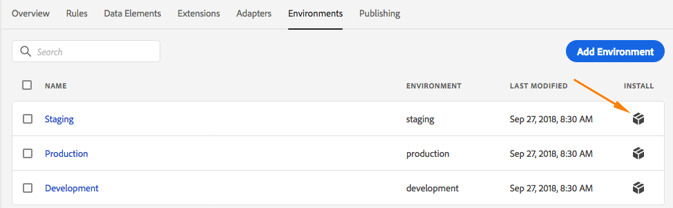

# Environments

Extensions, rules, and data elements are building blocks. When you want to make your application do something, these building blocks are added to a Library. This Library is then built to produce the actual artifacts that are used by your application.

When you create a Library, you must assign it to an Environment. Each Environment corresponds to a different state in the Publishing workflow.

* Development Environments go with the Development column
* The Staging Environment goes with the Submitted and Approved columns
* The Production Environment goes with the Published column

Different Launch artifacts can exist in each Environment. This allows you to test different Libraries in different environments as you push them through your Workflow.

## Installation Instructions

Each Environment has a set of instructions used to connect it to your application. For web properties, these instructions provide embed codes. For mobile properties, these instructions provide the code necessary to instantiate the libraries you're using and retrieve the configuration at run-time.

Installation instuctions can be accessed by clicking the Install Icon on the Environments list page.

## Web Configuration

For web properties, Launch also uses the settings from the assigned Environment to determine the following:

1. Destination - This is the location where you want your build to be deployed. It is controlled by selecting a host for the environment to use.
2. Archive Format - You can get a deployable set of files or have it zipped up in an archive format. This is controlled by the archive settings.
3. Embed Code - This is the code you'll use to deploy your build at run-time and will be different based on property type.

### Destination

On the environment screen, you have a drop-down menu to select from the existing hosts on your property.

When a build is created, Launch will deliver that build to whatever location you've specified with the assigned host.

### Archive

Most builds consist of multiple files. Multi-file builds contain a main library file \(linked in the embed code\) that contains internal references to the other files. Those other files are pulled in as needed.

By default, the archive option is `off`, and the build is delivered in a format that executes at run-time as is. For Web properties, this is .js. For Mobile properties, this is .json.

If you use the archive option, all build files are delivered as a .zip file \(optionally encrypted\) instead. This can be useful if:

1. You are self-hosting the library, but don't want to set up the SFTP host for delivery.
2. You need to run code analysis on the build prior to deployment.
3. You just want to look at the build contents to see what's in it.

### Embed code

The embed code is a `<script>` tag that you put on the pages of your site to load and execute the code you build in Launch.

When you view the installation instructions, you can choose to have this tag be synchronous or [asynchronous](../client-side-information/asynchronous-deployment.md). This setting is not persistent and does not reflect how you actually have implemented Launch on your site. It is only to show different ways to install it.

The embed code\(s\) is generated for you based on the environment configuration, so the only required action for you is to copy and paste it into your site on the pages where you want Launch to run.

#### Synchronous

If you load the library synchronously, when the browser reads the embed code, it retrieves the Launch library and executes it before continuing to load the page. This is also how [DTM](https://marketing.adobe.com/resources/help/en_US/dtm/) works.

In a synchronous deployment, the embed code consists of two `<script>` tags that you need to put within the HTML of your website. One `<script>` tag goes in the `<head>` and one goes at the footer in the bottom of the .

#### Asynchronous

If you load the library asynchronously, the while the library is being retrieved, the browser will continue to load the rest of the page in parallel. If you implement this way, there is only one embed code, which you put in the `<head>`. Depending on what's in your Launch library, the switch from sync to async can change the behavior of your rules and other elements, so be sure to thoroughly test any changes.

For more information about asynchronous deployment, see [Asynchronous Deployment of Experience Cloud JavaScript](../client-side-information/asynchronous-deployment.md).

#### Switching embed codes

The embed code depends on the configuration of the environment. Some Environment configuration changes will also update your embed code. These changes are:

* Switching from an Akamai host to an SFTP host \(or vice versa\)
* Marking the Archive box
* Updating the path field \(the embed code changes in real time as you update the path\)

When the embed code changes in Launch, you'll need to update the embed codes in your HTML. For obvious reasons, many people try to avoid changing embed codes after they've been implemented.

## Create an Environment

New properties are created with three environments: one Development, one Staging, and one Production. This is enough to run the publishing workflow. If desired, you may add additional Development environments. This is most common on larger teams with multiple developers working on different projects at the same time.

1. Open the Environments tab.
2. Click Create New Environment.
3. Select the type of environment you want to create.
   * Development

     The environment where you create and edit, events, configurations, and so on.

   * Staging

     The environment where you test and approve your changes.

   * Production

     The environment where your embed codes are placed in the pages or applications that are available to the public.
4. Select your host.
5. \(Optional\) Enable Create Archive if you want your build delivered as a .zip package. If you want to encrypt the .zip file, enable Encrypt Archive and enter an encryption password. Enter the location where the library is hosted. The path can be either a full URL or a relative path that can be used across multiple domains. This is important because most builds have multiple files that contain internal references to one another.
6. Click Save.
7. In the Web Install Instructions dialog box, select whether to load the library asynchronously. If you choose to load the library asynchronously, copy the embed code provided in the dialog box.  You can also install your embed code later by clicking the Install icon for that environment in your Environments list.  Refer to the information below.
8. Repeat for each environment in your development, approval, and publishing change.

After the environments are created, you are ready to publish.

